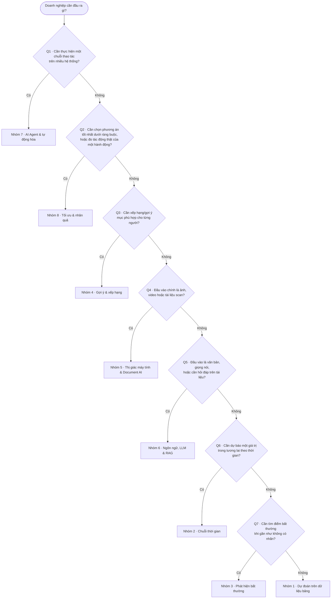
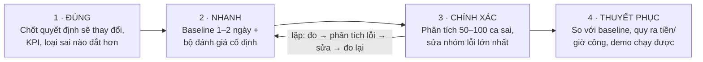

# 01 · Bản đồ bài toán AI trong doanh nghiệp (giai đoạn 1 — đã hoàn thành)

Tóm tắt của tài liệu gốc [ban-do-bai-toan-ai-doanh-nghiep_v1_20261004.docx](source/ban-do-bai-toan-ai-doanh-nghiep_v1_20261004.docx).
Dữ liệu có cấu trúc của từng nhóm (ví dụ, luồng giá trị, mức năng lực, metric, công cụ, bẫy, dự án luyện tập,
ma trận kỹ năng) nằm trong [catalog/problems.yaml](../../catalog/problems.yaml) và được hiển thị chi tiết ở
các trang nhóm trong [bản đồ kỹ năng](../02-skill-map/generated/README.md).

## 8 nhóm bài toán, 4 khối

Phân loại theo **đầu ra mà nghiệp vụ cần**, không theo loại dữ liệu hay thuật toán.

| Khối | Nhóm | Câu hỏi nghiệp vụ | Chi tiết + kỹ năng |
|---|---|---|---|
| A · Dự đoán | 1 · Dự đoán trên dữ liệu bảng | Khách này có rời bỏ, vỡ nợ hay mua hàng không? | [Nhóm 1](../02-skill-map/generated/nhom/g1-du-lieu-bang.md) |
| A · Dự đoán | 2 · Dự báo chuỗi thời gian | Tháng sau bán (hoặc cần) bao nhiêu? | [Nhóm 2](../02-skill-map/generated/nhom/g2-chuoi-thoi-gian.md) |
| A · Dự đoán | 3 · Phát hiện bất thường | Giao dịch hay máy móc này có gì lạ? | [Nhóm 3](../02-skill-map/generated/nhom/g3-bat-thuong.md) |
| A · Dự đoán | 4 · Gợi ý và xếp hạng | Nên hiển thị gì cho người này? | [Nhóm 4](../02-skill-map/generated/nhom/g4-goi-y-xep-hang.md) |
| B · Hiểu | 5 · Thị giác máy tính và Document AI | Trong ảnh hay tài liệu này có gì? | [Nhóm 5](../02-skill-map/generated/nhom/g5-anh-tai-lieu.md) |
| B · Hiểu | 6 · Ngôn ngữ, LLM và RAG | Văn bản này nói gì? Trả lời dựa trên tài liệu nội bộ. | [Nhóm 6](../02-skill-map/generated/nhom/g6-llm-rag.md) |
| C · Hành động | 7 · AI Agent và tự động hóa quy trình | Làm giúp tôi cả chuỗi việc này. | [Nhóm 7](../02-skill-map/generated/nhom/g7-agent-tu-dong-hoa.md) |
| D · Quyết định | 8 · Tối ưu hóa và suy luận nhân quả | Nên làm gì là tốt nhất? | [Nhóm 8](../02-skill-map/generated/nhom/g8-toi-uu-nhan-qua.md) |

## Nhận diện bài toán trong 30 giây

Đi từ trên xuống, dừng ở câu trả lời "Có" đầu tiên. Thứ tự đi từ bài toán rộng (hành động, quyết định) đến
hẹp (dự đoán), vì bài toán rộng thường chứa bài toán hẹp bên trong.

> Dự án thực tế thường ghép nhiều nhóm. Ví dụ: xử lý hồ sơ vay = Nhóm 5 (đọc giấy tờ) + Nhóm 1 (chấm điểm
> tín dụng) + Nhóm 7 (điều phối quy trình). Tách dự án thành bài toán con rồi nhận diện từng phần —
> xem [tổ hợp kỹ năng](../02-skill-map/02-ky-nang-ket-hop.md).

## Ma trận kỹ năng theo nhóm (giai đoạn 1)

Mức cần thiết của 8 mảng kỹ năng để làm tốt từng nhóm ở mức trung cấp trở lên (đánh giá định tính).
● Cốt lõi · ◐ Cần · ○ Ít.

| Nhóm | SQL & dữ liệu bảng | Thống kê & thực nghiệm | ML cổ điển | Deep learning | LLM & prompt | Tối ưu hóa (OR) | Triển khai & MLOps | Hiểu nghiệp vụ |
|---|:-:|:-:|:-:|:-:|:-:|:-:|:-:|:-:|
| 1 · Bảng | ● | ● | ● | ○ | ○ | ○ | ◐ | ● |
| 2 · Thời gian | ● | ● | ● | ◐ | ○ | ◐ | ◐ | ● |
| 3 · Bất thường | ● | ● | ● | ◐ | ○ | ○ | ● | ● |
| 4 · Gợi ý | ● | ◐ | ● | ◐ | ○ | ○ | ● | ◐ |
| 5 · Ảnh/TL | ○ | ○ | ○ | ● | ◐ | ○ | ● | ◐ |
| 6 · LLM/RAG | ◐ | ◐ | ○ | ◐ | ● | ○ | ● | ◐ |
| 7 · Agent | ◐ | ○ | ○ | ○ | ● | ○ | ● | ● |
| 8 · Tối ưu | ◐ | ● | ◐ | ○ | ○ | ● | ◐ | ● |

**Điều rút ra:** cột *Triển khai & MLOps* và *Hiểu nghiệp vụ* không có ô "Ít" ở nhóm nào — hai kỹ năng xương
sống. Giai đoạn 2 chi tiết hóa ma trận này thành 65 kỹ năng cụ thể và **kiểm tra tự động** rằng mọi ô Cốt lõi
ở trên đều được phủ (xem [đối chiếu](../02-skill-map/generated/ma-tran-ky-nang.md#doi-chieu-giai-doan-1)).

## Ba mức kỹ năng

| Cơ bản | Trung cấp | Nâng cao |
|---|---|---|
| Dựng được baseline, chọn đúng metric và đánh giá đúng cách. | Đạt chất lượng đủ để chạy thử (pilot) trên dữ liệu thật của doanh nghiệp. | Vận hành ổn định ở production: tối ưu chi phí, giám sát, giải thích được và mở rộng quy mô. |

## Cách làm: ĐÚNG → NHANH → CHÍNH XÁC → THUYẾT PHỤC

Bốn bước này trở thành bốn kỹ năng nền tảng BIZ-01 → BIZ-04 trong [catalog](../02-skill-map/generated/mang/biz.md).

## Lộ trình 6 tháng (giai đoạn 1)

| Giai đoạn | Nội dung | Mốc |
|---|---|---|
| Tháng 1–2 · Nền tảng | Python, SQL, thống kê, Git; một dự án dữ liệu bảng đóng gói thành API (FastAPI + Docker). Sách: *Hands-On Machine Learning* (Géron) | Cuối tháng 2: dự án bảng chạy qua API |
| Tháng 3–4 · GenAI | LLM API, structured output; hệ RAG tiếng Việt có bộ đánh giá và tracing. Sách: *AI Engineering* (Chip Huyen) | Cuối tháng 4: RAG tiếng Việt có bộ đánh giá |
| Tháng 5–6 · Chuyên sâu | 1–2 nhóm sát nhu cầu công ty; MLOps (MLflow, drift, chi phí, độ trễ). Sách: *Designing Machine Learning Systems* (Chip Huyen) | Cuối tháng 6: dự án chuyên sâu cho công ty |
| Xuyên suốt | Mô hình chữ T: nhận diện và dựng baseline cho cả 8 nhóm, thật sâu ở 1–2 nhóm; mỗi tuần một paper | — |

Giai đoạn 2 ánh xạ lộ trình này xuống từng kỹ năng: [04-lo-trinh-hoc.md](../02-skill-map/04-lo-trinh-hoc.md).
