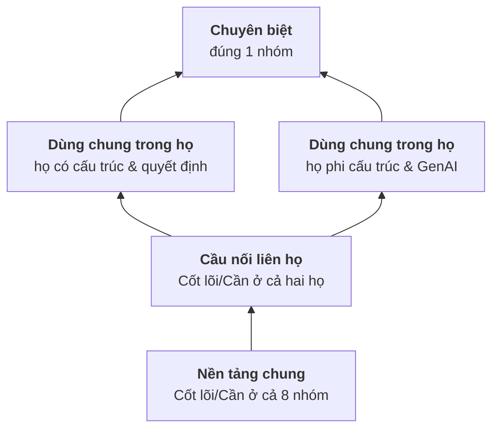

# 1 · Kiến trúc kỹ năng: mảng × tầng × mức

Mỗi kỹ năng trong danh mục được định vị bằng ba trục:

| Trục | Trả lời | Giá trị |
|---|---|---|
| **Mảng** (domain) | Kỹ năng thuộc lĩnh vực nào? | 10 mảng: PY, DATA, STAT, ML, DL, LLM, OPT, OPS, BIZ, EFF |
| **Tầng** (tier) | Dùng rộng đến đâu? (dùng chung hay riêng) | Nền tảng chung · Cầu nối liên họ · Dùng chung trong họ · Chuyên biệt · Bổ trợ |
| **Mức** (level) | Làm được đến đâu? | Cơ bản · Trung cấp · Nâng cao |

Thêm một chiều thứ tư — **tổ hợp** — cho dự án ghép nhiều nhóm: xem [02-ky-nang-ket-hop.md](02-ky-nang-ket-hop.md).

## Trục 1 · Mười mảng kỹ năng

Tám mảng đầu giữ nguyên các cột của ma trận giai đoạn 1 để đối chiếu được; hai mảng mới được bổ sung.

| Mã | Mảng | Tương ứng giai đoạn 1 | Số kỹ năng | Thẻ kỹ năng |
|---|---|---|--:|---|
| PY | Lập trình nền tảng | *mới* — "Nền tảng chung: Python, Git" trong bảng tự đánh giá | 4 | [py.md](generated/mang/py.md) |
| DATA | SQL & dữ liệu | SQL & dữ liệu bảng | 7 | [data.md](generated/mang/data.md) |
| STAT | Thống kê & thực nghiệm | Thống kê & thực nghiệm | 6 | [stat.md](generated/mang/stat.md) |
| ML | ML cổ điển | ML cổ điển | 8 | [ml.md](generated/mang/ml.md) |
| DL | Deep learning | Deep learning | 6 | [dl.md](generated/mang/dl.md) |
| LLM | LLM, RAG & Agent | LLM & prompt | 8 | [llm.md](generated/mang/llm.md) |
| OPT | Tối ưu hóa (OR) | Tối ưu hóa (OR) | 4 | [opt.md](generated/mang/opt.md) |
| OPS | Triển khai & MLOps | Triển khai & MLOps | 8 | [ops.md](generated/mang/ops.md) |
| BIZ | Nghiệp vụ & phương pháp | Hiểu nghiệp vụ + "Cách làm" (Phần III) | 6 | [biz.md](generated/mang/biz.md) |
| EFF | Tiết kiệm token & độ tin cậy | *mới* | 8 | [eff.md](generated/mang/eff.md) |

## Trục 2 · Tầng — dùng chung hay riêng

Mỗi kỹ năng khai báo mức cần thiết cho từng nhóm bài toán:

- **● Cốt lõi** — thiếu thì không làm được nhóm đó ở mức trung cấp.
- **◐ Cần** — cần để đi tới pilot/production, có thể học sau hoặc dựa vào đồng đội lúc đầu.
- **○ Ít** — đôi khi hữu ích.

Từ đó **tầng được tính tự động** (không gán tay, nên không thiên vị và tự cập nhật khi thêm nhóm mới):

Số lượng mới nhất của từng tầng: [generated/README.md](generated/README.md).

| Tầng | Quy tắc | Ý nghĩa khi học |
|---|---|---|
| Nền tảng chung | Cốt lõi/Cần ở **cả 8** nhóm | Học đầu tiên; dùng mọi nơi |
| Cầu nối liên họ | Cốt lõi/Cần ở **cả hai họ**, chưa đủ 8 nhóm | Chìa khóa chuyển giữa ML cổ điển và GenAI |
| Dùng chung trong họ | Cốt lõi/Cần ở ≥ 2 nhóm **cùng một họ** | Học khi vào họ đó; dùng lại trong cả họ |
| Chuyên biệt | Cốt lõi/Cần ở **đúng 1** nhóm | Học khi đi sâu nhóm đó (chân chữ T) |
| Bổ trợ | Chỉ ở mức Ít | Tăng năng suất (đọc paper, dùng AI hỗ trợ lập trình) |

### Vì sao có "họ"?

Ma trận chia sẻ ([số kỹ năng Cốt lõi/Cần chung giữa từng cặp nhóm](generated/ma-tran-ky-nang.md#chia-se))
cho thấy hai cụm: trừ 13 kỹ năng nền tảng mà cặp nào cũng có, hai nhóm trong {5, 6, 7} chia sẻ thêm trung bình
khoảng 20 kỹ năng, hai nhóm trong {1, 2, 3, 4, 8} khoảng 10, còn hai nhóm khác cụm chỉ khoảng 5. Hai họ này khớp
với nhận xét của giai đoạn 1: khối A và D xoay quanh thống kê, ML cổ điển, tối ưu; khối B và C xoay quanh deep
learning, LLM và triển khai. Họ được khai báo trong
[catalog/problems.yaml](../../catalog/problems.yaml) và có thể đổi khi bản đồ bài toán mở rộng.

## Trục 3 · Ba mức

Giữ nguyên định nghĩa của giai đoạn 1, áp dụng cho **từng kỹ năng**:

| Mức | Định nghĩa | Trong thẻ kỹ năng |
|---|---|---|
| Cơ bản | Dựng được baseline, chọn đúng metric, đánh giá đúng cách | Việc làm được với công cụ có sẵn, dữ liệu sạch |
| Trung cấp | Đủ chất lượng chạy pilot trên dữ liệu thật của doanh nghiệp | Việc làm được trên dữ liệu thật, có đo lường; tiêu chí **"Đạt khi"** của thẻ là ở mức này |
| Nâng cao | Vận hành ổn định ở production: chi phí, giám sát, giải thích, mở rộng | Việc làm được ở quy mô, có giám sát, có tối ưu chi phí |

### Từ mức kỹ năng suy ra mức của một nhóm bài toán

Để bảng tự đánh giá của giai đoạn 1 (theo nhóm) và của giai đoạn 2 (theo kỹ năng) khớp nhau:

| Đạt mức ... của Nhóm X | khi |
|---|---|
| Cơ bản | Mọi kỹ năng **Cốt lõi** của X ở mức ≥ Cơ bản |
| Trung cấp | Mọi kỹ năng Cốt lõi ở ≥ Trung cấp **và** mọi kỹ năng **Cần** ở ≥ Cơ bản |
| Nâng cao | Mọi kỹ năng Cốt lõi ở Nâng cao **và** mọi kỹ năng Cần ở ≥ Trung cấp |

Danh sách kỹ năng Cốt lõi/Cần của từng nhóm nằm ở trang nhóm, ví dụ
[Nhóm 1](generated/nhom/g1-du-lieu-bang.md), [Nhóm 6](generated/nhom/g6-llm-rag.md).

## Thẻ kỹ năng gồm gì

Ví dụ: [ML-07 · Truy xuất và xếp hạng hai tầng](generated/mang/ml.md#ml-07).

| Mục | Nội dung |
|---|---|
| Tóm tắt | Kỹ năng giải quyết vấn đề gì (một câu) |
| Tầng · điểm đòn bẩy | Tầng (tính tự động) và điểm đòn bẩy = Σ(Cốt lõi = 2, Cần = 1) trên 8 nhóm |
| Dùng cho | Mức cần thiết theo từng nhóm |
| Cơ bản / Trung cấp / Nâng cao | Việc **làm được** ở từng mức — viết bằng động từ, kiểm chứng được |
| Tiên quyết · Mở khóa | Kỹ năng cần học trước / kỹ năng được mở ra sau |
| Công cụ | Thư viện, dịch vụ tiêu biểu |
| Đạt khi | Tiêu chí tự đánh giá ở mức trung cấp — thường gắn với dự án luyện tập |
| Token & độ chính xác | (nếu có) kỹ năng giúp giảm token/chi phí hoặc giữ độ chính xác thế nào |

## Kỹ năng kết hợp trong danh mục

Một số kỹ năng tự bản thân là **kết hợp** của kỹ năng từ nhiều mảng — thể hiện qua tiên quyết:

| Kỹ năng kết hợp | = | Ý nghĩa |
|---|---|---|
| [LLM-03 · RAG](generated/mang/llm.md#llm-03) | LLM-02 structured output + ML-07 truy xuất + DATA-06 văn bản tiếng Việt | RAG tốt trước hết là truy xuất tốt và dữ liệu sạch |
| [LLM-04 · Đánh giá hệ LLM](generated/mang/llm.md#llm-04) | LLM-02 + STAT-02 đo bất định + BIZ-02 bộ đánh giá cố định | Eval là thống kê + phương pháp, không phải "hỏi thử vài câu" |
| [LLM-08 · Text-to-SQL](generated/mang/llm.md#llm-08) | DATA-01 SQL + LLM-02 + LLM-04 | Con số do SQL tính, LLM chỉ chọn và giải thích |
| [DL-05 · Document AI & VLM](generated/mang/dl.md#dl-05) | DL-04 thị giác máy tính + LLM-02 | OCR/VLM + schema + kiểm tra trường |
| [EFF-07 · Kiểm chứng xác định](generated/mang/eff.md#eff-07) | LLM-02 + STAT-05 calibration | Nền móng của "chính xác tuyệt đối" |
| [EFF-04 · Định tuyến & cascade](generated/mang/eff.md#eff-04) | EFF-01 đo chi phí + LLM-04 + ML-01 model nhỏ | Nền móng của "tiết kiệm token" |
| [OPT-03 · Dự báo rồi tối ưu](generated/mang/opt.md#opt-03) | OPT-01 LP/MIP + STAT-04 dự báo xác suất | Cầu nối Nhóm 2 → Nhóm 8 |
| [STAT-06 · Nhân quả & uplift](generated/mang/stat.md#stat-06) | STAT-03 thí nghiệm + ML-02 boosting | Cầu nối Nhóm 1 → Nhóm 8 |
