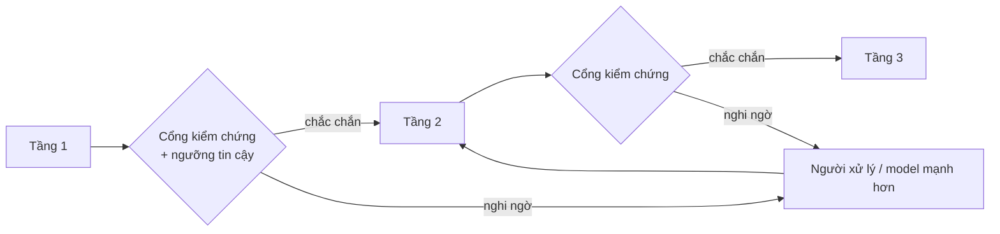
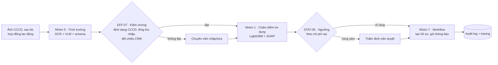

# 2 · Kỹ năng kết hợp — ghép nhiều nhóm thành một hệ

Dự án thật hiếm khi thuộc một nhóm. Tài liệu này trả lời: khi ghép nhiều nhóm bài toán (và nhiều kỹ năng) lại
với nhau, cần thêm kỹ năng gì và tránh lỗi gì.

## Ba kiểu quan hệ giữa kỹ năng và bài toán

| Kiểu | Định nghĩa | Ví dụ | Cách học |
|---|---|---|---|
| **Dùng chung** | Một kỹ năng phục vụ nhiều nhóm | ML-07 truy xuất & xếp hạng dùng cho cả gợi ý (Nhóm 4) và RAG (Nhóm 6) | Học một lần, luyện trên hai bài toán để thấy điểm chung |
| **Riêng** | Kỹ năng chỉ một nhóm cần | OPT-02 định tuyến & lập lịch (Nhóm 8) | Học khi đi sâu nhóm đó |
| **Kết hợp** | Kỹ năng sinh ra từ ghép kỹ năng khác, có "giao diện" ở giữa | LLM-08 text-to-SQL = SQL + structured output + eval | Học sau khi đã có các kỹ năng thành phần; trọng tâm là phần giao diện |

Danh sách kỹ năng kết hợp trong danh mục: [01-kien-truc-ky-nang.md](01-kien-truc-ky-nang.md#ky-nang-ket-hop).
Danh sách dự án ghép nhiều nhóm (tổ hợp): [generated/to-hop-ky-nang.md](generated/to-hop-ky-nang.md).

## Sáu nguyên tắc khi ghép

### 1. Tách bài toán con, nhận diện từng phần

Dùng cây quyết định 30 giây cho **từng** bước của quy trình, không cho cả dự án (BIZ-01). "Tự động hóa hồ sơ
vay" không phải một bài toán agent — nó là Nhóm 5 (đọc giấy tờ) + Nhóm 1 (chấm điểm) + Nhóm 7 (điều phối).

### 2. Hợp đồng dữ liệu giữa các tầng

Mỗi điểm nối là một schema rõ ràng (pydantic/JSON Schema — LLM-02). Không truyền văn bản tự do giữa các tầng.
Mỗi trường mang theo **giá trị + độ tin cậy + nguồn**:

```python
from pydantic import BaseModel, Field


class ExtractedField(BaseModel):
    value: str | None
    confidence: float = Field(ge=0, le=1)  # từ calibration (STAT-05) hoặc tín hiệu kiểm chứng (EFF-07)
    source: str  # "ocr", "vlm", "nhap_tay", "doi_chieu_CRM"...
    checks_passed: list[str] = []  # các luật kiểm chứng đã qua


class LoanApplication(BaseModel):
    full_name: ExtractedField
    id_number: ExtractedField
    monthly_income: ExtractedField
```

### 3. Lỗi cộng dồn — truyền độ tin cậy, không truyền "sự thật"

Ba tầng nối tiếp có độ chính xác 95%, 90%, 95% cho ra hệ end-to-end chỉ khoảng **0,95 × 0,90 × 0,95 ≈ 81%**.
Muốn hệ đúng gần như tuyệt đối trên phần tự động, mỗi tầng cần một **cổng**:



Ngưỡng ở mỗi cổng chọn bằng đường coverage–accuracy (STAT-05), không chọn theo cảm giác. Kết quả: độ chính xác
trên phần tự động có thể đạt mục tiêu rất cao, đổi lại tỷ lệ tự động thấp hơn 100% — và cả hai con số đều
phải được báo cáo.

### 4. Đánh giá từng tầng **và** end-to-end

- Metric từng tầng để **gỡ lỗi** (độ chính xác từng trường OCR, AUC model tín dụng...).
- Metric end-to-end để **ra quyết định** (tỷ lệ hồ sơ xử lý tự động đúng hoàn toàn, thời gian xử lý, nợ xấu).
- Golden set end-to-end gồm hồ sơ thật đi qua cả chuỗi, có đáp án ở từng tầng.

### 5. Một hạ tầng chung cho mọi tầng

Một harness đánh giá (BIZ-02), một hệ tracing (OPS-06), một registry model/prompt (OPS-02), một cách quản lý
bí mật (OPS-08). Mỗi tầng một kiểu là nguồn lỗi tích hợp lớn nhất và làm không thể so sánh chi phí giữa các tầng.

### 6. Người ở đúng chỗ

Bước có rủi ro cao hoặc không đảo ngược được (giải ngân, gửi email cho khách, chặn giao dịch, ghi vào ERP)
luôn có người duyệt hoặc ít nhất một luật chặn cứng. Agent không được tự cấp quyền cho mình (LLM-06).

## Kỹ năng "keo" ở điểm nối

Các kỹ năng xuất hiện nhiều nhất ở vai trò nối giữa các nhóm (đánh dấu 🔗 trong [tổ hợp](generated/to-hop-ky-nang.md)):

| Kỹ năng keo | Vai trò ở điểm nối |
|---|---|
| [LLM-02](generated/mang/llm.md#llm-02) Structured output | Hợp đồng dữ liệu giữa tầng LLM/VLM và tầng code |
| [STAT-05](generated/mang/stat.md#stat-05) Calibration & dự đoán có chọn lọc | Quyết định ca nào đi tiếp tự động, ca nào chuyển người |
| [EFF-07](generated/mang/eff.md#eff-07) Kiểm chứng xác định | Chặn lỗi lọt giữa các tầng bằng luật nghiệp vụ |
| [STAT-04](generated/mang/stat.md#stat-04) + [OPT-03](generated/mang/opt.md#opt-03) | Chuyển dự báo xác suất thành quyết định chịu được rủi ro |
| [STAT-03](generated/mang/stat.md#stat-03) + [OPT-04](generated/mang/opt.md#opt-04) | Đo tác động thật của cả hệ lên KPI |
| [STAT-06](generated/mang/stat.md#stat-06) Uplift | Chọn đối tượng mà hành động thật sự thay đổi kết quả |
| [EFF-04](generated/mang/eff.md#eff-04) Định tuyến & cascade | Chia việc giữa luật, model nhỏ, LLM và người |
| [LLM-08](generated/mang/llm.md#llm-08) Text-to-SQL | Nối ngôn ngữ tự nhiên với dữ liệu có cấu trúc mà vẫn đúng con số |

## Ví dụ: hồ sơ vay (CMB-01)



Bẫy và metric end-to-end: xem [CMB-01](generated/to-hop-ky-nang.md#cmb-01).

## Thêm một tổ hợp mới

Thêm vào [catalog/combinations.yaml](../../catalog/combinations.yaml):

```yaml
  - id: CMB-10
    name: Tên dự án
    groups: [G5, G3]                  # ≥ 2 nhóm, theo thứ tự luồng
    flow: Mô tả luồng giữa các nhóm
    examples: [ví dụ 1, ví dụ 2]
    skills: [DL-04, ML-05, OPS-04]    # kỹ năng cần
    glue: [STAT-05]                   # kỹ năng nối
    pitfalls:
      - Bẫy khi ghép
    end_to_end_metric: Metric đo từ đầu đến cuối
```

Rồi `make catalog && make check`. Bộ kiểm tra sẽ báo nếu id nhóm/kỹ năng không tồn tại.
