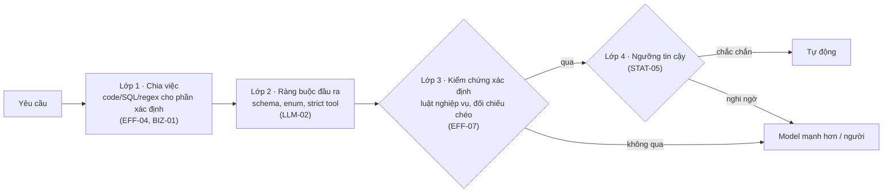
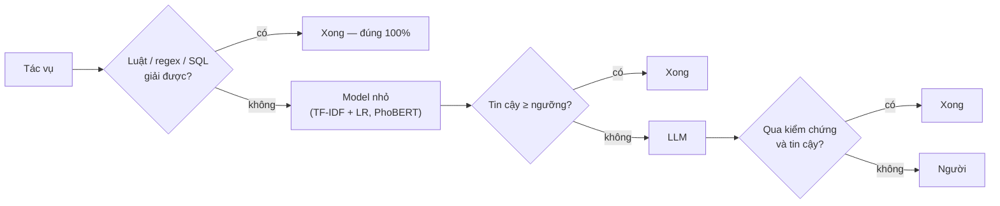
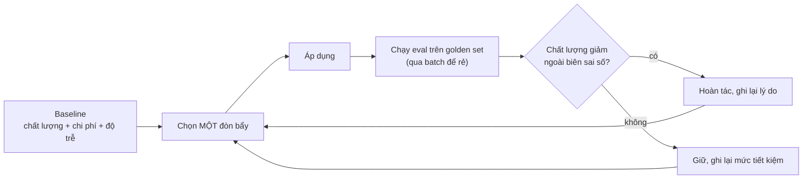

# 3 · Tiết kiệm token mà vẫn chính xác tuyệt đối

Kỹ năng liên quan: mảng [EFF](generated/mang/eff.md) (EFF-01 → EFF-08) cùng LLM-02, LLM-04, STAT-02, STAT-05,
ML-07, OPS-06.

## Tóm tắt

1. **"Chính xác tuyệt đối" là thuộc tính của hệ thống, không phải của model.** Không model nào đúng 100%.
   Hệ thống đạt được bằng cách: làm bằng code mọi thứ xác định được, ép đầu ra vào schema, kiểm chứng mọi
   đầu ra tự động, và chuyển ca nghi ngờ sang model mạnh hơn hoặc cho người.
2. **Tiết kiệm token theo đúng thứ tự:** đo trước → các đòn bẩy "miễn phí" (không đổi đầu ra) → tinh gọn →
   cuối cùng mới đến các đòn bẩy đánh đổi (model nhỏ hơn, suy luận ít hơn).
3. **Quy tắc vàng:** một tối ưu token chỉ được giữ lại khi chất lượng trên golden set **không giảm ngoài biên
   sai số** (STAT-02). Không có eval thì không tối ưu.

## 1. "Chính xác tuyệt đối" nghĩa là gì trong vận hành

Định nghĩa dùng trong dự án:

- **Không có lỗi im lặng:** mọi đầu ra tự động đều qua lớp kiểm chứng; ca không qua được đi đường khác,
  không bao giờ lọt thẳng vào hệ thống nghiệp vụ.
- **Phần xác định được làm bằng code:** tính toán, tra cứu, chuyển đổi định dạng, so khớp danh mục — đúng 100%
  theo định nghĩa. LLM gọi công cụ (tool, SQL) thay vì tự "nhẩm".
- **Phần tự động đạt mục tiêu đo được:** ví dụ precision ≥ 99,5% trên phần tự động, đo trên golden set và
  kiểm tra mẫu định kỳ ở production.

Luôn báo cáo **hai con số đi cùng nhau** — độ chính xác trên phần tự động và tỷ lệ được tự động:

| Ngưỡng tin cậy để tự động | Tỷ lệ tự động | Độ chính xác trên phần tự động | Phần chuyển người |
|--:|--:|--:|--:|
| 0,50 | 100% | 93,0% | 0% |
| 0,80 | 85% | 98,2% | 15% |
| 0,95 | 70% | 99,6% | 30% |

*(Số liệu minh họa.)* Chọn dòng nào là quyết định kinh doanh (chi phí một lỗi lọt so với chi phí một ca chuyển
người — BIZ-01), còn vẽ được bảng này là kỹ năng STAT-05. Muốn tăng tỷ lệ tự động mà giữ độ chính xác: sửa nhóm
lỗi lớn nhất (BIZ-03) hoặc thêm luật kiểm chứng (EFF-07), không phải hạ ngưỡng.

## 2. Bốn lớp bảo đảm độ chính xác



Ví dụ lớp kiểm chứng xác định theo bài toán:

| Bài toán | Kiểm chứng bằng code |
|---|---|
| Trích xuất hóa đơn (Nhóm 5) | Mã số thuế đúng định dạng (độ dài, ký tự) theo quy định hiện hành; tổng tiền = Σ dòng hàng + thuế (sai số làm tròn cho phép); ngày hóa đơn hợp lệ, không ở tương lai; nhà cung cấp có trong danh mục |
| eKYC (Nhóm 5) | Số CCCD đúng 12 chữ số; thông tin mặt trước khớp dữ liệu đọc từ chip/QR khi có; điểm so khớp khuôn mặt vượt ngưỡng đã hiệu chỉnh |
| RAG (Nhóm 6) | Mọi câu trả lời có trích dẫn; đoạn được trích **tồn tại nguyên văn** trong tài liệu nguồn; người hỏi có quyền xem tài liệu đó; không có nguồn → trả lời "không tìm thấy" |
| Phân loại ticket (Nhóm 6) | Nhãn thuộc enum; không mâu thuẫn luật cứng (ví dụ ticket có mã đơn hoàn tiền → bộ phận tài chính) |
| Text-to-SQL (Nhóm 6–7) | SQL parse được, chỉ đọc, chỉ dùng bảng cho phép; mọi con số trong câu trả lời phải xuất hiện trong kết quả truy vấn |
| Agent (Nhóm 7) | Tham số tool đúng schema; số tiền/mã khách đối chiếu với nguồn; hành động không đảo ngược được chờ người duyệt |

Một lớp nữa chạy ở production: **kiểm tra mẫu định kỳ** phần đã tự động để đo tỷ lệ lỗi lọt thực tế.

## 3. Thứ tự áp dụng các đòn bẩy tiết kiệm token

**Bước 0 — đo trước (EFF-01, OPS-06).** Ghi baseline: chất lượng trên golden set, **chi phí trên mỗi tác vụ
hoàn thành** (không phải mỗi request — một request rẻ mà phải retry hai lần thì không rẻ), độ trễ. Tách chi phí
thành: input thường, input đọc từ cache, output, retry.

| Nhóm | Đòn bẩy | Kỹ năng | Ảnh hưởng tới độ chính xác | Cần eval lại? |
|---|---|---|---|---|
| A · Miễn phí | Không gọi LLM khi code/luật/SQL làm được | EFF-04, BIZ-01 | Thường **tăng** | Có (nhẹ) |
| A · Miễn phí | Prompt caching của nhà cung cấp | EFF-02 | Không đổi đầu ra | Không |
| A · Miễn phí | Batch API cho việc không cần trả lời ngay | EFF-06 | Không đổi đầu ra | Không |
| A · Miễn phí | Cache kết quả cho input **trùng khớp chính xác** (hash) | EFF-02 | Không đổi đầu ra | Không |
| A · Miễn phí | Tránh retry thừa: structured output đúng ngay lần đầu, idempotency | LLM-02, PY-04 | Không đổi / tăng | Không |
| B · Tinh gọn | Gửi đúng phần ngữ cảnh cần thiết (top-k, schema linking, cắt kết quả tool) | EFF-03, ML-07 | Thường tăng, có thể giảm | **Có** |
| B · Tinh gọn | Đầu ra ngắn theo schema, giải thích chỉ khi cần | EFF-05 | Có thể giảm ở tác vụ khó | **Có** |
| C · Đánh đổi | Giảm mức suy luận (effort/reasoning) | EFF-05 | Có thể giảm | **Bắt buộc** |
| C · Đánh đổi | Model nhỏ hơn hoặc cascade nhiều tầng | EFF-04 | Có thể giảm | **Bắt buộc** |
| C · Đánh đổi | Semantic cache (câu hỏi "gần giống") | EFF-02 | **Rủi ro cao** | **Bắt buộc** |
| C · Đánh đổi | Fine-tune/distill model riêng | LLM-07 | Có thể giảm | **Bắt buộc** |

Làm hết nhóm A trước. Nhiều hệ chỉ cần nhóm A + B đã giảm phần lớn chi phí mà không chạm vào độ chính xác.

## 4. Chi tiết từng đòn bẩy

### Prompt caching (EFF-02)

Nhà cung cấp lưu lại phần **đầu** (prefix) của prompt; request sau có cùng prefix chỉ trả giá đọc cache cho phần
đó. Số liệu tham khảo của Anthropic tại thời điểm viết (10/2026 — luôn kiểm tra trang giá hiện hành): ghi cache
tốn khoảng 1,25× giá input với thời hạn 5 phút (2× với thời hạn 1 giờ), đọc cache tốn khoảng 0,1× giá input
(một số model mới còn thấp hơn) — hai request cùng prefix trong vòng 5 phút đã hòa vốn. Mỗi model có **độ dài
prefix tối thiểu** để được cache (từ vài trăm đến vài nghìn token); prefix ngắn hơn đơn giản là không được cache,
không báo lỗi. Các nhà cung cấp khác có cơ chế tương tự (có nơi tự động) — đọc tài liệu của hãng bạn dùng.

Quy tắc thiết kế prompt để cache trúng:

- **Cố định trước, thay đổi sau:** định nghĩa tool → system prompt → tài liệu/ví dụ cố định → (điểm cache) →
  câu hỏi của người dùng.
- Không chèn thời gian hiện tại, ID request, tên người dùng vào phần đầu prompt.
- Serialize JSON với thứ tự key ổn định; không đổi danh sách tool giữa các lượt.
- Agent loop chỉ **nối thêm** vào lịch sử, không sửa lượt cũ.
- Kiểm tra bằng số liệu: trường usage của response cho biết bao nhiêu token đọc từ cache. Nếu luôn bằng 0
  qua nhiều request lặp lại → có thứ gì đó đang "phá cache".

```python
# Thứ tự các phần của request — cú pháp đánh dấu điểm cache khác nhau giữa các hãng, thứ tự thì giống nhau
STATIC_SYSTEM = load_prompt("phan_loai_ticket_v3.md")  # 1. cố định, có version
STATIC_EXAMPLES = load_text("phan_loai_ticket_v3_vi_du.md")  # 2. cố định


def build_request(ticket_text: str) -> dict:
    return {
        "system": STATIC_SYSTEM,
        "user_parts": [
            STATIC_EXAMPLES,  # ← đặt điểm cache ngay sau phần cố định cuối cùng
            f"<ticket>\n{ticket_text}\n</ticket>",  # 3. phần thay đổi luôn ở cuối
        ],
    }
```

### Batch (EFF-06)

Việc không cần trả lời ngay — chạy eval, gán nhãn hàng loạt, tóm tắt cuối ngày, backfill — gửi qua Batch API
(nhiều nhà cung cấp giảm khoảng 50%; với Anthropic, giảm giá batch cộng dồn với giảm giá cache). Cùng model, cùng
prompt nên chất lượng không đổi. Kết quả có thể trả về **không theo thứ tự** — luôn ghép theo `custom_id`.

### Tinh gọn đầu vào (EFF-03)

- **RAG:** gửi top-k đoạn đã rerank (ví dụ 5 đoạn × 400 token ≈ 2.000 token) thay vì cả tài liệu hàng chục
  nghìn token. Truy xuất tốt hơn (ML-07) vừa rẻ hơn vừa ít nhiễu hơn → thường **chính xác hơn**.
- **Text-to-SQL:** chỉ đưa schema các bảng liên quan (schema linking), không đưa cả kho dữ liệu.
- **Kết quả tool:** trả về đúng các trường cần, phân trang, cắt log dài trước khi đưa lại cho model.
- **Ảnh/tài liệu:** cắt đúng vùng, giảm độ phân giải tới mức vừa đủ đọc; chỉ gửi trang cần thiết.
- **Hội thoại dài:** tóm tắt/nén lịch sử cũ. Lưu ý: xóa/sửa lịch sử làm thay đổi prefix nên **mất cache** — chỉ
  nén theo đợt lớn, thưa, khi cần chỗ trong cửa sổ ngữ cảnh, đừng làm mỗi lượt.
- **Văn bản tiếng Việt:** chuẩn hóa, bỏ HTML/boilerplate, khử trùng lặp (DATA-06). Tiếng Việt thường tốn
  nhiều token hơn tiếng Anh cho cùng nội dung — đếm bằng tokenizer/endpoint đếm token của đúng nhà cung cấp, đừng
  ước lượng bằng tokenizer của hãng khác.

### Tinh gọn đầu ra (EFF-05)

Token đầu ra thường đắt gấp nhiều lần token đầu vào.

- Trả về **mã nhãn/enum/JSON tối giản** thay vì văn xuôi; không yêu cầu giải thích cho mọi ca — chỉ cho ca bị
  từ chối, ca chuyển người, hoặc khi người dùng hỏi.
- Đặt `max_tokens` hợp lý — **quá thấp** gây cắt cụt, phải gọi lại, tốn hơn.
- Mức suy luận (effort/reasoning/thinking) chỉnh theo từng loại tác vụ: phân loại đơn giản thường không cần suy
  luận sâu; tác vụ nhiều bước thì cần. Quét các mức trên golden set để chọn mức rẻ nhất vẫn đạt ngưỡng.

### Định tuyến & cascade (EFF-04)



- Ngưỡng mỗi tầng chọn từ **đường coverage–accuracy** đo trên golden set (STAT-05): tầng rẻ chỉ giữ những ca mà
  nó đúng ít nhất ngang tầng đắt.
- Đo **chi phí mỗi tác vụ hoàn thành** của cả cascade, kể cả ca bị đẩy lên tầng trên.
- Trước khi dựng cascade nhiều model, thử phương án đơn giản hơn: **model mạnh với mức suy luận thấp** — nhiều
  khi rẻ ngang mà chính xác hơn, và chỉ có một nơi cache (cache tách riêng theo từng model).

### Semantic cache — dùng rất thận trọng

Trả lại câu trả lời cũ cho câu hỏi "gần giống" có thể sai hoàn toàn: "lãi suất kỳ hạn 6 tháng" và "lãi suất kỳ
hạn 12 tháng" rất gần nhau về embedding nhưng khác đáp án. Chỉ dùng cho bộ câu hỏi thường gặp có đáp án đã được
duyệt, ngưỡng tương đồng cao, có eval riêng — và không bao giờ cho câu hỏi có con số, tên riêng, thời gian.

## 5. Ví dụ tính toán: phân loại 100.000 ticket/tháng

Giả định *(minh họa — thay bằng số đo của bạn)*:

| Thông số | Giá trị |
|---|---|
| Phần prompt cố định (hướng dẫn, định nghĩa nhãn, ví dụ) | 2.000 token |
| Nội dung một ticket | 300 token |
| Đầu ra ban đầu: nhãn + giải thích | 150 token |
| Đầu ra sau tối ưu: chỉ mã nhãn dạng JSON | 15 token |
| Giá token đầu ra so với đầu vào | 5× |
| Giá đọc cache so với input thường | 0,1× (bỏ qua phí ghi cache vì được chia đều cho lưu lượng lớn) |
| Ca model nhỏ xử lý được với độ tin cậy cao (đo trên golden set) | 60% |

Đơn vị: chi phí của 1 token đầu vào.

| Bước | Chi phí / ticket | So với ban đầu | Điều kiện để giữ bước này |
|---|--:|--:|---|
| Ban đầu: 2.300 input + 150 output × 5 | 3.050 | — | Ghi baseline chất lượng |
| + Prompt caching: 300 + 2.000 × 0,1 = 500 input; + 750 output | 1.250 | −59% | Không cần — đầu ra không đổi; chỉ cần kiểm tra cache hit |
| + Đầu ra chỉ mã nhãn: 500 + 15 × 5 | 575 | −81% | Eval không giảm ngoài biên sai số (nếu giảm ở ca khó: giữ suy luận cho tầng LLM) |
| + Cascade: chỉ 40% lên LLM | ≈ 230 | −92% | Độ chính xác tầng model nhỏ trên phần nó giữ ≥ độ chính xác LLM trên cùng phần đó |
| + Batch (nếu phân loại không cần ngay, ví dụ chạy lại hằng đêm) | ≈ 115 | −96% | Không cần — đầu ra không đổi |

Nếu giá đầu vào là 1 USD cho 1 triệu token, chi phí tháng đi từ khoảng 305 USD xuống khoảng 12 USD — và ở mỗi bước
độ chính xác đều đã được chứng minh là không giảm. Thứ tự này cũng cho thấy: hai bước lớn nhất (caching, rút gọn
đầu ra) không cần đánh đổi gì.

## 6. Quy trình "tối ưu có kiểm soát"



Checklist trước khi merge một thay đổi tối ưu token:

- [ ] Có số baseline và số sau thay đổi cho cả **chất lượng**, **chi phí mỗi tác vụ hoàn thành** và **độ trễ**.
- [ ] So sánh chất lượng có khoảng tin cậy (paired bootstrap hoặc McNemar — STAT-02), không chỉ hai con số.
- [ ] Chỉ thay đổi **một** đòn bẩy trong PR.
- [ ] Golden set có đủ ca khó và ca biên, không chỉ ca dễ.
- [ ] Không có đầu ra nào bỏ qua lớp kiểm chứng (EFF-07).
- [ ] Dashboard chi phí (OPS-06) sẽ cho thấy tác động sau khi triển khai.

## 7. Tiết kiệm token khi dùng AI hỗ trợ lập trình (EFF-08)

Cùng nguyên tắc áp dụng cho chính việc học và viết code với trợ lý AI:

- **Ngữ cảnh đúng và đủ:** chỉ rõ file, hàm, lỗi cụ thể thay vì "đọc cả repo và sửa".
- **File hướng dẫn dự án ngắn gọn** (CLAUDE.md / AGENTS.md): lệnh build/test, quy ước — được đọc mỗi phiên nên
  càng gọn càng tốt.
- **Phiên mới cho việc mới** — lịch sử dài của việc cũ là token thừa.
- **Kiểm chứng tự động thay vì đọc lại:** `make check` (lint, test, catalog) cho trợ lý tự phát hiện và sửa lỗi;
  đây cũng là "lớp kiểm chứng xác định" cho code.
- **Yêu cầu kế hoạch ngắn trước khi sửa lớn** — sửa sai hướng tốn token hơn nhiều so với đọc một kế hoạch.

## 8. Kỹ năng liên quan

| Muốn | Học |
|---|---|
| Đo token và chi phí | [EFF-01](generated/mang/eff.md#eff-01), [OPS-06](generated/mang/ops.md#ops-06) |
| Giảm token không ảnh hưởng chất lượng | [EFF-02](generated/mang/eff.md#eff-02), [EFF-06](generated/mang/eff.md#eff-06), [EFF-04](generated/mang/eff.md#eff-04) (phần cơ bản) |
| Gửi ít ngữ cảnh hơn mà đúng hơn | [EFF-03](generated/mang/eff.md#eff-03), [ML-07](generated/mang/ml.md#ml-07), [LLM-03](generated/mang/llm.md#llm-03), [LLM-08](generated/mang/llm.md#llm-08) |
| Đầu ra ngắn, kiểm tra được | [EFF-05](generated/mang/eff.md#eff-05), [LLM-02](generated/mang/llm.md#llm-02) |
| Chứng minh không giảm chất lượng | [LLM-04](generated/mang/llm.md#llm-04), [STAT-02](generated/mang/stat.md#stat-02), [PY-03](generated/mang/py.md#py-03) |
| Chính xác tuyệt đối trên phần tự động | [EFF-07](generated/mang/eff.md#eff-07), [STAT-05](generated/mang/stat.md#stat-05) |
| Rẻ hơn nữa khi lưu lượng lớn | [EFF-04](generated/mang/eff.md#eff-04) (nâng cao), [LLM-07](generated/mang/llm.md#llm-07), [DL-02](generated/mang/dl.md#dl-02) |
