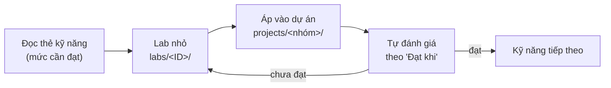

# 4 · Lộ trình học theo kỹ năng

Lộ trình 6 tháng của giai đoạn 1 (nền tảng → GenAI → chuyên sâu, mô hình chữ T) được ánh xạ xuống từng kỹ năng.
Thứ tự trong mỗi giai đoạn đã tôn trọng tiên quyết ([thứ tự học theo vòng](generated/thu-tu-hoc.md)).

## Nguyên tắc

1. **Chữ T:** thanh ngang = đạt **Cơ bản** cho các kỹ năng nền tảng và đủ để dựng baseline ở cả 8 nhóm; thân dọc =
   **Trung cấp → Nâng cao** ở 1–2 nhóm sát nhu cầu công ty.
2. **Đòn bẩy trước:** học kỹ năng dùng được cho nhiều nhóm nhất trước ([bảng đòn bẩy](generated/thu-tu-hoc.md)).
3. **Học qua dự án:** mỗi kỹ năng được luyện trong một lab nhỏ rồi áp dụng ngay vào dự án luyện tập của nhóm.
4. **Đo được mới tính là đạt:** dùng tiêu chí "Đạt khi" của thẻ kỹ năng và [bảng tự đánh giá](generated/tu-danh-gia.md).

## Vòng lặp mỗi kỹ năng

## Giai đoạn A · Tháng 1–2 · Nền tảng

**Mốc:** dự án Nhóm 1 (churn) chạy qua API FastAPI + Docker, có bộ đánh giá cố định và danh sách top 500 khách
kèm lý do SHAP. Cài: `make setup-tabular setup-mlops`.

| Tuần | Kỹ năng | Mức cần đạt |
|---|---|---|
| 1 | [PY-01](generated/mang/py.md#py-01) Python, [PY-02](generated/mang/py.md#py-02) Git & môi trường, [BIZ-01](generated/mang/biz.md#biz-01) Framing | Cơ bản |
| 2 | [DATA-01](generated/mang/data.md#data-01) SQL, [DATA-02](generated/mang/data.md#data-02) Xử lý bảng, [STAT-01](generated/mang/stat.md#stat-01) Thống kê mô tả | Cơ bản |
| 3 | [ML-01](generated/mang/ml.md#ml-01) Quy trình học có giám sát, [BIZ-02](generated/mang/biz.md#biz-02) Baseline & bộ đánh giá cố định, [STAT-02](generated/mang/stat.md#stat-02) Đo bất định | Cơ bản |
| 4 | [DATA-03](generated/mang/data.md#data-03) Chống rò rỉ, [DATA-04](generated/mang/data.md#data-04) Feature engineering, [DATA-05](generated/mang/data.md#data-05) Kiểm định dữ liệu | Cơ bản → Trung cấp |
| 5 | [ML-02](generated/mang/ml.md#ml-02) Gradient boosting, [ML-03](generated/mang/ml.md#ml-03) Mất cân bằng, [STAT-05](generated/mang/stat.md#stat-05) Ngưỡng theo chi phí | Trung cấp |
| 6 | [BIZ-03](generated/mang/biz.md#biz-03) Phân tích lỗi, [ML-04](generated/mang/ml.md#ml-04) SHAP, [PY-03](generated/mang/py.md#py-03) Kiểm thử | Trung cấp |
| 7 | [OPS-01](generated/mang/ops.md#ops-01) FastAPI + Docker, [OPS-02](generated/mang/ops.md#ops-02) MLflow, [OPS-08](generated/mang/ops.md#ops-08) Bảo mật dữ liệu | Cơ bản |
| 8 | [BIZ-04](generated/mang/biz.md#biz-04) Trình bày & demo — hoàn thiện mốc | Cơ bản |

## Giai đoạn B · Tháng 3–4 · GenAI

**Mốc:** hệ RAG tiếng Việt có golden set ~100 câu, đo recall@k + faithfulness + độ đúng, có tracing và **bảng
chất lượng–chi phí–độ trễ** trước/sau tối ưu token. Cài thêm: `make setup-llm setup-agent`.

| Tuần | Kỹ năng | Mức cần đạt |
|---|---|---|
| 9 | [LLM-01](generated/mang/llm.md#llm-01) Prompt, [LLM-02](generated/mang/llm.md#llm-02) Structured output, [PY-04](generated/mang/py.md#py-04) Gọi API bền vững | Cơ bản → Trung cấp |
| 10 | [EFF-01](generated/mang/eff.md#eff-01) Đo token & chi phí, [OPS-06](generated/mang/ops.md#ops-06) Tracing, [LLM-04](generated/mang/llm.md#llm-04) Evals | Cơ bản |
| 11 | [DATA-06](generated/mang/data.md#data-06) Văn bản tiếng Việt, [DL-03](generated/mang/dl.md#dl-03) Embedding, [ML-07](generated/mang/ml.md#ml-07) Truy xuất & rerank | Cơ bản → Trung cấp |
| 12 | [LLM-03](generated/mang/llm.md#llm-03) RAG | Trung cấp |
| 13 | [LLM-04](generated/mang/llm.md#llm-04) Evals (LLM-as-judge đối chiếu người), [EFF-07](generated/mang/eff.md#eff-07) Kiểm chứng xác định | Trung cấp |
| 14 | [EFF-02](generated/mang/eff.md#eff-02) Caching, [EFF-03](generated/mang/eff.md#eff-03) Tinh gọn ngữ cảnh, [EFF-05](generated/mang/eff.md#eff-05) Tinh gọn đầu ra, [EFF-06](generated/mang/eff.md#eff-06) Batch | Cơ bản → Trung cấp |
| 15 | [LLM-05](generated/mang/llm.md#llm-05) Tool calling & workflow, [LLM-06](generated/mang/llm.md#llm-06) Bảo mật LLM | Cơ bản |
| 16 | [EFF-04](generated/mang/eff.md#eff-04) Cascade — hoàn thiện mốc với bảng chất lượng–chi phí | Cơ bản |

## Giai đoạn C · Tháng 5–6 · Chuyên sâu

Chọn **một hướng** sát nhu cầu công ty, mở trang nhóm tương ứng để lấy danh sách kỹ năng Cốt lõi/Cần đầy đủ và
thứ tự học. Mục tiêu: kỹ năng Cốt lõi của hướng đó lên **Trung cấp**, một phần lên **Nâng cao**. Song song: MLOps
([OPS-02](generated/mang/ops.md#ops-02), [OPS-04](generated/mang/ops.md#ops-04)) lên Trung cấp.

| Hướng chuyên sâu | Nhóm | Kỹ năng chuyên sâu chính | Tổ hợp tiêu biểu |
|---|---|---|---|
| Rủi ro & tín dụng | [1](generated/nhom/g1-du-lieu-bang.md) + [3](generated/nhom/g3-bat-thuong.md) | ML-02/03/04 nâng cao, STAT-05, ML-05, DATA-07, OPS-04, OPS-07 | CMB-04, CMB-06 |
| Dự báo & vận hành | [2](generated/nhom/g2-chuoi-thoi-gian.md) + [8](generated/nhom/g8-toi-uu-nhan-qua.md) | ML-06, STAT-04, OPT-01/02/03 | CMB-02 |
| Cá nhân hóa & tăng trưởng | [4](generated/nhom/g4-goi-y-xep-hang.md) + [8](generated/nhom/g8-toi-uu-nhan-qua.md) | ML-07, ML-08, STAT-03, STAT-06, OPT-04 | CMB-05, CMB-06 |
| Document AI | [5](generated/nhom/g5-anh-tai-lieu.md) + [6](generated/nhom/g6-llm-rag.md) | DL-01/02/04/05, OPS-05, EFF-07 | CMB-01 |
| LLM ứng dụng & Agent | [6](generated/nhom/g6-llm-rag.md) + [7](generated/nhom/g7-agent-tu-dong-hoa.md) | LLM-03 → 08, EFF-02 → 07, OPS-06 | CMB-03, CMB-07, CMB-08, CMB-09 |

**Mốc:** một dự án chuyên sâu cho công ty (hoặc tổ hợp ở cột cuối) có baseline, bộ đánh giá, kết quả quy ra tiền/giờ
công, demo và tài liệu giới hạn.

## Xuyên suốt 6 tháng

- **Thanh ngang chữ T — dựng baseline cho cả 8 nhóm.** Ngoài nền tảng, mỗi nhóm cần thêm ít nhất một kỹ năng
  riêng ở mức **Cơ bản**:

  | Nhóm | Kỹ năng tối thiểu để dựng baseline |
  |---|---|
  | 1 · Bảng | ML-01, ML-02 |
  | 2 · Thời gian | ML-06 (seasonal naive, ETS, backtest cuốn chiếu) |
  | 3 · Bất thường | ML-05 (luật + Isolation Forest), ML-03 (precision@k) |
  | 4 · Gợi ý | ML-08 (baseline phổ biến, ALS) |
  | 5 · Ảnh/TL | DL-04 (YOLO/OCR có sẵn), DL-05 (VLM + schema) |
  | 6 · LLM/RAG | LLM-01, LLM-02, LLM-03 |
  | 7 · Agent | LLM-05 (workflow cố định + người duyệt) |
  | 8 · Tối ưu | OPT-01 (LP với OR-Tools), STAT-03 (A/B test đúng cách) |

- **Mỗi tuần một paper** gắn với bài toán đang làm ([BIZ-06](generated/mang/biz.md#biz-06)).
- **Dùng AI hỗ trợ lập trình có kỷ luật** ([EFF-08](generated/mang/eff.md#eff-08)) — để `make check` làm lớp
  kiểm chứng.

## Theo dõi tiến độ

Sao chép [bảng tự đánh giá](generated/tu-danh-gia.md) thành một issue GitHub cá nhân (hoặc ghi chú) và cập nhật
mỗi tuần. Mức của từng nhóm bài toán suy ra từ mức kỹ năng theo quy tắc ở
[01-kien-truc-ky-nang.md](01-kien-truc-ky-nang.md#muc-nhom).
