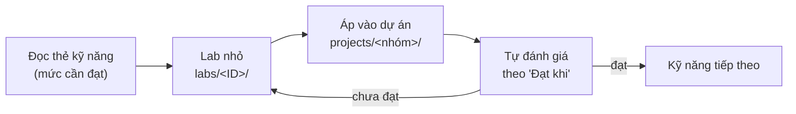

# 4 · Lộ trình học theo kỹ năng

Lộ trình 6 tháng của giai đoạn 1 (nền tảng → GenAI → chuyên sâu, mô hình chữ T) được ánh xạ xuống từng kỹ năng,
cộng thêm giai đoạn D để đi tới mức **Nâng cao** (production).

- **Chi tiết từng bước** (việc cần làm, sản phẩm phải nộp, kỹ năng và mức mục tiêu): [generated/lo-trinh.md](generated/lo-trinh.md)
- **Bản web có tự đánh dấu tiến độ**: trang GitHub Pages của repo (`https://superken-python.github.io/ai-architecture/`
  sau khi bật Pages — xem [web/README.md](../../web/README.md)).
- **Nguồn dữ liệu**: [catalog/roadmap.yaml](../../catalog/roadmap.yaml). Sửa lộ trình ở đó rồi `make catalog`.

## Bốn giai đoạn

| Giai đoạn | Thời gian | Trọng tâm | Mốc |
|---|---|---|---|
| A · Nền tảng | Tháng 1–2 (tuần 1–8) | Python, SQL, thống kê, baseline + bộ đánh giá, LightGBM, đóng gói | Dự án Nhóm 1 (churn) chạy qua API |
| B · GenAI | Tháng 3–4 (tuần 9–16) | LLM, structured output, truy xuất, RAG, eval, tiết kiệm token | RAG tiếng Việt có bộ đánh giá và bảng chất lượng–chi phí |
| C · Chuyên sâu | Tháng 5–6 (tuần 17–24) | Một trong 5 hướng chuyên sâu + MLOps | Dự án chuyên sâu cho công ty |
| D · Nâng cao · Production | Tháng 7 trở đi | Vận hành, giám sát, chi phí ở quy mô, bảo mật, phương pháp cho team | Hệ chạy thật có SLO và báo cáo chi phí |

## Nguyên tắc

1. **Chữ T:** thanh ngang = đạt **Cơ bản** cho các kỹ năng nền tảng và đủ để dựng baseline ở cả 8 nhóm; thân dọc =
   **Trung cấp → Nâng cao** ở 1–2 nhóm sát nhu cầu công ty.
2. **Đòn bẩy trước:** học kỹ năng dùng được cho nhiều nhóm nhất trước ([bảng đòn bẩy](generated/thu-tu-hoc.md)).
3. **Học qua dự án:** mỗi kỹ năng được luyện trong một lab nhỏ rồi áp dụng ngay vào dự án luyện tập của nhóm.
4. **Đo được mới tính là đạt:** dùng tiêu chí "Đạt khi" của thẻ kỹ năng và [bảng tự đánh giá](generated/tu-danh-gia.md).
5. **Không nhảy cóc:** bộ kiểm tra bảo đảm mọi kỹ năng tiên quyết đã có ở bước trước, mức mục tiêu không giảm, và lộ
   trình phủ toàn bộ kỹ năng trong danh mục.

## Vòng lặp mỗi kỹ năng

## Theo dõi tiến độ

- **Trên web:** đánh dấu từng mức của từng kỹ năng; tiến độ lưu trong trình duyệt của bạn, có nút xuất/nhập file
  để chuyển máy hoặc gửi cho người hướng dẫn.
- **Trên GitHub:** sao chép [bảng tự đánh giá](generated/tu-danh-gia.md) thành một issue cá nhân và cập nhật mỗi tuần.

Mức của từng nhóm bài toán suy ra từ mức kỹ năng theo quy tắc ở
[01-kien-truc-ky-nang.md](01-kien-truc-ky-nang.md#muc-nhom).
