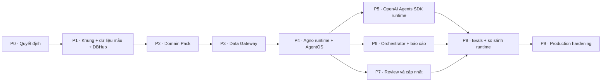

# Checklist triển khai — CMB-09 Data Agent OS

Bản **đề xuất** để chủ dự án review trước khi viết code. Thiết kế: [kiến trúc](docs/01-kien-truc.md) ·
[chi tiết kỹ thuật](docs/03-chi-tiet-ky-thuat.md) · [ADR-001](docs/04-adr-openai-agents-sdk.md).

Quy ước: mỗi việc có mã `Px-yy` để gắn vào PR/commit · **DoD** = tiêu chí hoàn thành, kiểm chứng được · cỡ việc
**S** ≤ 1 ngày, **M** 2–3 ngày, **L** ≥ 4 ngày (ước lượng ban đầu, chỉnh sau P1).

## Thứ tự và phụ thuộc

Mốc demo đầu tiên (sau P4): hỏi một câu timesheet trên AgentOS UI, thấy câu trả lời có `[Q1]`, trace và evidence trong DB.

## P0 · Quyết định cần chủ dự án chốt (trước khi code)

- [ ] **P0-01** Duyệt kiến trúc v1 và các thay đổi so với diagram v0 ([review](docs/02-review-diagram-v0.md)).
- [ ] **P0-02** Duyệt [ADR-001](docs/04-adr-openai-agents-sdk.md): Agno là runtime chính, OpenAI Agents SDK là runtime phụ; triage
      không nạp skill core; không dùng SandboxAgent mặc định.
- [ ] **P0-03** Nhà cung cấp/model mặc định cho Agno và cho OpenAI SDK (đề xuất `gpt-5.4-mini` cho cả hai để so sánh công bằng).
- [ ] **P0-04** Nguồn dữ liệu thật đầu tiên sau dữ liệu giả lập: hệ timesheet/kế toán nào, engine gì (Postgres?), ai cấp DB user chỉ SELECT.
- [ ] **P0-05** Nguồn danh tính và role: IdP nào phát JWT, claim nào chứa role, danh sách role ban đầu.
- [ ] **P0-06** Chính sách trace: có cho phép gửi trace của OpenAI SDK lên nền tảng OpenAI không (đề xuất: không).
- [ ] **P0-07** Người phụ trách (`owners`) và người duyệt learning cho pack `timesheet`, `finance`.
- [ ] **P0-08** Câu hỏi chéo nhiều pack có cần trong v1 không (đề xuất: không).
- [ ] **P0-09** Ngân sách token cho eval mỗi tháng (đặt `LLM_DAILY_BUDGET_USD`).

## P1 · Khung dự án, dữ liệu mẫu, DBHub chạy local

- [ ] **P1-01** (S) `pyproject.toml` + `uv.lock` **riêng** của dự án: `agno[os]>=3.1,<4`, `openai-agents>=0.23,<0.24`, `mcp>=2.3,<3`,
      `sqlglot`, `jinja2`, `sqlalchemy`, `pydantic`; nhóm dev `pytest`, `pytest-asyncio`, `ruff`.
- [ ] **P1-02** (S) `Makefile`: `setup`, `seed`, `dbhub`, `serve`, `test`, `test-integration`, `eval`, `packs-check`; `.env.example`.
- [ ] **P1-03** (M) Sinh dữ liệu giả lập **tất định** (`random.Random(seed)`) cho `timesheet` (phòng ban, nhân viên, dự án,
      timesheet_entries, ngày lễ) và `finance` (tài khoản, trung tâm chi phí, sổ cái, ngân sách, hóa đơn), cố ý chứa bẫy nghiệp vụ:
      dòng draft/rejected, nghỉ phép, contractor, nhân viên nghỉ giữa kỳ, doanh thu ghi âm, bút toán đảo, hóa đơn hủy.
- [ ] **P1-04** (S) Chạy DBHub 1.4 local (`npx @bytebase/dbhub --transport http --port 8080 --config dbhub/dbhub.toml`) với 2 nguồn SQLite.

**DoD:** `make seed && make dbhub` chạy được; script gọi `execute_sql_timesheet` qua `mcp.Client` trả đúng số dòng; chạy seed
hai lần cho cùng kết quả (so hash).

## P2 · Domain Pack

- [ ] **P2-01** (M) Model pydantic cho `pack.yaml`, `rules.yaml`, `dictionary.yaml`, `tools.yaml`, `queries.yaml`, `reports.yaml`,
      `evals/golden.yaml`, `learnings.yaml` ([đặc tả](docs/03-chi-tiet-ky-thuat.md)).
- [ ] **P2-02** (M) Loader + Resolver: `core` luôn đứng đầu chuỗi; skill domain thay skill core cùng tên; **lỗi** khi ghi đè skill
      `metadata.locked: "true"`; phát hiện vòng `extends`; id rule/tool/eval trùng → lỗi; ghi nguồn gốc (core/domain/ghi đè).
- [ ] **P2-03** (M) Pack `core`: persona, 7 quy tắc lõi, 7 skill (`clarify-question`, `schema-discovery`, `sql-authoring`,
      `result-validation`, `answer-with-evidence`, `capture-learning`, `report-writing`), template `report-base.md.j2`, ca eval hành vi.
- [ ] **P2-04** (L) Pack `timesheet`: rules + metric (billable ratio, utilization, tuân thủ nộp), `sql_checks`, dictionary đầy đủ cột,
      2 tool nghiệp vụ, ≥ 5 queries mẫu, 2 skill, 1 báo cáo tuần, **≥ 12 ca golden** (gồm ca mơ hồ, ca PII).
- [ ] **P2-05** (L) Pack `finance`: quy ước dấu sổ cái, bút toán đảo, P&L, tuổi nợ; như trên, **≥ 12 ca golden**; ghi đè `report-writing`.
- [ ] **P2-06** (M) `dagent packs validate|show`: dùng validator Agent Skills của Agno cho mọi SKILL.md; kiểm tham chiếu bảng/cột;
      parse mọi SQL bằng sqlglot; biên dịch template Jinja.
- [ ] **P2-07** (S) `dagent dbhub render [--check]`: sinh `dbhub.toml` (sqlite cho dev, `${DSN}` cho prod), đổi `:param` sang placeholder
      của dialect, chặn tham số dùng hai lần.

**DoD:** `validate` xanh cho 3 pack; test: thứ tự skill core trước domain, ghi đè skill khóa báo lỗi, ghi đè skill thường ghi
nhận nguồn gốc; mọi `golden_sql` chạy được trên dữ liệu seed và trả ≥ 1 dòng; `render --check` xanh.

## P3 · Data Gateway

- [ ] **P3-01** (M) `DbHubClient`: `mcp.Client` (Streamable HTTP), timeout, retry có backoff khi lỗi kết nối, parse JSON kết quả,
      map `READONLY_VIOLATION`/lỗi SQL thành thông điệp ngắn.
- [ ] **P3-02** (L) `SqlPolicy` (sqlglot): 1 câu lệnh; chỉ SELECT/phép tập hợp; không DML/DDL ở bất kỳ nút nào; qualify theo
      dictionary; bảng ∈ allowlist; cột restricted qua alias, `*`, WHERE, JOIN; hàm cấm; thêm LIMIT; lint `sql_checks` → `warnings`.
- [ ] **P3-03** (S) RBAC: `config/rbac.yaml`, `RoleResolver` (dev: file; prod: claim JWT), `allow_restricted`, `can_review`.
- [ ] **P3-04** (M) Evidence ledger (`dagent_evidence`): ref `Q1..` theo run, hash kết quả, preview cấu hình được, ghi cả lần bị chặn.
- [ ] **P3-05** (M) `ToolSpec` dùng chung: `search_schema`, `describe_table`, `run_sql`, tool nghiệp vụ của pack, `propose_learning`;
      kết quả rút gọn ≤ 50 dòng.

**DoD:** bảng test policy ≥ 25 ca (DML, đa câu lệnh `;`, DML trong CTE, bảng ngoài allowlist, `SELECT *` trên bảng có PII, PII qua alias,
PII trong WHERE, cột không tồn tại, `load_extension`, thiếu LIMIT, thiếu lọc `status`...) đều đúng; test tích hợp với DBHub thật
(tự bỏ qua nếu thiếu Node ≥ 22.5).

## P4 · Agno runtime + AgentOS

- [ ] **P4-01** (M) Context Builder: thứ tự 8 phần, ngân sách token từng phần, ghi số token ước tính vào metadata run.
- [ ] **P4-02** (S) `PackSkillLoader(SkillLoader)` → `Skills(loaders=[...])`.
- [ ] **P4-03** (M) `config/agents.yaml` (Agent Registry) + `build_agno_agent` (instructions dạng hàm nhận `run_context`).
- [ ] **P4-04** (M) App AgentOS: `db` (SQLite dev / Postgres prod), `tracing=True`, agents từ Registry, `base_app` với
      `/dagent/packs`, `/dagent/registry`, `/dagent/runs/{run_id}/evidence`.
- [ ] **P4-05** (M) `ScriptedModel` cho Agno (test không cần API key).
- [ ] **P4-06** (S) Chạy thật 3 câu golden mỗi pack với API key, ghi lại kết quả vào HISTORY.

**DoD:** test offline: agent gọi `run_sql` theo kịch bản qua endpoint `/agents/{id}/runs` của AgentOS; trong DB có session, run, trace
(đúng `agent_id`, `session_id`) và evidence `Q1`; instructions chứa skill core trước skill domain; AgentOS UI hiển thị agent và trace.

## P5 · OpenAI Agents SDK runtime

- [ ] **P5-01** (M) `build_openai_agent`: instructions dạng hàm, `FunctionTool` sinh từ `ToolSpec`, tool `load_skill`, skill index.
- [ ] **P5-02** (L) `OpenAIAgentsAdapter(BaseExternalAgent)`: `_arun_adapter` và `_arun_adapter_stream` (map text delta, tool call,
      tool output sang event của Agno); dùng `history` từ session AgentOS.
- [ ] **P5-03** (M) `AgnoDbTracingProcessor(TracingProcessor)`: gom span theo trace, map sang `Trace`/`Span` của Agno, ghi bằng
      `upsert_trace`/`create_spans`; `DAGENT_OPENAI_TRACE_EXPORT=local|both`.
- [ ] **P5-04** (M) Agent điều phối `data-triage-openai` + handoffs tới agent chuyên trách; triage không có tool dữ liệu, không có skill index.
- [ ] **P5-05** (S) (tùy chọn) input guardrail: yêu cầu ghi dữ liệu/lấy PII → từ chối sớm, không tốn lượt gọi tool.

**DoD:** test với `agents.testing.ScriptedModel` (không API key); agent OpenAI xuất hiện trong `/agents` của AgentOS, chạy qua
`/agents/{id}/runs` (stream và không stream); trace nằm cùng bảng với Agno, cùng khóa `agent_id`/`session_id`; khi `local`, không có
request nào tới endpoint trace của OpenAI; test ADR: specialist có core trước domain, triage không có skill.

## P6 · Orchestrator và workflow báo cáo

- [ ] **P6-01** (M) Router: lọc pack theo role → khớp từ khóa (NFC, bỏ dấu) → Agno `Team(mode="route")` → câu hỏi làm rõ.
- [ ] **P6-02** (S) `POST /dagent/ask` trả `{answer, agent_id, run_id, session_id, references}`.
- [ ] **P6-03** (M) Workflow báo cáo từ `reports.yaml`: tham số → SQL qua gateway → Jinja (`extends` khung core) → (tùy chọn) nhận xét của agent.
- [ ] **P6-04** (S) Lịch chạy báo cáo bằng scheduler của AgentOS.

**DoD:** test định tuyến (≥ 15 câu, gồm câu mơ hồ và câu của pack người dùng không có quyền); báo cáo tuần timesheet sinh Markdown
đúng template, số liệu khớp golden SQL, có mục nguồn tham chiếu.

## P7 · Review và cập nhật

- [ ] **P7-01** (M) `POST /dagent/reviews`; có `correction` → learning `proposed`; `corrected_sql` chạy thử qua gateway.
- [ ] **P7-02** (S) `GET /dagent/learnings`, `approve`/`reject` (role `can_review` và thuộc `owners` của pack).
- [ ] **P7-03** (S) Learning `active` (pack + user) được Context Builder nạp ở lần chạy kế tiếp.
- [ ] **P7-04** (M) `dagent learnings export --pack <id>`: ghi `learnings.yaml`/`queries.yaml`, tăng patch version, đánh dấu `exported`.
- [ ] **P7-05** (S) Tool `propose_learning` cho agent (kỹ năng `capture-learning`).

**DoD:** test e2e: chê + sửa → approve → câu hỏi kế tiếp có learning trong instructions; người không có quyền không duyệt được;
export tạo diff YAML hợp lệ và `packs validate` vẫn xanh.

## P8 · Evals và so sánh runtime

- [ ] **P8-01** (L) Eval runner: chạy từng ca bằng session mới, lấy kết quả truy vấn thành công cuối cùng từ evidence, so với `golden_sql`
      (`scalar`/`set`/`ordered`, `tolerance`); kỳ vọng hành vi (`max_queries`, `must_clarify`, `answer_not_contains`, `must_cite`).
- [ ] **P8-02** (M) Báo cáo: độ chính xác, tỷ lệ hỏi lại đúng, số bước, token, chi phí, độ trễ theo pack × runtime × model; lưu vào bảng eval
      của AgentOS + file Markdown.
- [ ] **P8-03** (S) Tôn trọng `LLM_DAILY_BUDGET_USD`; cache kết quả theo (ca, pack version, model, runtime).
- [ ] **P8-04** (S) Cổng phát hành: version pack/model mới chỉ được `active` khi không giảm độ chính xác và không trượt ca an toàn.
- [ ] **P8-05** (M) Báo cáo nghiên cứu: Agno vs OpenAI Agents SDK trên 2 pack → cập nhật ADR-001 (giữ, thu hẹp hay bỏ runtime OpenAI).

**DoD:** báo cáo so sánh có khoảng tin cậy (bootstrap) cho độ chính xác; chạy lại cho cùng kết quả trên cache; ADR-001 được cập nhật.

## P9 · Production hardening

- [ ] **P9-01** (M) `docker-compose.yml`: agentos + dbhub + postgres; seed vào Postgres; DBHub chỉ mở trong mạng nội bộ.
- [ ] **P9-02** (M) Bật `authorization` (JWT) của AgentOS; `RoleResolver` đọc role từ claim; bỏ tin `user_id` trong body.
- [ ] **P9-03** (S) DB user chỉ SELECT trên bảng trong dictionary; DBHub `readonly`; kiểm tra ba lớp chặn ghi.
- [ ] **P9-04** (M) CI job riêng cho dự án: lint, test, `packs validate`, `dbhub render --check`, test tích hợp DBHub (Node 22).
- [ ] **P9-05** (S) Theo dõi chi phí token theo agent/pack (EFF-01); cảnh báo vượt ngân sách.
- [ ] **P9-06** (S) Lưu trữ: trace 90 ngày, evidence 180 ngày, job dọn dẹp; `trace_include_sensitive_data=False`.
- [ ] **P9-07** (S) Checklist bảo mật: prompt injection qua dữ liệu, PII, quyền tối thiểu — review cùng người phụ trách dữ liệu.

**DoD:** `docker compose up` chạy trọn luồng hỏi → trả lời → review; CI xanh; checklist bảo mật được ký duyệt.

## Sau v1 (chưa lên lịch)

- [ ] Câu hỏi ghép nhiều pack: tool tính toán trên evidence hoặc view hợp nhất ở tầng dữ liệu.
- [ ] Lớp tri thức tổ chức (Drive/SharePoint qua MCP hoặc Agno Knowledge).
- [ ] Nguồn BigQuery qua MCP server khác, sau cùng interface của gateway.
- [ ] Làm giàu ngữ cảnh từ code dbt/ETL (lớp ngữ cảnh 3 đầy đủ).
- [ ] Sandbox chạy script của skill (phân tích/biểu đồ) nếu ADR-001 giữ runtime OpenAI.
