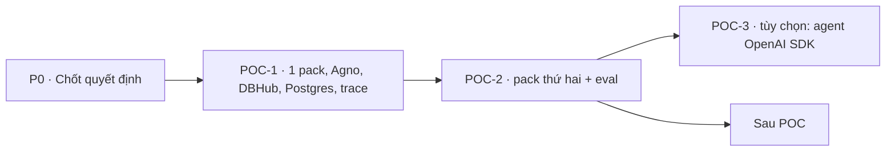

# Checklist POC — CMB-09 Data Agent OS (v2)

Bản **đề xuất** để chủ dự án review. Mục tiêu: POC đơn giản nhất chứng minh được ba điều —
(1) skill của Data plugin dùng lại được khi khởi tạo agent, (2) domain pack đổi được bằng cách thêm thư mục, (3) mọi lần chạy có
trace lưu trong PostgreSQL. Thiết kế: [kiến trúc v2](docs/01-kien-truc.md) ·
[tái sử dụng skill](docs/02-tai-su-dung-skill-data-plugin.md) · [chi tiết POC](docs/03-chi-tiet-poc.md) ·
[ADR-001](docs/04-adr-openai-agents-sdk.md).

## P0 · Chốt trước khi code

- [ ] **P0-01** Duyệt kiến trúc v2 và [ADR-001](docs/04-adr-openai-agents-sdk.md) (POC-1/2 chỉ Agno; OpenAI SDK là POC-3 tùy chọn).
- [ ] **P0-02** Gửi file của plugin Data bản 20 skill đang cài (xuất thư mục hoặc zip) để kiểm tra lại mục 5 của
      [tài liệu tái sử dụng](docs/02-tai-su-dung-skill-data-plugin.md); nếu không có, POC dùng bản công khai 1.1.0.
- [ ] **P0-03** Model cho POC (đề xuất `gpt-5.4-mini`) và ngân sách API.
- [ ] **P0-04** Miền làm trước: timesheet (đề xuất) hay finance.

## POC-1 · Một domain pack chạy end-to-end trên Agno

- [ ] **1.1** `pyproject.toml` + `uv.lock` riêng (`agno[os,mcp,postgres,openai]==3.1.*`, `pyyaml`), `.env.example`.
- [ ] **1.2** `docker-compose.yml` (PostgreSQL 17) + `db/init/` tạo DB `agentos`, `timesheet`, user `dbhub_ro` chỉ SELECT,
      dữ liệu mẫu có bẫy (draft/rejected, leave, dự án nội bộ).
- [ ] **1.3** `dbhub.toml` cho nguồn `timesheet` (`execute_sql` readonly, `max_rows = 500`); chạy DBHub bằng npx.
- [ ] **1.4** Sao chép 6 skill của Data plugin vào `vendor/data-plugin/` giữ nguyên cấu trúc (+ `CONNECTORS.md`, `LICENSE`,
      `NOTICE.md` ghi commit `8444efc`).
- [ ] **1.5** Sinh skill `timesheet-data-analyst` bằng `data-context-extractor` (Claude Code + DBHub), chỉnh tay, viết `pack.yaml`.
- [ ] **1.6** `app.py` theo [chi tiết POC](docs/03-chi-tiet-poc.md): đọc `packs/*`, nạp skill ① Data plugin → ② domain, `MCPTools`
      DBHub, `PostgresDb`, `AgentOS(tracing=True)`.
- [ ] **1.7** Hỏi 5 câu trên AgentOS UI, ghi lại: câu trả lời, skill nào được gọi, SQL đã chạy, token, thời gian.

**Xong khi:** `timesheet-agent` xuất hiện trên AgentOS UI; trả lời đúng ít nhất 4/5 câu (đối chiếu bằng SQL tay); trace của mỗi
lần chạy có trong `agno.agno_traces` / `agno.agno_spans` và còn sau khi khởi động lại app; danh mục skill trong prompt có skill
Data plugin đứng trước skill domain.

## POC-2 · Thêm pack thứ hai + đánh giá đơn giản

- [ ] **2.1** Pack `finance` (DB mẫu có doanh thu ghi âm, bút toán đảo, hóa đơn void) — **không sửa `app.py`**.
- [ ] **2.2** `evals.yaml` cho mỗi pack: 10 câu hỏi + `expected_sql` (gồm 2 câu dính bẫy nghiệp vụ, 1 câu mơ hồ).
- [ ] **2.3** `scripts/eval.py`: gọi API của AgentOS, so **kết quả** truy vấn với `expected_sql`, in bảng đúng/sai + token + thời gian.
- [ ] **2.4** Thí nghiệm nhỏ: chạy eval khi **có** và **không có** skill Data plugin (chỉ skill domain) để xem skill dùng lại có
      giúp gì không.

**Xong khi:** pack thứ hai chạy chỉ bằng cách thêm thư mục; có bảng kết quả eval cho 2 pack × 2 cấu hình skill, ghi vào
`HISTORY.md` của repo.

## POC-3 · (Tùy chọn) Agent OpenAI Agents SDK cho cùng pack

- [ ] **3.1** `resolve_skill_files(pack)` dùng chung (thứ tự ①→②), tool `load_skill`, danh mục skill trong instructions.
- [ ] **3.2** `OpenAIAgentsAdapter(BaseExternalAgent)` (không stream trước, stream sau); `MCPServerStreamableHttp` kết nối trong
      `lifespan` của AgentOS.
- [ ] **3.3** `PgTraceProcessor` + `set_trace_processors([...])`: trace vào cùng bảng, không gửi lên OpenAI.
- [ ] **3.4** Chạy `scripts/eval.py` cho `finance-openai`, so với `finance-agent`.

**Xong khi:** `finance-openai` chạy trên AgentOS UI; trace nằm cùng bảng với Agno; có bảng so sánh hai runtime → cập nhật ADR-001.

## Sau POC (chưa lên lịch)

- [ ] Báo cáo / dashboard: tool ghi file vào `outputs/` để dùng `build-dashboard`; report template của domain ("Build Report").
- [ ] Biểu đồ bằng Python (`create-viz`, `data-visualization`) — cần sandbox.
- [ ] Phân quyền theo người dùng (JWT của AgentOS + quyền dữ liệu), chặn cột nhạy cảm.
- [ ] Review → learning (ghi nhận góp ý, duyệt, cập nhật skill domain bằng iteration mode của `data-context-extractor`).
- [ ] Định tuyến tự động giữa các pack (Agno `Team(mode="route")`).
- [ ] Tool tùy biến của DBHub theo pack; CI cho dự án.
