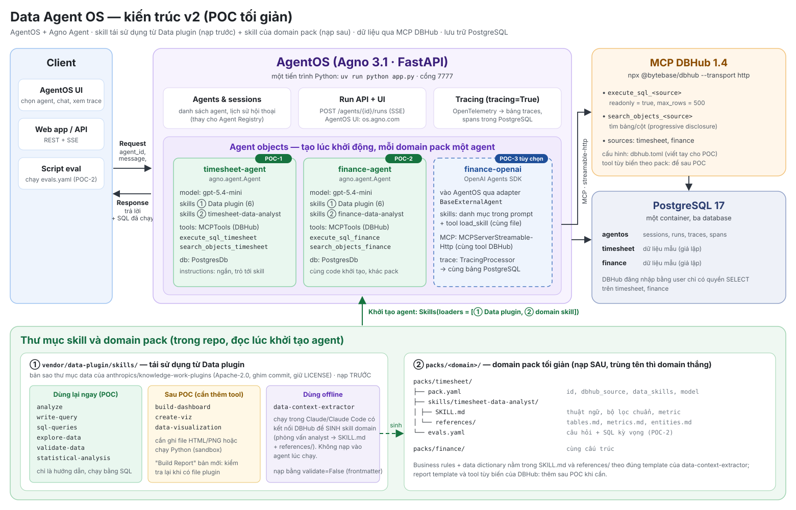

# CMB-09 · Data Agent OS — data agent nhiều domain pack trên AgentOS

**Tổ hợp:** CMB-09 · Hỏi số liệu bằng tiếng Việt (text-to-SQL agent) — Nhóm 6 + 7 · **Trạng thái:** thiết kế v2, chờ review
(chưa có code) · **Người thực hiện:** <tên>

Dự án nghiên cứu: data agent hỏi số liệu bằng tiếng Việt, gần giống data agent nội bộ của OpenAI, làm trước bằng một **POC đơn
giản nhất có thể**:

- **AgentOS** (Agno) chạy một agent cho mỗi **domain pack** (timesheet, finance, …).
- Khi khởi tạo agent object, nạp **① skill dùng lại từ Data plugin** của Anthropic (analyze, write-query, sql-queries,
  explore-data, validate-data, statistical-analysis) **rồi ② skill của domain** (sinh bằng `data-context-extractor`).
- Dữ liệu truy vấn qua **MCP DBHub** (chỉ đọc); session và **trace lưu bền vững trong PostgreSQL**.
- **OpenAI Agents SDK** là bước tùy chọn (POC-3) để so sánh runtime trên cùng pack.

## Tài liệu

| # | Tài liệu | Nội dung |
|---|---|---|
| 1 | [Kiến trúc v2](docs/01-kien-truc.md) | thành phần, **sequence diagram khởi tạo agent** và **một lần chạy**, biến thể OpenAI SDK, triển khai, so với v0/v1 |
| 2 | [Tái sử dụng skill của Data plugin](docs/02-tai-su-dung-skill-data-plugin.md) | đánh giá 10 skill, điểm không tương thích đã kiểm chứng, domain pack = skill sinh từ `data-context-extractor` |
| 3 | [Chi tiết POC](docs/03-chi-tiet-poc.md) | cấu trúc thư mục, `pack.yaml`, `app.py`, DBHub, PostgreSQL, eval, cấu hình |
| 4 | [ADR-001 · OpenAI Agents SDK](docs/04-adr-openai-agents-sdk.md) | có cần không trong POC; nạp skill trong luồng OpenAI thế nào |
| 5 | [Checklist POC](CHECKLIST.md) | P0 → POC-1 → POC-2 → POC-3, tiêu chí hoàn thành |

Diagram gốc (v0) của chủ dự án: [docs/assets/diagram-goc-v0.jpg](docs/assets/diagram-goc-v0.jpg).

## 1 · ĐÚNG — framing

| Câu hỏi | Trả lời |
|---|---|
| Quyết định nào sẽ thay đổi? | Quản lý tự lấy số liệu giờ công/tài chính trong vài phút thay vì chờ analyst viết SQL |
| Ai dùng, thế nào? | PMO, trưởng phòng, kế toán; chat qua AgentOS UI hoặc API |
| Metric của POC | Tỷ lệ câu trả lời có con số đúng trên `evals.yaml` (so **kết quả** truy vấn); token và thời gian mỗi câu; có/không có skill Data plugin |
| Loại sai nào đắt hơn? | Con số sai mà trông hợp lý ≫ từ chối hoặc hỏi lại → bộ lọc chuẩn trong skill domain, kiểm tra theo `validate-data`, luôn kèm SQL |
| Có cần AI không? | Câu hỏi lặp lại dùng dashboard/báo cáo cố định; agent cho câu hỏi ad-hoc |
| Ràng buộc POC | Dữ liệu giả lập; chỉ đọc; chưa có phân quyền theo người dùng — chỉ chạy trong máy dev/mạng nội bộ |

## Kỹ năng sẽ luyện

`DATA-01` SQL phân tích · `LLM-08` text-to-SQL · `LLM-04` đánh giá · `LLM-05` tool calling / agent · `OPS-06` tracing, chi phí ·
`EFF-03` tinh gọn ngữ cảnh — xem [danh mục kỹ năng](../../docs/02-skill-map/generated/README.md).
