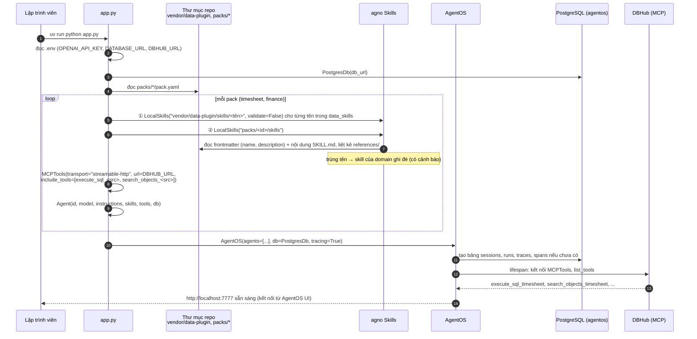
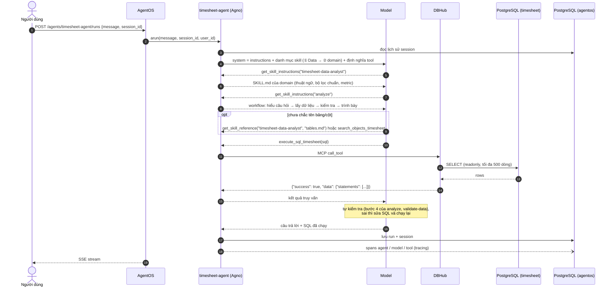
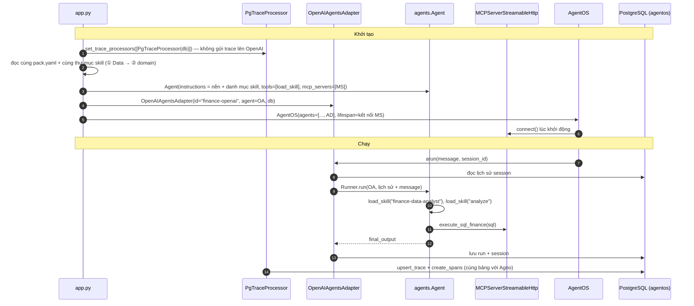
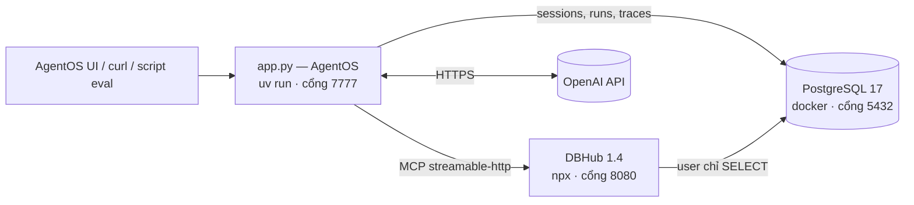

# 01 · Kiến trúc v2 — POC tối giản

Bản v2 thay cho v1 theo góp ý của chủ dự án: **đơn giản hóa để làm POC**, chưa làm review/learning và auth, platform DB
là **PostgreSQL**, và **domain pack không phải "core = data agent"**: kỹ năng chung lấy lại từ các skill có sẵn của
**Data plugin** (Anthropic) và được nạp **trước** skill của domain khi khởi tạo agent object.

## 1. Nguyên tắc cho POC

1. **Ít thành phần nhất có thể:** một tiến trình Python (AgentOS), một tiến trình DBHub, một container PostgreSQL.
2. **Không viết lại thứ đã có:** kỹ năng phân tích dữ liệu chung dùng lại từ Data plugin; AgentOS lo session, UI,
   tracing; DBHub lo kết nối và chế độ chỉ đọc.
3. **Domain pack = dữ liệu, không phải code:** thêm một domain là thêm một thư mục (`pack.yaml` + một skill); code khởi
   tạo agent dùng chung cho mọi pack.
4. **Mỗi bước POC chạy được và đo được** trước khi thêm bước sau (xem [Checklist POC](../CHECKLIST.md)).

## 2. Thành phần

| Thành phần | Vai trò trong POC | Công nghệ |
|---|---|---|
| Client | Chọn agent, chat, xem trace; script chạy eval | AgentOS UI, REST/SSE, script Python |
| AgentOS | Chứa danh sách agent, API chạy agent, session, tracing | `agno[os]` 3.1 (FastAPI) |
| Agent object | Một agent cho mỗi domain pack: model + instructions ngắn + **skills** + **tools DBHub** + db | `agno.agent.Agent`; tùy chọn `agents.Agent` (OpenAI Agents SDK) qua adapter |
| Skill dùng chung | Workflow phân tích, viết SQL, khám phá và kiểm tra dữ liệu | `vendor/data-plugin/` — bản sao thư mục `data` của Data plugin (Apache-2.0) |
| Domain pack | Thuật ngữ, bộ lọc chuẩn, metric, mô tả bảng của một miền; nguồn dữ liệu DBHub; câu hỏi eval | `packs/<domain>/` |
| DBHub | Cổng MCP tới dữ liệu: `execute_sql_<source>` (readonly), `search_objects_<source>` | `@bytebase/dbhub` 1.4 |
| PostgreSQL | DB `agentos` (sessions, runs, traces, spans) + DB dữ liệu mẫu `timesheet`, `finance` | PostgreSQL 17 (docker) |

## 3. Khởi tạo agent object (init process)

Khi `app.py` khởi động, mỗi domain pack tạo ra **một agent object**. Kỹ năng được nạp theo thứ tự cố định:
**① skill chung từ Data plugin → ② skill của domain**. Agno giữ thứ tự này trong danh mục skill đưa vào prompt; nếu hai skill
trùng tên, loader sau (domain) ghi đè loader trước.

Ghi chú:

- `validate=False` là bắt buộc với skill của Data plugin: frontmatter của chúng có `argument-hint` / `user-invocable`
  (trường riêng của Claude) mà validator của Agno không chấp nhận — chi tiết ở
  [02 · Tái sử dụng skill của Data plugin](02-tai-su-dung-skill-data-plugin.md).
- Mỗi pack chọn skill chung nào cần qua `data_skills` trong `pack.yaml` (mặc định 6 skill chỉ-hướng-dẫn).
- Agent **không** nạp `data-context-extractor`; skill đó chỉ dùng offline để sinh skill của domain.

## 4. Một lần chạy (run process)

- Prompt ban đầu chỉ có **tên + mô tả** của skill; nội dung đầy đủ chỉ được tải khi model gọi `get_skill_instructions` —
  nhờ vậy nạp 6 skill chung không làm phình prompt.
- An toàn dữ liệu trong POC dựa vào DBHub `readonly = true` + `max_rows` + user PostgreSQL chỉ có quyền SELECT.

## 5. Biến thể OpenAI Agents SDK (POC-3, tùy chọn)

Dùng **cùng** `pack.yaml` và **cùng** thư mục skill. Khác biệt: OpenAI Agents SDK không có skill native ngoài sandbox, nên
danh mục skill được chèn vào instructions và nội dung skill đọc qua function tool `load_skill`; agent được đưa vào AgentOS
qua adapter `BaseExternalAgent`; trace ghi về cùng PostgreSQL. Lý do và phạm vi: [ADR-001](04-adr-openai-agents-sdk.md).

## 6. Triển khai POC

`docker compose up -d` (PostgreSQL), `npx @bytebase/dbhub@1.4.0 --transport http --port 8080 --config dbhub.toml`, rồi
`uv run python app.py`. App và DBHub chạy trực tiếp (không container) để sửa và chạy lại nhanh; DBHub cần Node ≥ 22.5.

## 7. So với diagram v0 và thiết kế v1

| Hạng mục | v0 (diagram gốc) | v1 (đã bỏ) | v2 (POC) |
|---|---|---|---|
| Kỹ năng chung | không nêu | pack `core` tự viết | **dùng lại skill của Data plugin**, nạp trước |
| Domain pack | 6 loại asset | 10 loại file YAML/Markdown | `pack.yaml` + một skill sinh theo template `data-context-extractor` + `evals.yaml` |
| Agent Registry | có | `agents.yaml` + version | danh sách agent của AgentOS, sinh từ `packs/*` |
| Orchestrator | có | router cascade + workflow báo cáo | người dùng chọn agent trên UI; để sau POC |
| Auth & RBAC | có | JWT + RBAC dữ liệu | **bỏ** trong POC |
| Data Gateway | không | kiểm SQL, PII, evidence | **bỏ**; dựa vào DBHub readonly + user chỉ SELECT |
| Review & learning | không | có | **bỏ** trong POC |
| Observability | có | trace 2 runtime + evidence + eval gate | `tracing=True` → PostgreSQL; eval bằng script đơn giản |
| Platform DB | không nêu | Postgres/SQLite | **PostgreSQL** |
| OpenAI Agents SDK | ngang hàng Agno | runtime phụ + triage/handoff | runtime phụ, **một agent**, POC-3 tùy chọn |
| Report templates, dashboard | có | Jinja + workflow | để sau POC (cần tool ghi file) |
