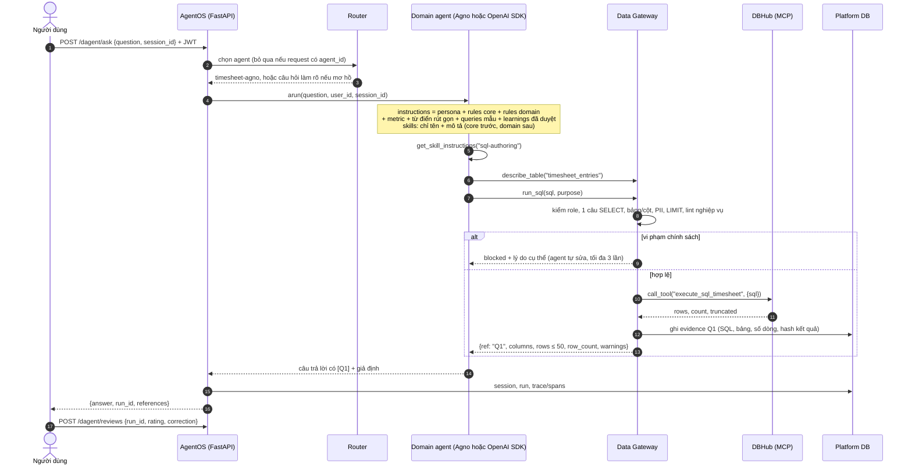
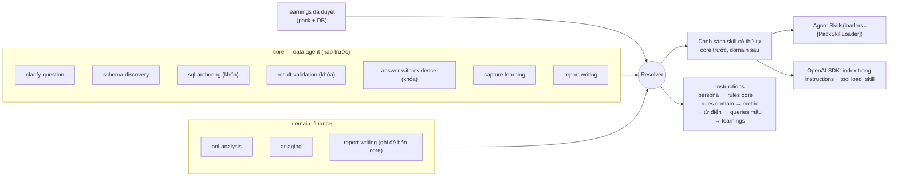
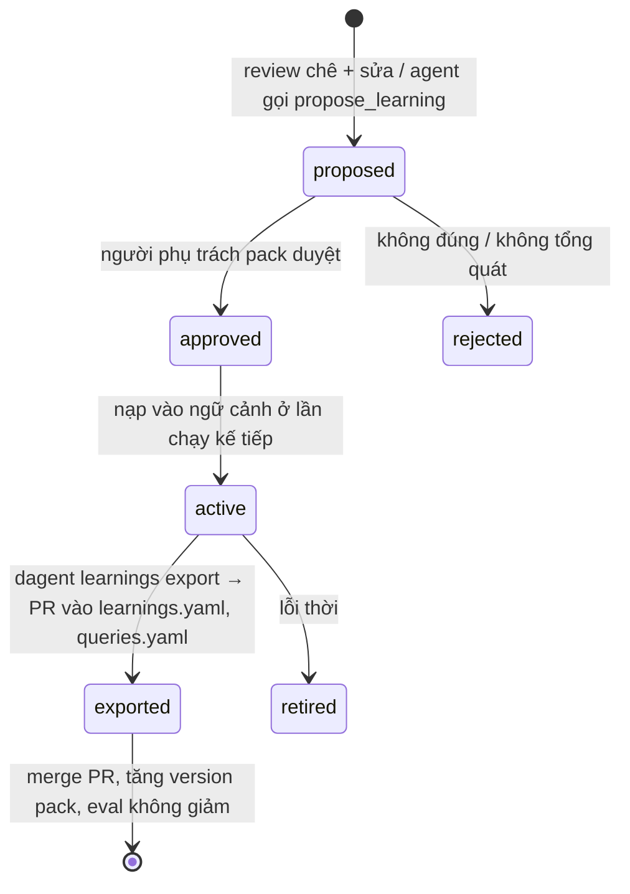
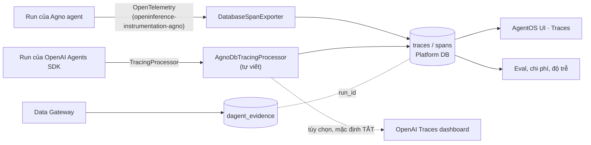
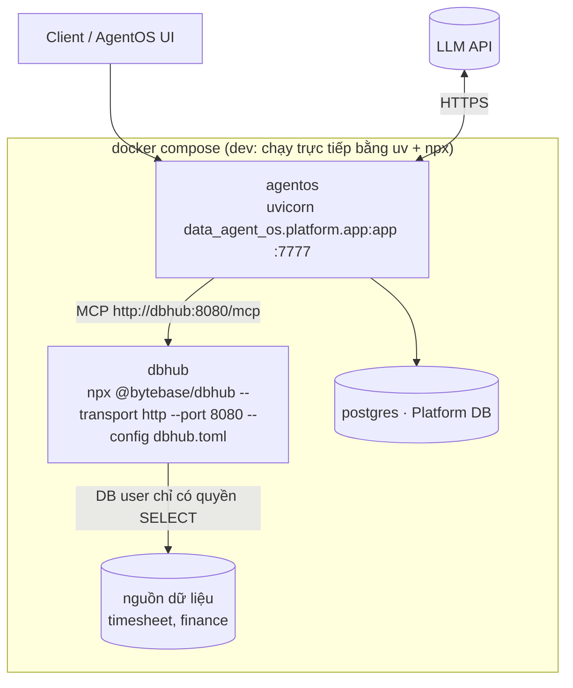

# 01 · Kiến trúc Data Agent OS (v1)

Tài liệu này mô tả **kiến trúc mục tiêu**: thành phần, trách nhiệm, các luồng xử lý chính. Chi tiết cài đặt (API, định
dạng file, bảng dữ liệu) nằm ở [03 · Chi tiết kỹ thuật](03-chi-tiet-ky-thuat.md); lý do thay đổi so với diagram ban
đầu nằm ở [02 · Review diagram v0](02-review-diagram-v0.md).

## 1. Nguyên tắc thiết kế

1. **Domain pack là nguồn sự thật, không phụ thuộc runtime.** Quy tắc nghiệp vụ, từ điển dữ liệu, kỹ năng, mẫu báo cáo,
   bộ đánh giá nằm trong thư mục pack (YAML/Markdown, review qua PR). Agno và OpenAI Agents SDK chỉ là hai cách *chạy*
   cùng một pack.
2. **Kỹ năng của data agent là mặc định, nạp trước.** Pack `core` chứa bộ kỹ năng chung của data agent (làm rõ câu hỏi,
   khám phá schema, viết SQL an toàn, tự kiểm tra, trả lời kèm nguồn, ghi nhận bài học). Mọi domain pack kế thừa `core`;
   kỹ năng lõi quan trọng bị **khóa**, domain không ghi đè được.
3. **Một điểm thực thi chính sách cho mọi truy cập dữ liệu.** Agent không gọi thẳng DBHub; mọi truy vấn đi qua Data
   Gateway để kiểm quyền theo người dùng, chặn cột nhạy cảm, giới hạn số dòng và ghi bằng chứng.
4. **Không con số nào thiếu bằng chứng, không lần chạy nào thiếu trace.** Mỗi truy vấn có mã tham chiếu (`[Q1]`), mỗi
   run của cả hai runtime có trace lưu bền vững trong cùng một DB.
5. **Workflow đơn giản nhất chạy được** (nguyên tắc của [Nhóm 7](../../../docs/02-skill-map/generated/nhom/g7-agent-tu-dong-hoa.md)):
   câu hỏi lặp lại → workflow báo cáo cố định (SQL + template); agent tự chủ chỉ dành cho câu hỏi ad-hoc.
6. **Ít tool, tool tốt.** Mỗi agent thấy khoảng 6 tool cộng tool nghiệp vụ của pack mình; nhiều tool chồng chéo làm agent
   chọn sai (bài học được nêu trong bài viết về data agent của OpenAI).
7. **Học có kiểm soát.** Góp ý của người dùng tạo ra *đề xuất* bài học; chỉ bài học đã được người phụ trách pack duyệt mới
   được nạp vào ngữ cảnh và sau đó ghi ngược vào pack qua PR.

## 2. Thành phần

| Thành phần | Trách nhiệm | Công nghệ | So với v0 |
|---|---|---|---|
| **Client / App** | Web chat, AgentOS UI, Slack/ERP, API/MCP client; người review đánh giá câu trả lời | AgentOS UI (control plane), REST, MCP | + vai trò người review |
| **Agent Registry** | `agent_id` → `pack@version`, runtime, model, trạng thái (`draft/active/retired`) | `config/agents.yaml` + danh sách agent của AgentOS | giữ, thêm pin version pack |
| **Orchestrator** | Định tuyến câu hỏi tới domain agent; chạy workflow báo cáo theo lịch | Router tự viết (từ khóa → LLM) + Agno `Team(mode="route")`, Agno Workflow + scheduler | làm rõ chiến lược định tuyến |
| **Auth & RBAC** | Ai được gọi agent nào (tầng platform); role → pack/bảng/cột (tầng dữ liệu) | AgentOS `authorization` (JWT); `config/rbac.yaml` thực thi tại Data Gateway | tách 2 tầng quyền |
| **Observability** | Trace hợp nhất hai runtime, evidence, metric chi phí/độ trễ, kết quả eval | Agno tracing (OpenTelemetry) + `TracingProcessor` tự viết cho OpenAI Agents SDK | thêm lưu bền vững, hợp nhất |
| **Review & Learning** | Nhận đánh giá/sửa lỗi → đề xuất bài học → duyệt → nạp vào ngữ cảnh → xuất về pack | API `/dagent/reviews`, `/dagent/learnings`, bảng `dagent_learnings` | **mới** |
| **Pack Resolver + Context Builder** | Ghép `core` → domain → learnings; sinh instructions, danh sách skill có thứ tự | Python (pydantic), dùng chung hai runtime | **mới** |
| **Agno runtime** (chính) | Agent theo domain, Skills native, memory, team định tuyến, workflow | `agno` 3.1 (`Agent`, `Skills`, `Team`, `Workflow`) | giữ |
| **OpenAI Agents SDK runtime** (phụ) | Agent theo domain, handoff từ agent điều phối, guardrails | `openai-agents` 0.23, đăng ký vào AgentOS qua `OpenAIAgentsAdapter` | làm rõ cách tích hợp và khi nào dùng |
| **Data tools** | `search_schema`, `describe_table`, `run_sql`, tool nghiệp vụ của pack, `load_skill`, `propose_learning` | Định nghĩa một lần, bọc thành Agno `Function` và OpenAI `FunctionTool` | **mới** |
| **Data Gateway** | Kiểm SQL (1 câu SELECT, bảng/cột được phép, PII, LIMIT, lint nghiệp vụ), gọi DBHub, ghi evidence | `sqlglot`, client `mcp` 2.x | **mới** |
| **MCP DBHub** | Cổng MCP tới CSDL: `execute_sql_<source>` (readonly), `search_objects_<source>`, tool tùy biến | `@bytebase/dbhub` 1.4 (Node ≥ 22.5) | giữ, cấu hình sinh từ pack |
| **Platform DB** | sessions, runs, traces/spans, evals, evidence, reviews, learnings | Postgres (prod), SQLite (dev) | **mới** |
| **Domain Pack** | `core` + các domain (`timesheet`, `finance`, …) | Thư mục YAML/Markdown/Jinja có version | thêm `core`, `queries`, `reports`, `learnings` |

## 3. Luồng một câu hỏi

Điểm chính:

- **Agent không thấy DBHub.** Tool `run_sql` thuộc Data Gateway; gateway mới là MCP client của DBHub. Nhờ vậy cùng một
  chính sách áp cho cả Agno lẫn OpenAI SDK, và evidence được ghi ở một chỗ.
- **Tự kiểm tra trong vòng lặp.** Kết quả rỗng, bị cắt bớt hoặc có `warnings` (ví dụ quên lọc `status = 'approved'`)
  được trả lại cho agent; kỹ năng `result-validation` hướng dẫn agent sửa và chạy lại.
- **Câu trả lời mang `run_id` và `references`** để người dùng kiểm chứng và gửi review.

## 4. Thứ tự nạp kỹ năng và ngữ cảnh

- Thứ tự **core → domain → learnings** cố định cho mọi runtime. Domain pack không cần khai báo `extends: [core]`; resolver
  luôn chèn `core` ở đầu chuỗi.
- Skill trùng tên: bản domain thay bản core, **trừ** skill core có `metadata.locked: "true"` → lỗi khi validate pack (chặn
  ngay ở CI, không đợi tới lúc chạy).
- Prompt chỉ chứa **tên + mô tả** của skill (progressive disclosure); nội dung đầy đủ được tải khi agent gọi
  `get_skill_instructions` (Agno) hoặc `load_skill` (OpenAI SDK). Giữ prompt nhỏ khi số pack tăng.

## 5. Sáu lớp ngữ cảnh của data agent → vị trí trong hệ thống

Bài viết của OpenAI về data agent nội bộ mô tả agent dựa trên nhiều lớp ngữ cảnh chồng lên nhau. Bảng dưới ánh xạ từng lớp
vào thiết kế này (tóm tắt theo bài viết công khai; môi trường làm tài liệu không truy cập được openai.com nên cần đối chiếu
lại nguyên bản trước khi trích dẫn).

| Lớp ngữ cảnh | Ý nghĩa | Ở đâu trong thiết kế | Giai đoạn |
|---|---|---|---|
| 1. Cách dùng bảng (metadata, truy vấn lịch sử) | schema, kiểu cột, bảng hay JOIN với nhau | `search_objects` của DBHub + `dictionary.yaml` (mục `joins`) | v1 |
| 2. Chú thích của con người | ý nghĩa nghiệp vụ, caveat của bảng/cột | `dictionary.yaml`, `rules.yaml` (metric chuẩn) | v1 |
| 3. Hiểu từ code/pipeline | bảng được tạo ra thế nào | `queries.yaml` (SQL đã kiểm chứng); đọc code dbt/ETL là việc sau | v1 (một phần) |
| 4. Tri thức tổ chức | tài liệu, định nghĩa chính thức, sự cố | Files/Docs qua MCP hoặc Agno Knowledge | sau v1 |
| 5. Bộ nhớ (memory) | sửa lỗi và sắc thái học được từ người dùng | `dagent_learnings` + `learnings.yaml` qua vòng review | v1 |
| 6. Ngữ cảnh lúc chạy | truy vấn trực tiếp để xem dữ liệu hiện tại | `describe_table`, `run_sql` qua gateway | v1 |

## 6. Vòng review → cập nhật

- Review đi kèm `run_id` → hệ thống tìm được trace và evidence của đúng lần chạy đó.
- `corrected_sql` trong review được chạy lại qua gateway (cùng chính sách) trước khi trở thành đề xuất truy vấn mẫu.
- Learning `active` có hiệu lực ngay (instructions dạng hàm, đọc lại mỗi run); bản xuất về pack là để có lịch sử, review
  code và đánh giá lại bằng eval trước khi tăng version.

## 7. Tracing hợp nhất, lưu bền vững

- Hai runtime ghi vào **cùng bảng `traces`/`spans`** của AgentOS, cùng khóa `agent_id`, `session_id`, `user_id`,
  `run_id` → xem chung trên AgentOS UI, so sánh được hai runtime.
- OpenAI Agents SDK mặc định gửi trace lên nền tảng OpenAI; thiết kế này **thay** bộ xử lý mặc định bằng processor ghi
  vào DB nội bộ (`set_trace_processors`), chỉ bật gửi ra ngoài khi chính sách dữ liệu cho phép.

## 8. Triển khai

- DBHub chỉ mở trong mạng nội bộ của compose; AgentOS là cửa duy nhất ra ngoài.
- Phòng thủ nhiều lớp cho thao tác ghi: DB user chỉ SELECT → DBHub `readonly = true` → gateway chỉ cho 1 câu SELECT.

## 9. Các quyết định kiến trúc chính

| # | Quyết định | Lý do ngắn | Chi tiết |
|---|---|---|---|
| 1 | Agno là runtime chính, OpenAI Agents SDK là runtime phụ qua adapter | AgentOS là sản phẩm của Agno; OpenAI SDK chỉ dùng khi có lý do cụ thể | [ADR-001](04-adr-openai-agents-sdk.md) |
| 2 | Agent gọi tool của gateway, không gọi DBHub trực tiếp | DBHub không biết người dùng; cần một chỗ kiểm quyền và ghi evidence | [Chi tiết kỹ thuật](03-chi-tiet-ky-thuat.md) |
| 3 | `core` luôn nạp trước, có skill khóa | Bảo đảm kỹ năng data agent là mặc định, domain không làm yếu an toàn | mục 4 ở trên |
| 4 | `dbhub.toml` sinh từ `tools.yaml` của pack | Contract và tool thật không lệch nhau; CI kiểm tra như catalog của repo | [Chi tiết kỹ thuật](03-chi-tiet-ky-thuat.md) |
| 5 | Eval so khớp **kết quả** truy vấn, không so chuỗi SQL | Nhiều SQL khác nhau cùng đúng (bẫy đã nêu trong CMB-09) | [Chi tiết kỹ thuật](03-chi-tiet-ky-thuat.md) |
| 6 | Câu hỏi chéo nhiều pack để sau v1 | DBHub không JOIN chéo nguồn; ghép số liệu bằng LLM dễ sai | [Checklist](../CHECKLIST.md) |
