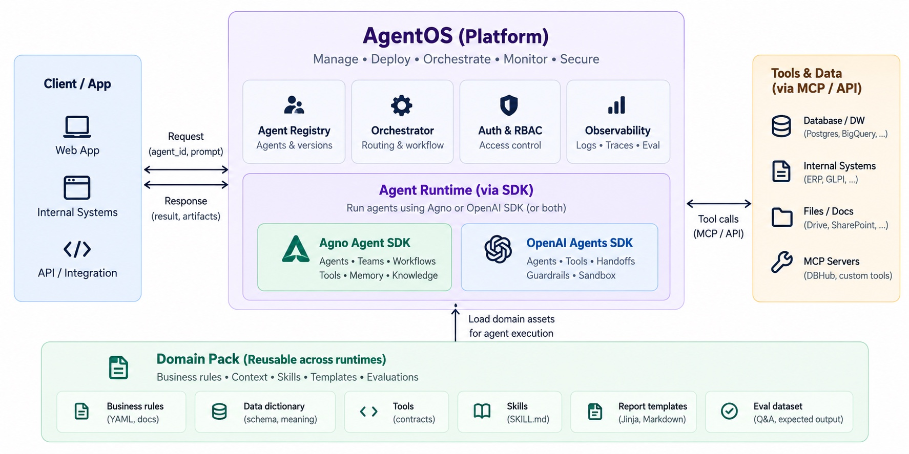
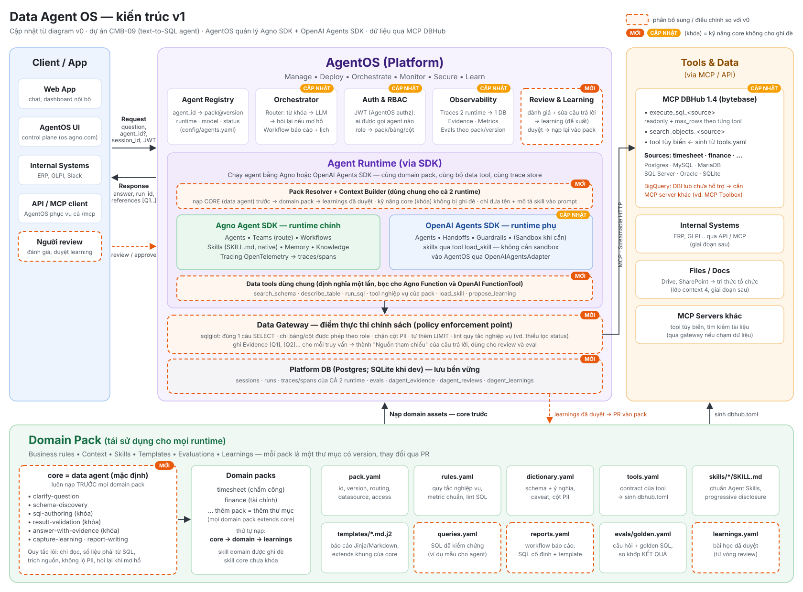

# 02 · Review diagram v0 và các thay đổi trong v1

Diagram ban đầu (v0) do chủ dự án cung cấp:

Diagram sau khi cập nhật (v1) — khung cam nét đứt là phần bổ sung/điều chỉnh:

## Điểm mạnh của v0 (giữ nguyên)

- **Tách lớp rõ ràng:** Client → Platform (AgentOS) → Runtime (SDK) → Tools & Data, và Domain Pack nằm riêng.
- **Domain Pack độc lập với runtime:** đúng hướng để một bộ tri thức nghiệp vụ chạy được trên cả Agno lẫn OpenAI SDK, và
  để so sánh hai runtime trên cùng bộ đánh giá.
- **Bốn năng lực platform** (Registry, Orchestrator, Auth & RBAC, Observability) là đủ khung cho vận hành.
- **Dữ liệu qua MCP** (DBHub) thay vì mỗi agent tự giữ kết nối CSDL.
- Pack đã có **eval dataset** và **report templates** ngay từ đầu.

## Các điểm cần bổ sung hoặc điều chỉnh

| # | Vấn đề trong v0 | Rủi ro nếu giữ nguyên | Thay đổi trong v1 |
|---|---|---|---|
| 1 | Không có pack lõi của data agent, không nói thứ tự nạp kỹ năng | Mỗi domain tự viết lại kỹ năng chung (viết SQL, tự kiểm tra, trích nguồn) → chất lượng không đồng đều; không bảo đảm yêu cầu "kỹ năng data agent làm mặc định" | Thêm pack `core`, luôn nạp **trước**; skill an toàn bị khóa; thứ tự cố định `core → domain → learnings` |
| 2 | Auth & RBAC chỉ ở tầng platform | DBHub kết nối bằng một tài khoản dịch vụ, không biết ai đang hỏi → mọi người dùng có chung quyền dữ liệu | Tách 2 tầng: JWT của AgentOS (ai gọi agent nào) + **Data Gateway** thực thi role → pack/bảng/cột cho từng truy vấn |
| 3 | Không có vòng học (memory) | Agent lặp lại cùng một lỗi; mất đi lớp ngữ cảnh quan trọng nhất của data agent OpenAI | Thêm **Review & Learning**: review → learning đề xuất → duyệt → nạp vào ngữ cảnh → xuất về pack qua PR |
| 4 | Không có kho lưu bền vững; Observability chưa nói trace của OpenAI SDK đi đâu | OpenAI SDK mặc định gửi trace lên nền tảng OpenAI (dữ liệu nội bộ ra ngoài); trace hai runtime nằm hai nơi | **Platform DB** chung; processor tự viết ghi trace OpenAI SDK vào cùng bảng `traces`/`spans` của AgentOS; mặc định không gửi ra ngoài |
| 5 | Response chỉ có "result, artifacts" | Người dùng không kiểm chứng được con số; không biết review cho lần chạy nào | Response có `run_id` và `references` (`[Q1]` → SQL, bảng, số dòng) |
| 6 | Request là `(agent_id, prompt)` | Người dùng phải biết agent nào; không có danh tính để phân quyền dữ liệu; không có hội thoại nhiều lượt | `agent_id` tùy chọn (router chọn), thêm danh tính (JWT) và `session_id` |
| 7 | Guardrails và Sandbox chỉ nằm trong ô OpenAI SDK | Agno agent không có cùng mức bảo vệ; dễ hiểu nhầm là phải dùng sandbox để chạy skill | Guardrail dữ liệu là việc của **gateway** (cho mọi runtime); sandbox chỉ cần khi skill có `scripts/` phải chạy — xem [ADR-001](04-adr-openai-agents-sdk.md) |
| 8 | "Tools (contracts)" trong pack và "MCP Servers" tách rời | Contract trong pack và tool thật trên DBHub lệch nhau theo thời gian | `dbhub.toml` **sinh từ** `tools.yaml`; CI báo lỗi nếu file sinh ra đã cũ (cùng cách repo làm với `catalog/`) |
| 9 | Mũi tên "Load domain assets" chỉ đi vào runtime | Bỏ sót các nơi khác cũng cần pack | Pack còn cấp cho Registry (pin version), Gateway (bảng được phép, cột PII, lint), DBHub (tool), Eval (golden set) |
| 10 | BigQuery được liệt kê dưới DBHub | DBHub 1.4 hỗ trợ Postgres, MySQL, MariaDB, SQL Server, Oracle, SQLite — **không có BigQuery** | Ghi chú rõ; BigQuery cần MCP server khác (ví dụ MCP Toolbox for Databases) nhưng vẫn phải đi qua gateway |
| 11 | Orchestrator chỉ ghi "Routing & workflow" | Không rõ chọn agent thế nào, làm gì khi câu hỏi mơ hồ | Cascade: `agent_id` chỉ định → khớp từ khóa của pack → LLM route (Agno `Team(mode="route")`) → hỏi lại; chỉ xét pack mà role được phép |
| 12 | Eval dataset chưa nối vào quy trình phát hành | Đổi prompt/skill/pack có thể làm giảm độ chính xác mà không ai biết | Eval là **cổng** khi tăng version pack hoặc đổi model trong Registry; so sánh được Agno vs OpenAI SDK |
| 13 | Thiếu truy vấn mẫu đã kiểm chứng và báo cáo định kỳ | Agent phải tự nghĩ lại SQL cho câu hỏi đã có lời giải; báo cáo lặp lại tốn token | Thêm `queries.yaml` (SQL đã kiểm chứng) và `reports.yaml` (workflow báo cáo: SQL cố định + template, không cần agent) |

## Những gì không đổi

- Hai SDK trong cùng một Agent Runtime, cùng nhận asset từ Domain Pack.
- Sáu thành phần pack ban đầu: business rules, data dictionary, tools, skills (SKILL.md), report templates
  (Jinja, Markdown), eval dataset.
- Tools & Data qua MCP / API, DBHub là cổng dữ liệu chính.

## Việc cần chủ dự án xác nhận

Các câu hỏi ảnh hưởng tới thiết kế được gom ở mục **P0 · Quyết định** trong [Checklist triển khai](../CHECKLIST.md).
