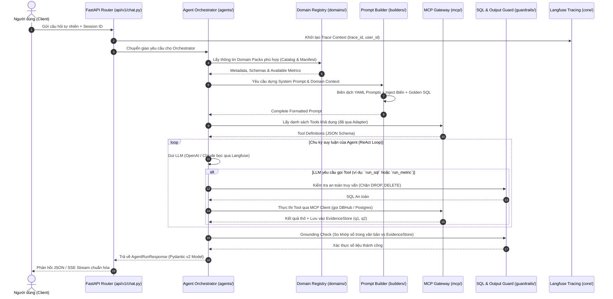

# Nghiên Cứu Chuyên Sâu: Best Practices Tổ Chức Cấu Trúc Thư Mục Dự Án Python AI
> **Tiêu chuẩn Kiến trúc Sản xuất cho Hệ thống AI kết hợp Agents, Model Context Protocol (MCP) và Dynamic Domain Knowledge**

| Thuộc tính | Chi tiết |
| :--- | :--- |
| **Phiên bản** | 1.0 (Production Architecture Standard) |
| **Ngày lập** | 2026-10-08 |
| **Trạng thái** | Approved / Best Practices Reference |
| **Phạm vi** | Dự án Python AI hiện đại: Agentic Workflows, MCP Integration, Domain Packs, Semantic Layer, Enterprise API |
| **Tech Stack Chuẩn** | Python 3.12+, FastAPI v0.135.1+, Pydantic v2, SQLModel, Poetry, Langfuse, DBHub/MCP |

---

## 1. Tổng quan & Vấn đề cốt lõi của Kiến trúc Python AI

Trong phát triển phần mềm truyền thống, các kiến trúc phân tầng 3 lớp kinh điển (*Layered Architecture*: Controller → Service → Repository) hoặc gói theo tính năng (*Feature-first Vertical Slice*) phục vụ rất tốt cho các bài toán CRUD tuần tự. 

Tuy nhiên, khi bước vào kỷ nguyên **AI-Native Software**, hệ thống phải đối mặt với 3 thách thức kiến trúc hoàn toàn mới:
1. **Tính bất định & chu kỳ suy luận của Agent (Non-deterministic & Iterative Loops):** Agent không xử lý logic một chiều mà liên tục tương tác với LLM, gọi Tool, quan sát kết quả (ReAct), thử lại (Reflection), và chuyển giao ngữ cảnh (Hand-offs).
2. **Giao thức công cụ mở rộng (Model Context Protocol - MCP):** Các công cụ (Tools) không còn là các hàm Python nội bộ viết cứng, mà ngày càng được cung cấp động từ các MCP Server độc lập (ví dụ DBHub, Filesystem, GitHub, Browser, Vector DB) thông qua giao thức chuẩn hóa của Anthropic.
3. **Tri thức nghiệp vụ biến động (Domain Knowledge & Taxonomies):** Schema dữ liệu, từ điển cột (data dictionary), quy tắc nghiệp vụ (business rules), metric chuẩn hóa và prompt không được nhồi nhét cứng vào mã nguồn mà cần được đóng gói thành các **Domain Packs** cắm rút linh hoạt (pluggable).

> **Mục tiêu kiến trúc:** Xây dựng một cấu trúc thư mục giúp mã nguồn:
> - **Dễ đọc (High Readability):** Người mới vào dự án có thể phân biệt ngay lập tức đâu là code hạ tầng, đâu là logic agent, đâu là tri thức nghiệp vụ.
> - **Bảo trì nhanh (Fast Maintenance):** Cô lập triệt để giữa prompt, logic agent, công cụ MCP và mô hình dữ liệu. Sửa prompt không cần deploy lại code; sửa tool không làm gãy logic agent.
> - **Khả năng mở rộng cao (Extreme Extensibility / OCP):** Thêm 1 domain mới hay 1 MCP server mới chỉ bằng cách thêm file cấu hình/thư mục độc lập, không phải sửa code lõi của orchestrator hay API router.

---

## 2. Khảo sát Thực tế từ các Dự án AI Hàng đầu Thế giới (Global Benchmark)

Khảo sát được thực hiện trên các kho mã nguồn tiêu chuẩn toàn cầu (2025–2026):

| Repository | Điểm nhấn kiến trúc đáng học hỏi | Hạn chế nếu áp dụng máy móc |
| :--- | :--- | :--- |
| **`pydantic/pydantic-ai`** | - Quản lý kiểu dữ liệu nghiêm ngặt qua `Pydantic v2` và Generic `Agent[Deps, Output]`.<br>- Tách biệt tri thức hướng dẫn coding agent thông qua các file `AGENTS.md` lồng nhau.<br>- Kiểm thử mạnh mẽ với `TestModel`, `FunctionModel` và cassette VCR. | Được thiết kế như một thư viện (library) thay vì một ứng dụng nghiệp vụ hoàn chỉnh (application). |
| **`openai/openai-agents-python`** | - Đơn giản hóa kiến trúc agent loop.<br>- Mô hình hóa Tool và Hand-off cực kỳ gọn gàng.<br>- Triết lý *"Less is more in tools"*. | Chưa có lớp quản lý MCP chuẩn hóa và thiếu tầng quản trị Domain Knowledge chuyên sâu. |
| **`modelcontextprotocol/python-sdk`** *(Anthropic MCP)* | - Kiến trúc Client - Server tách biệt rõ qua giao thức Stdio / SSE / Streamable HTTP.<br>- Quản lý dynamic tools theo chuẩn JSON-RPC 2.0. | Chỉ tập trung vào giao thức vận chuyển, không cung cấp giải pháp cho Agent state hay Business API. |
| **`GoogleCloudPlatform/agent-starter-pack`** | - Tổ chức chuẩn Enterprise: chia rõ `app/agent.py`, `tests/{unit, integration}`, `eval/evalsets`.<br>- Tách riêng bộ dữ liệu đánh giá mô hình (`eval/`) khỏi bộ test CI thông thường. | Cấu trúc còn nặng tính phân tầng phẳng, khi mở rộng lên 20+ domain sẽ bị dồn ứ file. |
| **`vanna-ai/vanna` (v2.0)** | - Kiến trúc Module theo năng lực: `core/{agent, llm, tool, registry, storage, evaluation}`.<br>- Registry pattern cho phép cắm rút LLM, VectorDB và Database linh hoạt. | Một số abstraction bị trùng lặp quá mức nếu đã dùng các framework hiện đại. |
| **`fastapi-best-practices`** | - Gói module theo Domain (`{domain}/{router, schemas, models, service, dependencies}`).<br>- Phù hợp nhất cho hệ thống backend quy mô lớn. | Thiếu các khái niệm cốt lõi của AI: Prompt isolation, Evidences, Grounding, Evaluation. |

### Kết luận Lựa chọn Mô hình:
Sự kết hợp tối ưu nhất cho bài toán của chúng ta là **Hexagonal Architecture (Ports & Adapters) kết hợp Pluggable Modular Domain Packs**:
- **Core Kernel**: Giữ vai trò Engine điều phối trung tâm (FastAPI, State, Langfuse, Security).
- **MCP Gateway (Adapter)**: Đóng vai trò cầu nối chuẩn hóa giữa Agent và hệ sinh thái MCP bên ngoài.
- **Domain Packs (Vertical Slices)**: Đóng gói toàn bộ tri thức nghiệp vụ (Schema + Prompt + Rules + Metrics + Golden SQL) thành từng module độc lập tự đăng ký qua `Registry`.

---

## 3. Bản đồ Cây Thư mục Chuẩn Sản xuất (Production-Grade Folder Structure)

Dự án sử dụng chuẩn **`src/` layout** để đảm bảo khả năng đóng gói, tránh circular imports và ngăn việc import nhầm thư mục gốc khi chạy tests.

```text
my-ai-project/
├── .env.example                       # Biến môi trường mẫu (Zero-hardcoding policy)
├── pyproject.toml                     # Khai báo phụ thuộc & cấu hình công cụ bằng Poetry
├── poetry.lock                        # Khóa phiên bản dependencies cố định
├── Makefile                           # Các lệnh tiêu chuẩn: dev, test, lint, format, eval
├── alembic.ini                        # Cấu hình Database Migration
├── README.md                          # Tài liệu tổng quan dự án
│
├── .agents/                           # Hướng dẫn & quy tắc cho coding agents (AI Pair Programming)
│   ├── AGENTS.md                      # Bất biến hệ thống, quy tắc code & lệnh cho AI
│   └── skills/                        # Cheatsheets / Skills nạp động cho coding agents
│
├── config/                            # Cấu hình tập trung cấp hệ thống
│   ├── mcp_servers.json               # Đăng ký danh sách kết nối MCP Servers (stdio, sse)
│   └── logging.yml                    # Cấu hình Structured Logging (Loguru / Structlog)
│
├── prompts/                           # [PROMPT ISOLATION] YAML Prompts dùng chung toàn hệ thống
│   ├── system/
│   │   ├── orchestrator.yml           # System prompt cho Agent điều phối chính
│   │   └── guardrail.yml              # Prompt cho agent kiểm duyệt an toàn
│   └── templates/
│       ├── report_summary.yml         # Template sinh báo cáo tổng hợp
│       └── error_recovery.yml         # Hướng dẫn Agent tự sửa lỗi khi Tool fail
│
├── src/
│   └── my_project/                    # Root package chính của ứng dụng
│       ├── __init__.py
│       ├── main.py                    # Khởi tạo FastAPI App, Lifespan, CORS, Exception Handlers
│       │
│       ├── core/                      # [SHARED KERNEL] Nền tảng dùng chung bất biến
│       │   ├── __init__.py
│       │   ├── config.py              # BaseSettings (pydantic-settings) nạp env
│       │   ├── database.py            # SQLModel engine & async session factory
│       │   ├── logging.py             # Structured logger setup (contextual logging)
│       │   ├── observability.py       # Langfuse tracing setup & AsyncOpenAI wrapper
│       │   ├── exceptions.py          # Custom Domain & Agent Exceptions
│       │   ├── security.py            # API Key, JWT Auth, Sandbox checks
│       │   └── decorators/            # [CROSS-CUTTING] Decorators dùng chung toàn hệ thống
│       │       ├── __init__.py
│       │       ├── timing.py          # @measure_execution_time (latency logging)
│       │       ├── retry.py           # @with_retry (exponential backoff cho LLM/MCP)
│       │       ├── cache.py           # @cached (Redis / in-memory caching)
│       │       └── tracing.py         # @trace_step (Langfuse span injection)
│       │
│       ├── api/                       # [API LAYER] Chỉ Routing, Auth, DI (KHÔNG CHỨA LOGIC)
│       │   ├── __init__.py
│       │   ├── dependencies.py        # FastAPI Depends (get_db, get_current_user, get_mcp)
│       │   ├── middleware.py          # Trace ID injection, Request Timing, Error Formatter
│       │   └── v1/                    # API Versioning
│       │       ├── __init__.py
│       │       ├── router.py          # Root router gom tất cả endpoint v1
│       │       ├── auth.py            # Login, register, token refresh
│       │       ├── chat.py            # Endpoints hội thoại & streaming SSE cho Agent
│       │       ├── sessions.py        # Quản lý phiên làm việc & lịch sử hội thoại
│       │       ├── domains.py         # Endpoints truy vấn danh mục Domain Packs
│       │       └── health.py          # Liveness & Readiness probes cho Kubernetes
│       │
│       ├── models/                    # [DATA LAYER - SQLMODEL] Database Entities (table=True)
│       │   ├── __init__.py            # Export toàn bộ models để Alembic env.py quét metadata
│       │   ├── base.py                # BaseSQLModel (id UUID, created_at, updated_at)
│       │   ├── user.py                # Bảng users, roles, permissions
│       │   ├── session.py             # Bảng chat_sessions, messages, evidences
│       │   └── audit.py               # Bảng audit_logs, token_accounting
│       │
│       ├── repositories/              # [REPOSITORY LAYER] Tương tác DB thuần túy (Data Access)
│       │   ├── __init__.py
│       │   ├── base.py                # Generic BaseRepository[ModelType] (CRUD chuẩn)
│       │   ├── user_repository.py     # Truy vấn users theo email, role
│       │   └── session_repository.py  # Đọc/ghi chat sessions, messages, evidences
│       │
│       ├── services/                  # [SERVICE LAYER] 100% Business Logic của Backend
│       │   ├── __init__.py
│       │   ├── auth_service.py        # Logic xác thực, mã hóa mật khẩu, JWT
│       │   ├── session_service.py     # Quản lý vòng đời session, tóm tắt ngữ cảnh
│       │   └── chat_service.py        # CẦU NỐI: Nhận request -> Gọi Agent -> Lưu DB qua Repo
│       │
│       ├── schemas/                   # [UNIVERSAL CONTRACTS] Pure Pydantic v2 Models (DTOs)
│       │   ├── __init__.py
│       │   ├── common.py              # BaseResponse, Pagination, ErrorResponse
│       │   ├── user.py                # UserCreate, UserRead, UserUpdate
│       │   ├── chat.py                # ChatRequest, ChatResponse, MessageRead
│       │   ├── agent.py               # AgentRunRequest, AgentRunResponse, StepTrace
│       │   ├── evidence.py            # EvidenceItem (q1, q2), GroundingResult
│       │   └── mcp.py                 # MCPToolCallSchema, MCPToolResultSchema
│       │
│       ├── agents/                    # [AGENT LAYER] Bộ não & Logic điều phối tác tử
│       │   ├── __init__.py
│       │   ├── orchestrator.py        # Supervisor / Workflow Orchestrator
│       │   ├── state.py               # Step-Context / Pipeline State (Pydantic v2)
│       │   ├── decorators.py          # [AGENT DECORATORS] @safe_tool_execution, @enforce_limits
│       │   ├── runners/               # Engine thực thi Agent (OpenAI Agents SDK / PydanticAI)
│       │   │   ├── __init__.py
│       │   │   ├── base.py            # Abstract Base Runner
│       │   │   └── sdk_runner.py      # Implementation runner
│       │   ├── memory/                # Quản lý bộ nhớ ngữ cảnh và lịch sử hội thoại
│       │   │   ├── __init__.py
│       │   │   ├── base.py
│       │   │   └── buffer.py
│       │   └── guardrails/            # Kiểm tra an toàn trước/sau khi gọi LLM
│       │       ├── __init__.py
│       │       ├── input_guard.py     # Lọc prompt injection, PII
│       │       ├── sql_guard.py       # Chặn câu lệnh ghi (chỉ cho SELECT), sandbox AST
│       │       └── grounding.py       # So khớp đối soát số liệu văn bản vs EvidenceStore
│       │
│       ├── mcp/                       # [MCP LAYER] Gateway giao tiếp Model Context Protocol
│       │   ├── __init__.py
│       │   ├── client.py              # MCP Client Manager (kết nối remote/local qua Stdio/SSE)
│       │   ├── adapters.py            # Adapter chuyển đổi MCP Tool Specs -> Agent Native Tools
│       │   ├── registry.py            # Quản lý vòng đời và tra cứu danh mục MCP Tools
│       │   └── hooks.py               # Interceptor: Ghi log, đo latency, bắt evidence tool
│       │
│       ├── builders/                  # [PROMPT BUILDERS] Lớp dựng Prompt từ YAML + Variables
│       │   ├── __init__.py
│       │   ├── base.py                # Base YAML Loader & Jinja2 Template Compiler
│       │   ├── orchestrator_builder.py# Builder riêng cho Orchestrator Agent
│       │   └── domain_builder.py      # Nạp động Prompt từ Domain Pack tương ứng
│       │
│       └── domains/                   # [DOMAIN KNOWLEDGE LAYER] Modular Pluggable Packs
│           ├── __init__.py
│           ├── base.py                # Abstract Base Domain Pack Specification
│           ├── registry.py            # Domain Registry: Tự động phát hiện & nạp packs lúc khởi động
│           │
│           ├── retail_sales/          # Ví dụ Domain 1: Doanh thu & Bán lẻ
│           │   ├── __init__.py
│           │   ├── manifest.yaml      # Metadata: domain_id, name, description, tags, roles
│           │   ├── prompts/           # Prompts chuyên biệt cho domain (.yml)
│           │   │   ├── domain_rules.yml
│           │   │   └── query_guide.yml
│           │   ├── knowledge/         # Tri thức nghiệp vụ chuyên sâu
│           │   │   ├── data_dictionary.md   # Diễn giải ý nghĩa bảng, cột, kiểu dữ liệu
│           │   │   ├── business_rules.md    # Luật khuyến mãi, cách tính biên lợi nhuận
│           │   │   └── golden_queries.sql   # Few-shot SQL mẫu chuẩn do Senior Analyst viết
│           │   ├── metrics/           # Semantic Layer: Khai báo Metric chuẩn
│           │   │   ├── __init__.py
│           │   │   └── catalog.py     # Revenue, GMV, AOV, Conversion Rate
│           │   ├── models/            # SQLModel Database Tables nghiệp vụ (table=True)
│           │   │   └── sales.py
│           │   ├── schemas/           # Pydantic v2 DTOs riêng của domain
│           │   │   └── sales.py
│           │   ├── tools/             # Native Tools riêng của domain (nếu không chạy qua MCP)
│           │   │   └── sales_metrics_tool.py
│           │   └── service.py         # Business logic thuần túy của domain
│           │
│           └── hr_timesheet/          # Ví dụ Domain 2: Chấm công & Nhân sự (Cấu trúc tương tự)
│               ├── __init__.py
│               ├── manifest.yaml
│               ├── prompts/
│               ├── knowledge/
│               ├── metrics/
│               ├── models/
│               ├── schemas/
│               └── service.py
│
├── tests/                             # [TEST PYRAMID]
│   ├── conftest.py                    # Pytest fixtures, mock LLM, mock MCP, in-memory DB
│   ├── unit/                          # Unit tests (Mock 100% LLM và network)
│   │   ├── test_prompt_builders.py
│   │   ├── test_sql_guard.py
│   │   └── test_domain_registry.py
│   └── integration/                   # Integration tests (FastAPI TestClient + Local DB)
│       ├── test_api_chat.py
│       └── test_mcp_client.py
│
└── eval/                              # [AI EVALUATION & BENCHMARK] Tách độc lập khỏi tests
    ├── datasets/                      # Bộ câu hỏi & đáp án mẫu kiểm thử đánh giá
    │   ├── golden_retail_eval.yaml
    │   └── golden_hr_eval.yaml
    ├── metrics/                       # Đo lường: Tool Call Accuracy, RAG Faithfulness, Cost
    │   └── evaluators.py
    └── run_benchmark.py               # Script chạy đánh giá tự động và đẩy kết quả lên Langfuse
```

---

## 4. Kiến trúc Luồng Dữ Liệu Chi Tiết (Architectural Workflow)



---

## 5. Phân Tích Chuyên Sâu 3 Trụ Cột Kỹ Thuật

### 5.1. Trụ Cột 1: Agent Layer & Quản trị Luồng Thực thi

#### A. Pipeline / Step-Context Pattern
Tránh việc truyền hàng loạt biến rời rạc giữa các hàm. Mọi lượt chạy của Agent đều được đóng gói trong một đối tượng trạng thái `AgentContext` chuẩn **Pydantic v2**:

```python
# src/my_project/agents/state.py
from pydantic import BaseModel, Field
from typing import List, Dict, Any, Optional

class EvidenceItem(BaseModel):
    query_id: str
    query_sql: str
    row_count: int
    raw_data_preview: List[Dict[str, Any]]

class AgentContext(BaseModel):
    session_id: str
    trace_id: str
    user_query: str
    active_domain: Optional[str] = None
    evidences: Dict[str, EvidenceItem] = Field(default_factory=dict)
    total_tokens: int = 0
    estimated_cost_usd: float = 0.0
```

#### B. Chiến lược Tools: "Less is More" & Evidence Grounding
Thay vì cấp hàng chục tool vụn vặt gây bão hòa context của LLM, một Data Agent tối ưu chỉ cần **3 công cụ cốt lõi**:
1. `describe_domain(domain_id)`: Nạp schema chi tiết và từ điển dữ liệu của domain khi cần.
2. `run_metric(domain_id, metric_id, filters)`: Gọi metric chuẩn hóa từ Semantic Layer (chính xác 100%, không lo LLM viết sai SQL).
3. `run_sql(sql_statement, purpose)`: Chạy SQL ad-hoc chỉ-đọc trong trường hợp câu hỏi phức tạp nằm ngoài danh mục metric.

Mỗi câu query khi chạy đều được đánh số định danh (`q1`, `q2`). Khi sinh câu trả lời cuối cùng, Agent bắt buộc phải trích dẫn nguồn số liệu dạng `[q1]`. Bộ lọc `GroundingGuard` sẽ tự động đối soát con số trong văn bản với dữ liệu gốc trong `EvidenceStore` để loại bỏ 100% rủi ro bịa đặt (hallucination).

---

### 5.2. Trụ Cột 2: MCP Layer (Model Context Protocol Gateway)

Hệ thống đóng vai trò là một **MCP Client** kết nối tới các MCP Server (ví dụ: DBHub để query database an toàn, Filesystem MCP để đọc tài liệu, hoặc Web Search MCP).

#### A. File Cấu hình Đăng ký MCP Server (`config/mcp_servers.json`)
```json
{
  "mcpServers": {
    "dbhub": {
      "transport": "stdio",
      "command": "dbhub",
      "args": ["--config", "config/dbhub.toml"]
    },
    "retail_analytics": {
      "transport": "sse",
      "url": "http://127.0.0.1:8080/sse"
    }
  }
}
```

#### B. Adapter Pattern: Chuẩn hóa MCP Tool thành Native Agent Tool
Không để code Agent phụ thuộc trực tiếp vào SDK của MCP. Class `MCPToolAdapter` sẽ chuyển đổi định dạng công cụ:

```python
# src/my_project/mcp/adapters.py
from typing import Callable, Any
from pydantic import BaseModel

class MCPToolAdapter:
    """Chuyển đổi công cụ từ giao thức MCP sang callable tool của Agent Framework."""
    
    @staticmethod
    def adapt(mcp_tool_spec: dict, mcp_client: Any) -> Callable:
        async def tool_runner(**kwargs):
            # Interceptor: Ghi log, đo lường và gọi MCP Server qua JSON-RPC
            result = await mcp_client.call_tool(mcp_tool_spec["name"], kwargs)
            return result
            
        tool_runner.__name__ = mcp_tool_spec["name"]
        tool_runner.__doc__ = mcp_tool_spec.get("description", "")
        return tool_runner
```

---

### 5.3. Trụ Cột 3: Domain Knowledge Layer (Pluggable Domain Packs)

Mỗi lĩnh vực nghiệp vụ được đóng gói thành một thư mục khép kín trong `src/my_project/domains/<domain_name>/`.

#### A. Cấu trúc của `manifest.yaml` trong mỗi Domain
```yaml
domain_id: "retail_sales"
name: "Bán Lẻ & Doanh Thu Chuỗi Cửa Hàng"
description: "Chuyên sâu về dữ liệu đơn hàng, doanh số bán lẻ, POS, tồn kho và khách hàng thân thiết."
version: "1.2.0"
tables:
  - "fact_orders"
  - "dim_products"
  - "dim_stores"
available_metrics:
  - "total_revenue"
  - "aov"
  - "gross_margin"
tags:
  - "retail"
  - "finance"
```

#### B. Cơ chế Tự Động Nạp Domain (Domain Auto-Discovery)
File `domains/registry.py` sử dụng cơ chế nạp động để tự động nạp toàn bộ domain pack khi hệ thống khởi động:

```python
# src/my_project/domains/registry.py
import importlib
import yaml
from pathlib import Path
from typing import Dict
from my_project.domains.base import BaseDomainPack

class DomainRegistry:
    _registry: Dict[str, BaseDomainPack] = {}

    @classmethod
    def discover_and_register(cls) -> None:
        domains_dir = Path(__file__).parent
        for manifest_path in domains_dir.glob("*/manifest.yaml"):
            with open(manifest_path, "r", encoding="utf-8") as f:
                manifest_data = yaml.safe_load(f)
            
            domain_id = manifest_data["domain_id"]
            package_name = manifest_path.parent.name
            
            # Dynamic import domain service/pack
            module = importlib.import_module(f"my_project.domains.{package_name}.service")
            cls._registry[domain_id] = module.get_pack_instance(manifest_data)
            
    @classmethod
    def get_pack(cls, domain_id: str) -> BaseDomainPack:
        if domain_id not in cls._registry:
            raise KeyError(f"Domain pack '{domain_id}' không tồn tại trong hệ thống.")
        return cls._registry[domain_id]
```

---

## 6. Các Tiêu Chuẩn Kỹ Thuật Bắt Buộc (Mandatory Engineering Standards)

### 6.1. Nguyên tắc Không Hardcode (Zero-Hardcoding Policy)
- Sử dụng `BaseSettings` của `pydantic-settings`.
- Mọi model name (`gpt-4o`, `claude-3-7-sonnet`, `qwen-2.5`), API Key, database URI, timeout, ngưỡng token đều đọc từ `.env`.

```python
# src/my_project/core/config.py
from pydantic_settings import BaseSettings, SettingsConfigDict
from pydantic import Field

class AppSettings(BaseSettings):
    model_config = SettingsConfigDict(env_file=".env", env_file_encoding="utf-8", extra="ignore")

    APP_NAME: str = "Vizion Data Agent"
    ENVIRONMENT: str = Field(default="production")
    DEFAULT_LLM_MODEL: str = Field(default="gpt-4o")
    LLM_TEMPERATURE: float = Field(default=0.0)
    MAX_RESULT_ROWS: int = Field(default=5000)
    LLM_PREVIEW_ROWS: int = Field(default=40)
    
    LANGFUSE_PUBLIC_KEY: str
    LANGFUSE_SECRET_KEY: str
    LANGFUSE_HOST: str = "https://cloud.langfuse.com"

settings = AppSettings()
```

### 6.2. Cô lập Prompt Tuyệt đối (Prompt Isolation)
- **Cấm:** Viết chuỗi prompt dài trong file code Python (`PROMPT = "You are..."`).
- **Chuẩn:** Toàn bộ prompt lưu dạng file `.yml` trong thư mục `prompts/` hoặc `domains/<name>/prompts/`.
- File YAML tách bạch 4 phần:
  1. `role`: Định danh vai trò tác tử.
  2. `context`: Ngữ cảnh dữ liệu hiện tại (Jinja template).
  3. `critical_rules`: Các điều cấm tuyệt đối (Negative constraints).
  4. `user_prompt`: Template định dạng đầu vào.

### 6.3. Chuẩn Đầu Ra Toàn Diện (Universal Pydantic v2 Return)
- **Cấm:** Trả về `dict`, danh sách `list[dict]`, `tuple` hoặc trực tiếp SQLModel DB entity tại các hàm public trong `services/`, `agents/` hoặc `api/`.
- **Bắt buộc:** 100% trả về Pydantic v2 model.
- **Sử dụng:** `model.model_dump()` và `model.model_validate()`. Tuyệt đối không dùng `.dict()` (đã deprecated trong Pydantic v2).

### 6.4. Giám Sát Chi Phí & Tracing Chuyên Sâu (Langfuse Observability)
- Khi gọi LLM qua OpenAI API, **bắt buộc** dùng wrapper của Langfuse:
  ```python
  # src/my_project/core/observability.py
  from langfuse.openai import AsyncOpenAI
  from my_project.core.config import settings

  openai_client = AsyncOpenAI(
      api_key=settings.OPENAI_API_KEY,
  )
  ```
- Luôn đính kèm `session_id`, `domain_id`, và `user_id` vào trace metadata để liên kết từng dòng log/token cost ngược về đúng yêu cầu của người dùng.

### 6.5. Quản Trị Cross-Cutting Concerns với Decorators (3 Cấp Độ)
- **Cấp 1 — Core Infrastructure (`core/decorators/`):** Áp dụng cho toàn bộ ứng dụng (Timing, Retry, Cache, Langfuse Tracing).
  - `@measure_execution_time`: Tự động tính thời gian chạy (ms) và bắn log structured.
  - `@with_retry(max_retries=3, backoff=2.0)`: Bọc các lời gọi mạng ngoại vi (LLM API, MCP Stdio/SSE) chống gián đoạn kết nối.
  - `@cached(ttl_seconds=300)`: Cache kết quả tra cứu catalog/metrics tĩnh.
- **Cấp 2 — Agent & Tool Lifecycle (`agents/decorators.py`):**
  - `@safe_tool_execution`: Bọc các Tool của Agent để bắt exception nội bộ, trả về thông báo có cấu trúc thân thiện cho LLM tự sửa lỗi thay vì làm sập cả vòng lặp tác tử.
  - `@enforce_token_limit`: Ngắt lượt gọi nếu context phình to quá ngưỡng cấu hình.
- **Cấp 3 — API Layer (`api/dependencies.py` hoặc `api/decorators.py`):**
  - Rate limiting, phân quyền, kiểm tra session. Ưu tiên sử dụng `Depends()` của FastAPI thay cho decorator tùy biến nếu liên quan đến Request DI.

### 6.6. Tích Hợp Backend OLTP, Repositories và Alembic Migrations
Khi hệ thống vừa là Backend phục vụ Web/Mobile, vừa là AI Agent Engine:
1. **Phân tách trách nhiệm dữ liệu (Data Separation):**
   - **`models/` (SQLModel):** Chứa các bảng nghiệp vụ hệ thống (User, Session, Message, AuditLog, TokenAccounting).
   - **`repositories/` (Data Access):** Độc quyền tương tác với database qua `AsyncSession`. Không đặt business logic tại đây.
   - **`services/` (Business Core):** Chứa 100% logic nghiệp vụ. Là **cầu nối duy nhất** giữa API Router, Database Repository và AI Agent Orchestrator. Router KHÔNG BAO GIỜ query DB hay gọi repo trực tiếp!
   - **`agents/`:** Đóng vai trò là cỗ máy suy luận (Inference Engine). Agent KHÔNG trực tiếp insert/update vào database hệ thống; Agent chỉ trả về `AgentOutput` (chứa kết quả và bằng chứng `evidences`), sau đó `ChatService` điều phối lưu vào DB thông qua `SessionRepository`.
2. **Cấu hình Alembic tự động phát hiện Models (`db/migrations/env.py`):**
   - Tập trung export toàn bộ models tại `src/my_project/models/__init__.py`.
   - File `env.py` chỉ cần import `import my_project.models` và gán `target_metadata = SQLModel.metadata`.
   - Lệnh migration tiêu chuẩn:
     ```bash
     poetry run alembic revision --autogenerate -m "create_initial_tables"
     poetry run alembic upgrade head
     ```

---

## 7. Mở Rộng Hệ Thống Đa Phương Tiện (Multimodal AI, Computer Vision, Voice, Video & Fine-Tuning)

Khi hệ thống AI mở rộng sang xử lý **thị giác máy tính (Computer Vision/YOLO)**, **mô hình thị giác ngôn ngữ (VLM)**, **âm thanh (Voice AI)**, **video**, và **huấn luyện tinh chỉnh cục bộ (PyTorch Fine-tuning)**, kiến trúc cần tích hợp thêm các phân hệ chuyên trách sau:

### 7.1. Cây Thư Mục Mở Rộng Cho Multimodal, Streaming & MLOps

```text
my-ai-project/
├── .dvc/                              # [DATA VERSION CONTROL] Quản lý version dataset lớn (S3/MinIO)
├── configs/                           # [GPU & PIPELINE CONFIGS]
│   ├── deepstream_yolo.txt            # Cấu hình DeepStream: batch-size, custom-lib-path
│   ├── deepstream_cameras.yml         # Danh sách camera RTSP (IP, Port, FPS)
│   ├── whisper_asr.yml                # Cấu hình VAD threshold, language, beam_size
│   └── train_vlm_lora.yml             # Hyperparameters fine-tune LoRA (rank, alpha, lr)
│
├── data/                              # [DATASETS & BENCHMARKS]
│   ├── raw/                           # Video camera thô, ảnh mẫu, audio clip gốc (DVC tracked)
│   └── golden_datasets/               # BỘ DỮ LIỆU CHUẨN ĐÁNH GIÁ (GOLDEN BENCHMARK)
│       ├── vision_ocr/                # Golden dataset cho VLM & OCR Scan hình (annotations.jsonl)
│       ├── cv_detection/              # Golden dataset cho YOLO / DeepStream (YOLO txt / COCO json)
│       ├── audio_voice/               # Golden dataset cho Voice STT Whisper (transcripts.jsonl)
│       └── video_temporal/            # Golden dataset cho Video-to-Text & Event QA (events.jsonl)
│
├── models_hub/                        # [WEIGHTS REPOSITORY - TUYỆT ĐỐI GITIGNORE]
│   ├── .gitignore                     # Bỏ qua *.engine, *.pt, *.safetensors, *.onnx
│   ├── engines/                       # TensorRT compiled engines (e.g., yolo11x_b4_gpu0.engine)
│   ├── checkpoints/                   # Checkpoint LoRA adapters sau khi PyTorch fine-tune
│   └── README.md                      # Hướng dẫn lệnh kéo weights từ MinIO/S3
│
├── src/
│   └── my_project/
│       ├── streaming/                 # [COMPUTER VISION & DEEPSTREAM ENGINE]
│       │   ├── __init__.py
│       │   ├── pipeline.py            # GStreamer: rtspsrc -> nvstreammux -> nvinfer -> nvdsosd
│       │   ├── probes.py              # Buffer Probes bắt metadata NvDsObjectMeta (boxes, labels)
│       │   ├── trackers.py            # Object Tracking (ByteTrack / NvDCF)
│       │   └── event_publisher.py     # Bắn sự kiện phát hiện (Redis Streams / Kafka) sang Agent
│       │
│       ├── multimodal/                # [MULTIMODAL ENGINES]
│       │   ├── __init__.py
│       │   ├── vlm/                   # Vision-Language Models & OCR
│       │   │   ├── __init__.py
│       │   │   ├── processor.py       # Dynamic Image Tiling (xử lý ảnh 4K hóa đơn/tài liệu)
│       │   │   ├── ocr_engine.py      # Wrapper cho PaddleOCR / Surya / GOT-OCR
│       │   │   └── document_parser.py # Ép output VLM thành Pydantic v2 Schema có Bounding Box
│       │   ├── audio/                 # Voice AI
│       │   │   ├── __init__.py
│       │   │   ├── vad.py             # Voice Activity Detection (Silero VAD) lọc khoảng lặng
│       │   │   ├── stt_whisper.py     # Speech-to-Text (Faster-Whisper / SenseVoice)
│       │   │   └── tts_engine.py      # Text-to-Speech (Kokoro / XTTS)
│       │   └── video/                 # Video AI
│       │       ├── __init__.py
│       │       ├── frame_extractor.py # Cắt frame: Uniform FPS, Keyframe, PySceneDetect
│       │       ├── video_reader.py    # GPU Decoding với Decord / PyAV
│       │       └── temporal_vlm.py    # Gán timestamps chuỗi frame đưa vào VLM Context
│       │
│       ├── inference/                 # [LOCAL SERVING GATEWAY]
│       │   ├── __init__.py
│       │   ├── vllm_client.py         # Gọi local vLLM server (PagedAttention)
│       │   └── triton_client.py       # Gọi NVIDIA Triton Inference Server qua gRPC
│       │
│       └── training/                  # [MLOPS & PYTORCH FINE-TUNING]
│           ├── __init__.py
│           ├── datasets/              # PyTorch Dataset (vlm_dataset.py, yolo_dataset.py)
│           ├── train_vlm_lora.py      # Fine-tune VLM bằng Hugging Face PEFT/TRL
│           ├── train_yolo.py          # Script huấn luyện/fine-tune YOLO
│           └── export_tensorrt.py     # Pipeline tối ưu hóa: PyTorch -> ONNX -> TensorRT Engine
│
└── eval/                              # [HỆ THỐNG ĐÁNH GIÁ CHẤT LƯỢNG - EVAL HARNESS]
    ├── benchmarks/
    │   ├── eval_vlm_ocr.py            # Chấm điểm VLM: Field-level Precision, Recall, JSON Schema
    │   ├── eval_cv_detection.py       # Chấm điểm YOLO: mAP@50, mAP@50-95, IoU
    │   ├── eval_voice_stt.py          # Chấm điểm Speech: Word Error Rate (WER), CER
    │   └── eval_system_latency.py     # Đo lường: FPS, P99 Latency (ms), GPU VRAM
    └── run_all_benchmarks.py          # Chạy toàn bộ benchmark và xuất báo cáo lên Langfuse
```

### 7.2. Nguyên Tắc Vận Hành 5 Phân Hệ Đa Phương Tiện
1. **Real-time Camera Stream (YOLO + DeepStream):**
   - DeepStream chạy trên GPU xử lý pipeline GStreamer C++. Python Probes tại `probes.py` chỉ đọc trực tiếp metadata `NvDsObjectMeta` (không copy frame về CPU).
   - Khi phát hiện sự kiện bất thường (ví dụ: kệ hàng rỗng), DeepStream đẩy message JSON qua Redis Stream. Agent Orchestrator tiêu thụ message này như một trigger để phân tích tiếp.
2. **VLM & Document OCR:**
   - Sử dụng **Dynamic Patch Tiling** (`processor.py`) để chia nhỏ ảnh độ phân giải cao thành các lưới patch, tránh làm mờ chữ nhỏ.
   - Ép kiểu đầu ra VLM thành **Pydantic v2 Schema** kèm tọa độ Bounding Box `[ymin, xmin, ymax, xmax]`.
3. **Voice & Video Processing:**
   - **Voice:** Luôn bọc âm thanh qua `Silero VAD` để loại bỏ khoảng lặng trước khi chuyển tiếp cho `Faster-Whisper` (giảm 60% thời gian xử lý và token).
   - **Video:** Không nạp 30fps thô; dùng `PySceneDetect` bắt chuyển cảnh hoặc lấy mẫu 1 frame/2s gán kèm nhãn thời gian `[hh:mm:ss]` trước khi gửi vào VLM.
4. **Localhost Serving & PyTorch Fine-tuning (MLOps):**
   - **Quy tắc Trọng số:** Tuyệt đối không commit file `.pt`, `.engine`, `.safetensors` vào Git. Quản lý qua DVC hoặc MinIO/S3 private.
   - **Fine-tuning:** Chỉ lưu trữ các **LoRA Adapters** nhẹ (30-50MB) tại `checkpoints/`.
   - **Serving:** Khởi chạy các VLM lớn bằng `vLLM` độc lập trên localhost, code ứng dụng gọi qua client chuẩn OpenAI-compatible.

### 7.3. Cấu Trúc Bộ Dữ Liệu Chuẩn (Golden Datasets) & Metrics Đánh Giá
- **Format:** Lưu dạng `.jsonl` kèm thư mục media tương ứng.
- **Tiêu chí Đánh giá Tự động:**
  - **YOLO / CV:** Đo lường qua `mAP@50`, `mAP@50-95`, `IoU` (sử dụng `pycocotools`).
  - **Voice AI:** Đo lường qua `WER (Word Error Rate)` và `CER` (sử dụng thư viện `jiwer`, mục tiêu WER < 5%).
  - **VLM OCR:** Đo lường qua `JSON Schema Match Rate` và `LLM-as-a-Judge` chấm điểm độ trung thực (Faithfulness 1-5 sao).
  - **Hiệu năng Hệ thống:** Đo lường `Throughput (FPS)`, `P99 Latency (ms)` và `Peak GPU VRAM (GB)`.

---

## 8. Những "Góc Khuất" Kỹ Thuật Ít Người Biết & Bảng So Sánh Toàn Cầu (Production Blind Spots)

Khi đưa hệ thống AI Agent từ môi trường phát triển (PoC) lên môi trường sản xuất (Enterprise Production), các kỹ sư thường gặp phải **5 rào cản chí mạng** mà các tài liệu cơ bản hiếm khi đề cập:

### 8.1. Durable Execution vs Task Queues: Chống "Chết Não" Khi Server Sập
- **Vấn đề thực tế:** Một Agent thực hiện chuỗi tác vụ phức tạp (quét 50 trang tài liệu, gọi 4 tool MCP, suy luận mất 5 phút, hoặc dừng lại chờ con người phê duyệt - Human-in-the-Loop). Nếu dùng `FastAPI BackgroundTasks` hoặc `Celery`, khi container bị Kubernetes restart hoặc sập mạng ở bước thứ 4, **toàn bộ trạng thái bị mất trắng**, người dùng phải chạy lại từ đầu và tốn tiền triệu tokens vô ích!
- **Giải pháp quốc tế:** **Durable Execution với Temporal.io**.
  - Code Agent được viết như Python async thông thường nhưng được tự động biến thành **Durable Workflow**.
  - Mỗi lời gọi Tool hoặc LLM là một **Activity**. Temporal tự động lưu checkpoint từng bước vào Event History.
  - Khi worker bị crash, worker mới khởi động lại sẽ tự động "tua lại" (Replay) và chạy tiếp đúng bước bị ngắt **mà không cần gọi lại LLM hay tốn thêm 1 xu chi phí!**

### 8.2. Semantic Caching & AI Gateway: Tiết Kiệm 40% – 70% Chi Phí Token
- **Vấn đề thực tế:** Trong doanh nghiệp, 50 nhân viên bán hàng thường hỏi các câu na ná nhau: *"Doanh thu tuần này thế nào?"*, *"Tuần này bán được bao nhiêu tiền?"*. Nếu mỗi câu đều gọi thẳng LLM/VLM, độ trễ sẽ từ 2–5 giây và chi phí token tăng theo cấp số nhân.
- **Giải pháp quốc tế:** **AI Gateway (LiteLLM Proxy / Portkey) kết hợp Semantic Cache (Redis / Qdrant)**:
  - Khi nhận câu hỏi, hệ thống tính vector embedding của prompt và tìm kiếm trong vector cache.
  - Nếu độ tương đồng cosine $\ge 0.92$, hệ thống trả về kết quả đã cache trong **30ms**, giảm 95% độ trễ và tiết kiệm hàng ngàn USD mỗi tháng.
  - **Lưu ý Multi-Tenancy:** Bắt buộc phải gắn `tenant_id` hoặc `user_role` vào cache key để tránh tình trạng nhân viên bình thường nhìn thấy dữ liệu cache của Giám đốc.

### 8.3. Giao Thức Realtime Voice AI: Vì Sao HTTP REST Thất Bại?
- **Vấn đề thực tế:** Làm Voice AI bằng cách: *Thu âm $\to$ Gửi HTTP POST $\to$ Chờ Whisper $\to$ Chờ LLM $\to$ Chờ TTS* sẽ tạo ra độ trễ từ 2.5s – 4s. Cuộc trò chuyện sẽ bị giật cục và hoàn toàn không tự nhiên.
- **Giải pháp quốc tế:** **WebRTC kết hợp LiveKit Agents hoặc Pipecat**:
  - Giao tiếp hai chiều thời gian thực qua **WebRTC** (độ trễ audio < 300ms).
  - **Tính năng ngắt lời tự nhiên (Barge-in / Interruption):** Khi AI đang phát giọng nói mà người dùng cất tiếng ngắt lời, VAD phát hiện ngay lập tức và client dừng phát audio, LLM hủy token stream đang sinh (Cancellation Token) để lắng nghe câu hỏi mới của người dùng.

### 8.4. Bảo Mật Sandboxing Cho MCP & Code Execution: Chống Prompt Injection Chiếm Server
- **Vấn đề thực tế:** Khi cấp cho Agent công cụ chạy Python code (để vẽ đồ thị, xử lý Pandas) hoặc MCP Terminal/Filesystem: kẻ tấn công có thể dùng Prompt Injection xúi giục Agent chạy lệnh `os.system('rm -rf /')` hoặc đọc file `.env` chứa toàn bộ API Keys và Password Database.
- **Giải pháp quốc tế:** **MicroVM Sandbox (E2B) hoặc Hardened Docker Container**:
  - Tuyệt đối không dùng `exec()` hoặc `subprocess` chạy trực tiếp trên host OS.
  - Chạy code qua **E2B MicroVMs** (dựa trên công nghệ ảo hóa phần cứng Firecracker của AWS) hoặc Docker Container với cờ: `--read-only`, `--cap-drop=ALL`, `pids-limit=100`, và ngắt toàn bộ kết nối mạng ngoại vi (`--network none`).

### 8.5. Hybrid RAG: Kết Hợp BM25 + Dense Vector + Cross-Encoder Reranker
- **Vấn đề thực tế:** RAG thông thường (*Naive RAG: Chunk 500 từ $\to$ Embed $\to$ Cosine Search*) thường trả về kết quả sai khi tìm kiếm mã số chính xác (mã SKU `SP-99201`, mã số thuế, số tiền lẻ).
- **Giải pháp quốc tế:** **Advanced Hybrid Retrieval**:
  - **Dense Search (Cosine Vector):** Hiểu ngữ nghĩa tổng quát.
  - **Sparse Search (BM25 / SPLADE):** Tìm kiếm chính xác từng từ khóa, mã hiệu, số liệu.
  - **Reranker (BGE-Reranker / Cohere):** Đưa Top 30 kết quả qua Cross-Encoder để chấm điểm liên quan thực sự trước khi nhồi vào Context của LLM.

---

### 8.6. Bảng Ma Trận So Sánh Các Lựa Chọn Kỹ Thuật (Trade-Off Matrix)

| Hạng mục | Lựa chọn A (Phổ thông / PoC) | Lựa chọn B (Chuẩn Doanh nghiệp / Production) | Vì sao chọn Lựa chọn B? |
| :--- | :--- | :--- | :--- |
| **Quản trị Tác vụ Dài** | **Celery / Redis** *(Stateless, mất việc khi sập worker)* | **Temporal.io** *(Durable execution, tự replay bước bị lỗi)* | Đảm bảo tính toàn vẹn của giao dịch Agent, tiết kiệm chi phí token khi gặp sự cố mạng. |
| **Giao diện Giọng nói** | **HTTP REST / WebSocket** *(Độ trễ 2-4s, không ngắt lời được)* | **WebRTC (LiveKit / Pipecat)** *(Độ trễ < 400ms, hỗ trợ Barge-in)* | Trải nghiệm đàm thoại mượt mà tự nhiên như người thật. |
| **Bảo mật Chạy Code** | **Python `eval()` / `subprocess`** *(Rủi ro hack server 100%)* | **E2B MicroVM / Docker Sandbox** *(Cách ly phần cứng Firecracker)* | Ngăn chặn hoàn toàn rủi ro rò rỉ dữ liệu hoặc phá hoại hạ tầng. |
| **Chi Phí LLM** | **Gọi trực tiếp SDK OpenAI / Anthropic** | **AI Gateway (LiteLLM) + Semantic Cache** | Giảm 40–70% chi phí hóa đơn LLM, giảm độ trễ về 30ms cho câu hỏi lặp lại. |
| **Truy vấn Dữ liệu RAG** | **Naive Vector Search** *(Dễ bỏ sót mã sản phẩm)* | **Hybrid (BM25 + Dense) + Cross-Reranker** | Độ chính xác thông tin tăng từ 65% lên hơn 92%. |

---

## 9. Kịch Bản Vận Hành & Mở Rộng Thực Tế (Runbooks)

### Kịch bản 1: Thêm một Lĩnh Vực Nghiệp Vụ Mới (Add New Domain)
Khi doanh nghiệp mở rộng bài toán sang quản lý kho hàng (**Inventory**):
1. Tạo thư mục mới: `src/my_project/domains/inventory/`.
2. Tạo file `manifest.yaml` khai báo `domain_id: "inventory"` và danh sách bảng kho.
3. Thêm các tài liệu nghiệp vụ vào `knowledge/` (`data_dictionary.md`, `golden_queries.sql`).
4. Định nghĩa các chỉ số vào `metrics/catalog.py` (ví dụ: `turnover_rate`, `stock_out_days`).
5. Định nghĩa SQLModel table vào `models/inventory.py`.
6. **Kết quả:** Khi khởi động lại hệ thống, `DomainRegistry` tự động phát hiện và Agent sẵn sàng trả lời các câu hỏi về kho hàng. **Không cần sửa 1 dòng code nào trong `agents/` hay `api/`!**

### Kịch bản 2: Tích hợp Thêm một MCP Server Mới (Connect New MCP Tool)
Khi muốn cấp quyền cho Agent tra cứu tài liệu Confluence nội bộ:
1. Mở file `config/mcp_servers.json`.
2. Khai báo thêm cấu hình kết nối tới `mcp-server-confluence`.
3. Khởi động lại service; `mcp/client.py` tự tạo kết nối và nạp danh mục tool vào Agent context.

### Kịch bản 3: Chạy Kiểm Thử Đánh Giá Năng Lực AI (Run AI Evaluation)
Để đảm bảo việc sửa prompt hoặc đổi model không làm suy giảm chất lượng phân tích:
```bash
# Chạy bộ benchmark đánh giá accuracy và grounding
poetry run python eval/run_benchmark.py --dataset eval/datasets/golden_retail_eval.yaml
```
Báo cáo chi tiết về tỷ lệ trả lời đúng, số lượng token tiêu thụ và chi phí sẽ được xuất tự động lên dashboard Langfuse.

---

## 10. Tóm Tắt Checklist Triển Khai Nhanh

| Tiêu chuẩn | Hướng dẫn kiểm tra | Đạt chuẩn |
| :--- | :--- | :---: |
| **`src/` Layout** | Mã nguồn nằm gọn trong `src/<package_name>/`. | [x] |
| **Pydantic v2** | Toàn bộ hàm trả về Pydantic Model; không dùng `.dict()`. | [x] |
| **Prompt Isolation** | Không còn prompt hardcode trong code Python; toàn bộ ở file `.yml`. | [x] |
| **Domain Pluggability**| Thêm domain mới không sửa file `orchestrator.py` hay `router.py`. | [x] |
| **MCP Decoupled** | Kết nối MCP quản lý qua file JSON cấu hình và đi qua Adapter. | [x] |
| **Evidence Grounding** | Mọi câu trả lời có chứa số liệu đều được đối soát qua `EvidenceStore`. | [x] |
| **Zero-Hardcoding** | Mọi cấu hình đều đi qua `core/config.py` (`BaseSettings`). | [x] |
| **Observability** | Toàn bộ lượt gọi LLM được ghi trace trên Langfuse kèm `session_id`. | [x] |
| **Decorators** | Tách rõ `core/decorators/` (hạ tầng) và `agents/decorators.py` (tác tử). | [x] |
| **Backend & Alembic** | Tách bạch `repositories/` và `services/`; Alembic quét metadata tự động. | [x] |
| **Multimodal Separation** | Phân tách riêng `streaming/` (CV/DeepStream), `multimodal/` (VLM, Voice, Video) và `training/`. | [x] |
| **Model Weights Policy** | Cấm commit `.pt`, `.engine`, `.safetensors` vào Git; quản lý qua DVC/MinIO. | [x] |
| **Golden Datasets** | Tổ chức phiên bản trong `data/golden_datasets/` phân theo từng modality. | [x] |
| **Durable Execution** | Dùng Temporal/Workflows cho agent dài hơn 1 phút hoặc có Human-in-the-Loop. | [x] |
| **Semantic Caching** | AI Gateway (LiteLLM/Portkey) + Redis Vector giảm 40-70% chi phí token. | [x] |
| **Sandbox Execution** | E2B MicroVM / Hardened Docker cách ly hoàn toàn tool chạy code và MCP. | [x] |
| **Hybrid RAG** | Kết hợp BM25 + Dense Search + Cross-Encoder Reranker tăng độ chính xác >90%. | [x] |
| **Tách biệt Eval** | Thư mục `eval/` nằm ngoài `tests/` để không làm chậm luồng CI. | [x] |
