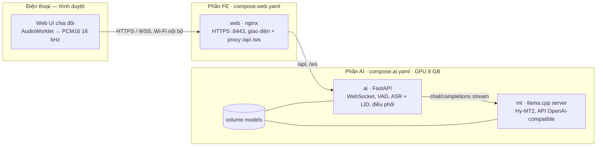
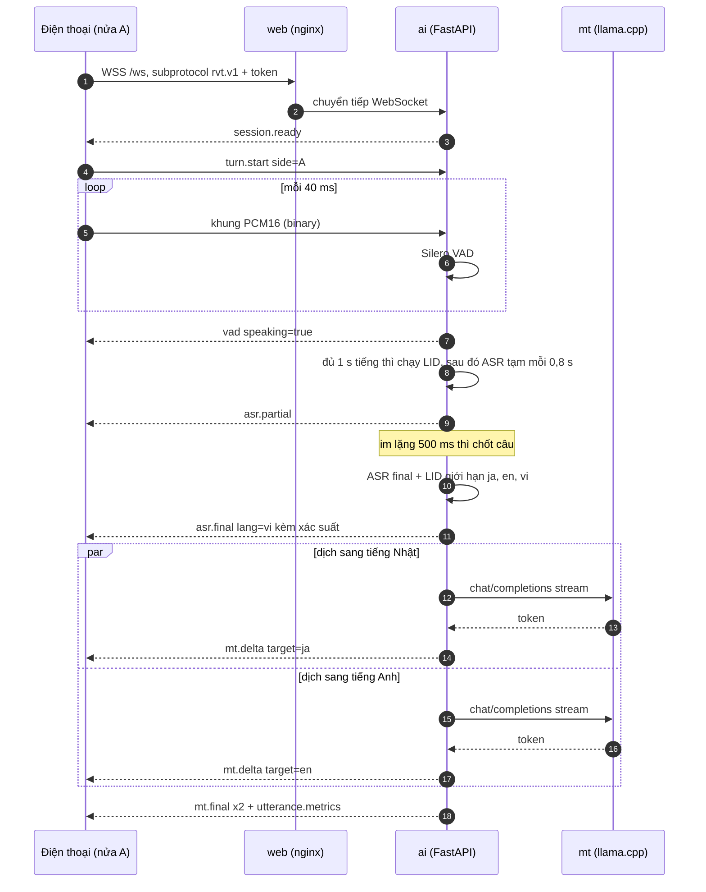
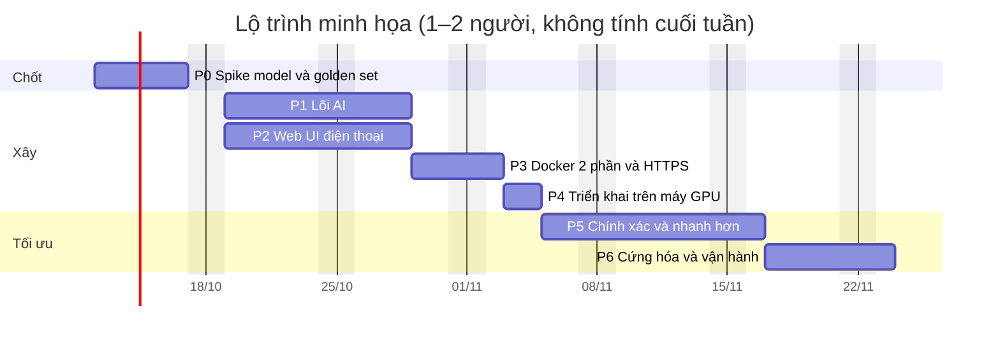

# 01 · Kế hoạch triển khai — Realtime Voice Translate

Dịch hội thoại trực tiếp **Nhật ⇄ Anh ⇄ Việt** trên web điện thoại: một người nói → hệ thống tự nhận ra câu đó là tiếng
nào → ghi lại câu nói → dịch ngay sang **hai tiếng còn lại**. Model chạy tại chỗ trên **một GPU tối đa 8 GB VRAM**.

| Thuộc tính | Chi tiết |
|---|---|
| Phiên bản | 0.2 — bản nháp chờ review (0.2: chỉ triển khai trên máy GPU, không dùng GitHub Actions để deploy; tạm bỏ ngrok, dùng trong mạng nội bộ) |
| Ngày lập | 2026-10-09 |
| Trạng thái | Thiết kế, chưa có code |
| Tài liệu nền | [Best practice cấu trúc dự án Python AI](../../python-ai-project-structure-best-practices.md) — cách áp dụng ở [mục 8](#8-cấu-trúc-dự-án-theo-best-practice) |
| Nhóm bài toán | Nhóm 6 — đầu vào giọng nói · kỹ năng chính `DL-06`, `OPS-05`, `OPS-07`, `LLM-07`, `LLM-04` |

> Thông tin về model và giới hạn dịch vụ được kiểm tra ngày 2026-10-09. Các con số VRAM và độ trễ là **ước tính để lập
> kế hoạch**; P0 đo lại trên máy thật rồi mới chốt.

## Mục lục

1. [Tóm tắt](#1-tóm-tắt)
2. [Yêu cầu và phạm vi](#2-yêu-cầu-và-phạm-vi)
3. [Chỉ tiêu chất lượng (SLO)](#3-chỉ-tiêu-chất-lượng-slo)
4. [Kiến trúc tổng thể](#4-kiến-trúc-tổng-thể)
5. [Chọn model AI cho GPU 8 GB](#5-chọn-model-ai-cho-gpu-8-gb)
6. [Pipeline realtime](#6-pipeline-realtime)
7. [Web UI trên điện thoại](#7-web-ui-trên-điện-thoại)
8. [Cấu trúc dự án theo best practice](#8-cấu-trúc-dự-án-theo-best-practice)
9. [Docker hai phần và HTTPS nội bộ](#9-docker-hai-phần-và-https-nội-bộ)
10. [Triển khai trên máy GPU](#10-triển-khai-trên-máy-gpu)
11. [Kiểm thử và đánh giá](#11-kiểm-thử-và-đánh-giá)
12. [Quan sát, bảo mật, quyền riêng tư](#12-quan-sát-bảo-mật-quyền-riêng-tư)
13. [Kế hoạch theo giai đoạn](#13-kế-hoạch-theo-giai-đoạn)
14. [Rủi ro](#14-rủi-ro)
15. [Quyết định kiến trúc (ADR)](#15-quyết-định-kiến-trúc-adr)
16. [Câu hỏi mở](#16-câu-hỏi-mở)

---

## 1. Tóm tắt

- **Trải nghiệm:** điện thoại đặt giữa bàn, màn hình chia đôi, nửa trên xoay 180° cho người ngồi đối diện. Ai nói thì
  chạm mic ở nửa của mình. Nửa đó hiện câu gốc để người nói tự kiểm tra; nửa đối diện hiện bản dịch bằng tiếng của người
  nghe, bản dịch sang tiếng thứ ba hiện nhỏ bên dưới.
- **Pipeline (cascade):** micro → `AudioWorklet` 16 kHz PCM16 → WebSocket → **Silero VAD** chốt câu → **Whisper
  `large-v3-turbo`** (faster-whisper) nhận dạng và phân biệt ngôn ngữ, giới hạn trong {ja, en, vi} → **Hy-MT2-1.8B**
  (llama.cpp) dịch song song sang 2 tiếng còn lại, stream từng chữ về giao diện.
- **Vừa GPU 8 GB:** profile mặc định `balanced` ước tính 4,5–5 GB VRAM. Phần còn trống dành cho profile `quality` hoặc
  các ứng viên khác (Qwen3-ASR, TranslateGemma) mà P0 sẽ benchmark.
- **Độ trễ mục tiêu:** từ lúc ngừng nói tới khi đủ 2 bản dịch, p50 ≤ 1,3 s trong mạng LAN.
- **Docker 2 phần:** *phần AI* gồm `ai` (FastAPI: WebSocket, VAD, ASR, điều phối) và `mt` (llama.cpp server), dùng chung
  GPU. *Phần FE* là `web` (nginx phục vụ giao diện và proxy `/api`, `/ws` sang AI).
- **Truy cập trong mạng nội bộ:** điện thoại cùng Wi-Fi vào `https://<IP máy GPU>:8443`. Chứng chỉ do CA nội bộ (mkcert)
  cấp, mỗi điện thoại cài CA một lần, vì trình duyệt chỉ cho dùng micro qua HTTPS. Tạm bỏ ngrok.
- **Triển khai chỉ trên máy GPU:** `make deploy` build image ngay tại máy, chạy, smoke test, lỗi thì tự quay về bản
  trước. Không dùng GitHub Actions để deploy, không cần registry hay runner.
- **Lộ trình:** P0 spike + golden set → P1 lõi AI song song với P2 web UI → P3 Docker + HTTPS nội bộ → P4 triển khai trên
  máy GPU → P5 tinh chỉnh → P6 cứng hóa. Khoảng 6–7 tuần cho 1–2 người.
- **Cần chủ dự án trả lời** ([mục 16](#16-câu-hỏi-mở)): yêu cầu số 7 đang để trống, GPU cụ thể, có tên miền riêng để làm
  HTTPS nội bộ không.

## 2. Yêu cầu và phạm vi

### 2.1 Đối chiếu yêu cầu

| # | Yêu cầu | Cách đáp ứng | Mục |
|---|---|---|---|
| 1 | Áp dụng best practice cấu trúc dự án Python AI | `src/` layout, ports & adapters cho VAD/ASR/MT, pack dữ liệu và prompt tách khỏi code, pydantic-settings, test 3 tầng, `eval/` riêng; phần không hợp (DB, Temporal, MCP, RAG) ghi rõ lý do bỏ | [8](#8-cấu-trúc-dự-án-theo-best-practice) |
| 2 | Nhận giọng nói nhanh, phân biệt tiếng Nhật/Anh/Việt; web UI; triển khai trên máy GPU (bỏ deploy qua GitHub Actions — chốt 2026-10-09) | VAD + Whisper turbo, nhận dạng ngôn ngữ giới hạn 3 tiếng + prior theo nửa màn hình; web PWA; `make deploy` ngay trên máy GPU | [6](#6-pipeline-realtime), [10](#10-triển-khai-trên-máy-gpu) |
| 3 | Ghi lại câu nói, dịch ra 2 tiếng còn lại | Mỗi câu: transcript + 2 bản dịch chạy song song, stream về giao diện | [6](#6-pipeline-realtime) |
| 4 | Model nhanh, gọn, chính xác; GPU tối đa 8 GB; chạy localhost | Bộ mặc định ~4,5–5 GB; 5 profile; ứng viên thay thế được benchmark ở P0 | [5](#5-chọn-model-ai-cho-gpu-8-gb) |
| 5 | Docker 2 phần (AI + FE gọi AI); ngrok để public API test — **tạm bỏ ngrok** (chốt 2026-10-09) | `compose.ai.yaml` + `compose.web.yaml`; nginx phục vụ giao diện, REST và WebSocket trên cùng một origin HTTPS trong mạng nội bộ; test API qua `/api` | [9](#9-docker-hai-phần-và-https-nội-bộ) |
| 6 | UI điện thoại chia 2 nửa: một nửa nhận giọng nói, nửa đối diện hiện tiếng của người đối diện | Màn hình chia đôi, nửa trên xoay 180°, mỗi nửa có mic và ngôn ngữ chủ riêng | [7](#7-web-ui-trên-điện-thoại) |
| 7 | *(để trống)* | Chờ chủ dự án bổ sung | [16](#16-câu-hỏi-mở) |

### 2.2 Kịch bản chính

Điện thoại nằm giữa bàn. Nửa dưới (nửa **A**) hướng về người A nói tiếng Việt; nửa trên (nửa **B**) xoay 180° hướng về
người B nói tiếng Nhật.

1. A chạm mic ở nửa A và nói. Nửa A hiện chữ đang nghe (tạm), rồi câu đã chốt kèm nhãn `VI 97%`.
2. Nửa B hiện bản dịch tiếng Nhật chữ lớn, bên dưới là bản tiếng Anh chữ nhỏ. Nửa A cũng hiện bản tiếng Anh nhỏ để A tự
   kiểm tra.
3. B chạm mic ở nửa B và nói tiếng Nhật → chiều ngược lại.
4. Nếu có người nói tiếng Anh, mỗi nửa hiện bản dịch sang tiếng chủ của nửa đó.

### 2.3 Ngoài phạm vi MVP

- Đọc to bản dịch (TTS) — để backlog; khi làm thì xem lại ADR-01.
- Hơn 2 người, tách người nói (diarization), ngôn ngữ thứ 4.
- Lưu hội thoại trên server, tài khoản người dùng. Lịch sử chỉ nằm trên điện thoại.
- Chạy offline trên điện thoại.

### 2.4 Giả định (xác nhận ở P0)

- Máy chủ Linux (Ubuntu 22.04/24.04), **1 GPU NVIDIA 8 GB** (lớp RTX 3060 Ti/3070/4060/4060 Ti 8 GB), driver mới (nhánh
  ≥ 550), Docker Engine + Compose v2.20+ + NVIDIA Container Toolkit. GPU không gánh màn hình desktop — màn hình có thể
  chiếm 0,3–1 GB VRAM.
- **Chỉ triển khai trên máy GPU** (chủ dự án chốt 2026-10-09): cả phần AI và phần FE chạy trên cùng máy, image build tại
  chỗ, không dùng GitHub Actions để deploy.
- Tải: 1–3 cuộc hội thoại đồng thời (demo, dùng nội bộ).
- **Chỉ dùng trong mạng nội bộ**, tạm bỏ ngrok (chốt 2026-10-09): điện thoại và máy GPU cùng Wi-Fi/LAN; máy GPU có IP cố
  định (DHCP reservation) và ra được Internet để tải model.

## 3. Chỉ tiêu chất lượng (SLO)

Đây là mục tiêu ban đầu để thiết kế; sau khi có baseline ở P0 thì chốt lại kèm khoảng tin cậy. Theo quy tắc của repo:
**đóng băng bộ đánh giá trước khi thử model đầu tiên**.

| Chỉ tiêu | Định nghĩa | Mục tiêu MVP (LAN) | Đo bằng |
|---|---|---|---|
| Phản hồi "đang nghe" | bắt đầu nói → vòng sáng báo có tiếng | ≤ 0,2 s | event `vad` |
| Chữ tạm đầu tiên | bắt đầu nói → partial đầu tiên hiện | p50 ≤ 1,5 s | event `asr.partial` |
| Câu chốt | ngừng nói → transcript chốt hiện | p50 ≤ 0,9 s · p95 ≤ 1,4 s | event `asr.final` |
| Đủ 2 bản dịch | ngừng nói → cả 2 `mt.final` | p50 ≤ 1,3 s · p95 ≤ 2,0 s | event `mt.final` |
| Điện thoại qua Wi-Fi nội bộ | như hai dòng trên | cộng thêm ≤ 0,1 s | đo từ điện thoại thật |
| Nhận dạng ngôn ngữ (LID) | % câu nhận đúng tiếng trong 3 tiếng | ≥ 98 % (câu ≥ 1,5 s) · ≥ 90 % (câu 0,5–1,5 s) | golden set |
| ASR | WER cho en/vi, CER cho ja | chốt sau baseline P0 (sơ bộ: en ≤ 8 %, vi ≤ 12 %, ja ≤ 10 %) | `jiwer` |
| Dịch | chrF++, COMET + người chấm 1–5 | người chấm trung bình ≥ 4,0/5 cho cả 6 chiều dịch | golden set |
| Ảo giác | đoạn không phải lời nói mà vẫn sinh ra chữ | ≤ 1 % | tập nhiễu/im lặng |
| VRAM | mức đỉnh khi 2 phiên chạy song song | ≤ 6,0 GB (`balanced`) · ≤ 7,4 GB (`quality`) | NVML / `nvidia-smi` |

## 4. Kiến trúc tổng thể

### 4.1 Thành phần



Điện thoại phải dùng HTTPS vì trình duyệt chỉ cho dùng micro trong *secure context*, nên nginx phục vụ HTTPS bằng chứng
chỉ nội bộ (mục 9.5). Trình duyệt chạy ngay trên máy chủ có thể vào `http://localhost:8080` (localhost cũng được coi là
secure context).

### 4.2 Luồng một câu nói



### 4.3 Hai phần Docker và ranh giới tin cậy

| Vùng | Thành phần | Mức tin cậy | Lộ ra ngoài |
|---|---|---|---|
| Client | trình duyệt trên điện thoại | không tin | — |
| Biên (phần FE) | `web` (nginx) | biên trong mạng nội bộ | `https://<IP LAN>:8443` cho điện thoại; `127.0.0.1:8080` (HTTP) trên máy chủ |
| Ứng dụng (phần AI) | `ai` (FastAPI) | kiểm token, giới hạn tài nguyên | chỉ qua nginx; không publish port |
| Model (phần AI) | `mt` (llama.cpp), volume `models` | nội bộ | không publish port; chỉ nằm trong network `backend` (internal) |

**Shared kernel** là gói `rvt_contracts`: hợp đồng message WebSocket/REST viết bằng Pydantic v2. Backend dùng trực tiếp;
frontend dùng kiểu TypeScript **sinh tự động** từ JSON Schema của gói này; script smoke test và eval cũng chỉ nói chuyện
với dịch vụ qua hợp đồng đó.

## 5. Chọn model AI cho GPU 8 GB

### 5.1 Tiêu chí (theo thứ tự ưu tiên)

1. Đủ cả ja/en/vi và phân biệt được ngôn ngữ ngay trong pipeline.
2. Độ trễ thấp trên GPU 8 GB khi ASR và dịch chạy chung.
3. Chính xác trên giọng hội thoại thật (giọng vùng miền, câu ngắn, ồn).
4. Giấy phép dùng được — cả thương mại nếu cần.
5. Chạy tại chỗ bằng runtime ổn định, có image Docker chính thức.

### 5.2 Bộ mặc định (profile `balanced`)

| Tầng | Model | Runtime | Định dạng | VRAM (ước tính) | Giấy phép | Vì sao chọn |
|---|---|---|---|---|---|---|
| VAD | Silero VAD | onnxruntime (CPU) | ONNX | 0 — chạy CPU, < 1 ms mỗi cửa sổ 32 ms | MIT | phổ biến, nhẹ, chạy streaming |
| ASR + LID | Whisper `large-v3-turbo` | faster-whisper (CTranslate2) | `int8_float16` | ~1,5 GB (số đo cộng đồng: int8, beam 5) | MIT | một model đủ ja/en/vi, có sẵn xác suất ngôn ngữ, nhanh hơn `large-v3` khoảng 2,7 lần, tooling chín |
| Dịch (MT) | **Hy-MT2-1.8B** (Tencent, 21/05/2026) | llama.cpp server | GGUF `Q8_0` (profile `fast`: `Q4_K_M` ~1,1 GB) | ~2–2,5 GB kể cả KV cache | Apache-2.0 theo model card | model chuyên dịch, 33 ngôn ngữ có ja/vi/en, có template thuật ngữ và ngữ cảnh, rất nhỏ nên nhanh |

Hy-MT2 mới phát hành và phần lớn số liệu chất lượng là do nhà phát triển công bố, nên **bắt buộc qua cổng đánh giá ở P0**
trên golden set. Phương án dự phòng theo thứ tự: TranslateGemma-4B → Qwen3-4B-Instruct-2507. Lúc mới phát hành Hy-MT2 dùng
giấy phép cộng đồng của Tencent; model card hiện ghi Apache-2.0 — cần đọc lại file `LICENSE` tại revision đã pin.

### 5.3 Ứng viên benchmark ở P0

| Tầng | Ứng viên | Chọn khi | Ghi chú |
|---|---|---|---|
| ASR | **Qwen3-ASR-0.6B** (01/2026, Apache-2.0) | thắng Whisper turbo về LID câu ngắn, CER ja, WER vi hoặc độ trễ | 30 ngôn ngữ + 22 phương ngữ tiếng Trung, có ja/vi; LID và streaming trong cùng một model; chạy qua vLLM (`qwen-asr[vllm]`) — vLLM giữ trước VRAM theo `gpu_memory_utilization`, phải đặt nhỏ để chạy chung với MT |
| ASR | Whisper `large-v3`, `int8` (~3 GB) | turbo kém rõ ở vi/ja | chậm hơn turbo khoảng 2,7 lần |
| ASR | PhoWhisper (vi), kotoba-whisper (ja) | lỗi dồn vào một tiếng | thêm model là thêm VRAM; định tuyến theo ngôn ngữ sau LID (`EFF-04`) |
| MT | Hy-MT2-7B, GGUF `Q4_K_M` | bản 1.8B chưa đạt chất lượng, nhất là chiều ja⇄vi | profile `quality`, sát giới hạn VRAM (mục 5.5) |
| MT | TranslateGemma-4B (01/2026) | Hy-MT2 không đạt hoặc vướng giấy phép | dựa trên Gemma 3, 55 ngôn ngữ; tải cần chấp nhận Gemma Terms (`HF_TOKEN`) |
| MT | Qwen3-4B-Instruct-2507 | làm baseline LLM tổng quát | linh hoạt prompt hơn; thường chậm hơn model chuyên dịch ở cùng mức chất lượng |

### 5.4 Đã cân nhắc nhưng không chọn

| Lựa chọn | Lý do |
|---|---|
| SenseVoice-Small | rất nhanh nhưng không có tiếng Việt |
| NVIDIA Parakeet / Canary (đa ngữ) | tập trung tiếng châu Âu; không có ja + vi trong cùng một model |
| SeamlessM4T v2 / SeamlessStreaming | giấy phép CC-BY-NC; ~2,3B tham số; một model làm hết nên khó đo và sửa từng tầng |
| NLLB-200 (qua CTranslate2) | rất nhanh nhưng CC-BY-NC; yếu với hội thoại tiếng Nhật |
| Hy-MT2-30B-A3B | tổng 30B tham số, không vừa 8 GB |
| LLM tổng quát 7–8B làm MT | chất lượng tốt nhưng chậm hơn và chật VRAM khi chạy cùng ASR |
| API cloud (DeepL, Google, OpenAI Realtime) | trái yêu cầu chạy localhost; chỉ dùng làm mốc so sánh chất lượng trong eval (tùy chọn) |

### 5.5 Ngân sách VRAM theo profile

| Profile | ASR | MT | VRAM ước tính (2 phiên) | Dùng khi |
|---|---|---|---|---|
| `fake` | engine kịch bản | engine kịch bản | 0 | làm FE trên máy không GPU (Mac/Colima), unit test, E2E trong CI |
| `cpu-dev` | Whisper `base` int8 (CPU) | Hy-MT2-1.8B `Q4_K_M` (CPU) | 0 | integration test, chạy thử trên máy không GPU; chậm (vài giây mỗi câu) |
| `fast` | turbo `int8_float16` | Hy-MT2-1.8B `Q4_K_M` | ~4 GB | ưu tiên độ trễ |
| **`balanced`** (mặc định) | turbo `int8_float16` | Hy-MT2-1.8B `Q8_0` | ~4,5–5 GB | dùng hằng ngày |
| `quality` (thử nghiệm) | turbo `int8_float16`, beam 1 | Hy-MT2-7B `Q4_K_M`, `-c 4096 --parallel 2`, KV `q8_0` | ~7–7,5 GB | chỉ khi GPU không gánh màn hình và đã đo; không vừa thì dùng TranslateGemma-4B (~5,5 GB) |

Cách cộng: mỗi tiến trình CUDA (`ai`, `mt`) tốn ~0,3–0,5 GB cho context; ASR ~1,5 GB; MT = trọng số + KV cache + buffer
tính toán. P0 đo bằng NVML khi 2 phiên chạy song song.

### 5.6 Ngân sách độ trễ (ước tính trên GPU lớp RTX 4060)

| Bước | p50 ước tính | Núm điều chỉnh |
|---|---|---|
| Khung 40 ms + mạng chiều lên (Wi-Fi nội bộ) | 40 ms + 10–30 ms | cỡ khung 20–60 ms |
| Chờ im lặng để chốt câu | 500 ms | `min_silence_ms` 300–800; chốt sớm có suy đoán (P5) |
| ASR final + LID (câu ~5 s) | 200–350 ms | `beam_size`, `compute_type` |
| Dịch 2 đích song song (~30 token mỗi đích) | 200–400 ms (token đầu ~50–100 ms) | mức lượng tử hóa, độ dài ngữ cảnh |
| Mạng chiều xuống + vẽ giao diện | 20–50 ms | |
| **Tổng: ngừng nói → đủ 2 bản dịch** | **≈ 1,0–1,4 s** | |

### 5.7 Lưu ý khi dùng các model này

- **Whisper luôn xử lý cửa sổ 30 s** (phần thiếu được đệm im lặng), nên mỗi lần gọi tốn gần như cố định dù câu ngắn. ASR
  tạm chạy dày sẽ tốn GPU → chu kỳ 0,8 s, partial được gộp và bị bỏ khi bận. Qwen3-ASR không có ràng buộc này — một lý do
  để benchmark.
- **LID trên câu rất ngắn** ("OK", "はい", "Dạ") kém tin cậy → giới hạn 3 tiếng, prior theo nửa màn hình, cho phép khóa
  ngôn ngữ và chạm để sửa (mục 6.3).
- **Whisper "bịa" chữ khi im lặng hoặc nhiễu** (ví dụ "Hãy subscribe cho kênh Ghiền Mì Gõ…", "ご視聴ありがとうございました",
  "Thanks for watching!") → chỉ đưa đoạn có tiếng vào ASR, giữ các ngưỡng `no_speech`/`log_prob`/`compression_ratio`,
  lọc thêm bằng danh sách câu ảo giác trong pack ngôn ngữ, và đo tỉ lệ ảo giác.
- **Model chuyên dịch nhạy với định dạng prompt** → dùng nguyên văn template trên model card, không thêm system prompt
  (Hy-MT2 không có system prompt mặc định), giới hạn `max_tokens`.
- **Tự chuyển Whisper sang CTranslate2** từ repo gốc `openai/whisper-large-v3-turbo` (pin revision) bằng
  `ct2-transformers-converter`, thay vì tải bản chuyển sẵn của bên thứ ba — để kiểm soát chuỗi cung ứng.

## 6. Pipeline realtime

### 6.1 Thu âm trên trình duyệt

- Xin quyền micro bằng `getUserMedia` khi người dùng chạm mic lần đầu (iOS yêu cầu tạo/resume `AudioContext` ngay trong sự
  kiện chạm).
- Dùng `AudioWorklet` (không dùng `ScriptProcessorNode` đã lỗi thời): trộn về mono → lọc thông thấp + hạ mẫu từ tần số của
  máy (thường 48 kHz) về **16 kHz** → đổi Float32 sang **PCM16** → gom thành khung **40 ms** (640 mẫu, 1.280 byte) → gửi
  qua WebSocket dạng binary.
- Băng thông chiều lên 32 KB/s, tức khoảng 115 MB cho mỗi giờ mở mic. Mic chỉ mở khi người dùng bật; P6 tối ưu thêm nếu
  cần (VAD ngay trên trình duyệt để chỉ gửi đoạn có tiếng, hoặc nén Opus).
- `echoCancellation`, `noiseSuppression`, `autoGainControl` bật mặc định và có công tắc trong cài đặt; P0/P5 đo cả hai
  trạng thái vì bộ lọc ồn của trình duyệt đôi khi làm ASR kém đi.

```ts
// web/src/audio/capture.ts — rút gọn
const stream = await navigator.mediaDevices.getUserMedia({
  audio: { channelCount: 1, echoCancellation: true, noiseSuppression: true, autoGainControl: true },
});
const ctx = new AudioContext();                      // tạo trong sự kiện chạm (iOS)
await ctx.audioWorklet.addModule(pcm16WorkletUrl);
const node = new AudioWorkletNode(ctx, "pcm16-16k"); // lọc + hạ mẫu + gom khung 40 ms
node.port.onmessage = (e) => ws.readyState === WebSocket.OPEN && ws.send(e.data); // ArrayBuffer PCM16
ctx.createMediaStreamSource(stream).connect(node);
```

### 6.2 Chốt câu bằng VAD

Server chạy Silero VAD (ONNX, CPU) trên từng cửa sổ 32 ms. Mỗi phiên có một ring buffer giữ âm thanh trước lúc phát hiện
tiếng (pre-roll) để không mất âm đầu câu. Mọi tham số nằm trong profile của pack, chỉnh không cần sửa code.

| Tham số | Mặc định | Ý nghĩa |
|---|---|---|
| `vad.threshold` | `0.5` | ngưỡng xác suất có tiếng nói |
| `vad.min_speech_ms` | `250` | đoạn ngắn hơn bị bỏ (ho, gõ bàn) |
| `vad.min_silence_ms` | `500` | im lặng đủ lâu thì chốt câu — núm độ trễ lớn nhất |
| `vad.speech_pad_ms` | `200` | đệm đầu và cuối câu để không mất âm |
| `vad.preroll_ms` | `300` | âm thanh giữ lại trước lúc phát hiện tiếng |
| `segment.max_ms` | `15000` | câu quá dài thì cắt mềm tại khoảng lặng ≥ 200 ms gần nhất; cắt cứng ở `hard_max_ms` = `20000` |
| `segment.partial_interval_ms` | `800` | chu kỳ chạy ASR tạm |

P5 thử **chốt câu sớm có suy đoán**: khi im lặng đạt 250 ms thì chạy luôn ASR final; nếu người nói tiếp trước mốc 500 ms
thì bỏ kết quả. Đổi một ít GPU lấy khoảng 250 ms độ trễ.

### 6.3 Nhận dạng và phân biệt ngôn ngữ

Whisper trả xác suất cho 99 ngôn ngữ. Hệ thống chỉ xét 3 tiếng và kết hợp thêm thông tin "nửa nào đang bấm mic":

1. Nửa đã **khóa ngôn ngữ** (người dùng chọn) → gọi ASR với `language` cố định, bỏ qua LID — nhanh và chắc nhất.
2. Chưa khóa: khi câu có ≥ 1 s tiếng, chạy LID trên buffer → lấy xác suất của ja/en/vi → chuẩn hóa lại → cộng prior của
   nửa đó theo kiểu log-linear với trọng số `prior_weight`.
3. Khóa ngôn ngữ vừa chọn cho các partial của câu này, tránh nhảy ngôn ngữ giữa chừng.
4. Khi chốt câu: chạy lại LID trên cả câu; nếu kết quả khác hẳn bản tạm thì giải mã lại bằng ngôn ngữ mới (hiếm gặp).
5. Xác suất cao nhất < `uncertain_below` → vẫn dịch nhưng gắn cờ `uncertain`; giao diện hiện nhãn "?" — chạm để chọn đúng
   tiếng → server nhận dạng lại và dịch lại (`utterance.override_lang`).
6. Prior của mỗi nửa được cập nhật bằng trung bình trượt các câu đã chắc chắn — người dùng không phải cài đặt gì.

```python
# ai/src/rvt_ai/pipeline/lid_policy.py — rút gọn
ALLOWED: tuple[Lang, ...] = ("ja", "en", "vi")

def pick_language(asr_probs: dict[str, float], side_prior: dict[Lang, float],
                  prior_weight: float, uncertain_below: float) -> LangDecision:
    """Giới hạn LID của Whisper về 3 tiếng rồi kết hợp với prior của nửa màn hình."""
    p = {k: max(asr_probs.get(k, 0.0), 1e-6) for k in ALLOWED}
    z = sum(p.values())
    score = {k: math.log(p[k] / z) + prior_weight * math.log(side_prior[k]) for k in ALLOWED}
    top = max(score.values())
    w = {k: math.exp(s - top) for k, s in score.items()}
    total = sum(w.values())
    post = {k: v / total for k, v in w.items()}
    lang = max(post, key=post.__getitem__)
    return LangDecision(lang=lang, probs=post, uncertain=post[lang] < uncertain_below)
```

Cấu hình ASR cho câu chốt: `beam_size` 1 hoặc 5 (chọn ở P0); `temperature=0` (không dùng fallback nhiều mức nhiệt để
tránh đột biến độ trễ); `condition_on_previous_text=False`; `without_timestamps=True`; `vad_filter=False` vì đã có VAD
riêng; giữ các ngưỡng `no_speech_threshold`, `log_prob_threshold`, `compression_ratio_threshold`; lọc thêm bằng danh sách
câu ảo giác của pack ngôn ngữ.

### 6.4 Dịch song song sang 2 tiếng còn lại

- Có `asr.final` → đích = {ja, en, vi} trừ ngôn ngữ nguồn → gửi **2 request song song** tới `mt` (llama.cpp
  `--parallel 4`, continuous batching, `stream: true`, `cache_prompt: true`). Mỗi token về được đẩy ngay thành `mt.delta`.
- Prompt render từ `prompts/mt/<họ model>/`, **chép nguyên văn template trên model card**. Hy-MT2 có sẵn template cho
  thuật ngữ và ngữ cảnh:
  - *Thuật ngữ:* chỉ đưa các mục trong `packs/glossary/` có xuất hiện trong câu nguồn, để prompt luôn ngắn.
  - *Ngữ cảnh:* 2 câu trước của hội thoại, lấy bản đã dịch sang chính ngôn ngữ đích → giữ nhất quán xưng hô và tên riêng.
    P5 đo xem ngữ cảnh giúp hay hại.
- Tham số sinh: bắt đầu theo model card (Hy-MT2-1.8B: `temperature 0.7, top_p 0.6, top_k 20, repetition_penalty 1.05`),
  so với greedy ở P0; `max_tokens` khoảng 3 lần độ dài câu nguồn để chặn sinh lan man.
- **Kiểm chứng xác định, không lỗi im lặng** (`EFF-07`): bản dịch không rỗng; đúng chữ viết của tiếng đích (ja có
  kana/kanji, vi/en là chữ Latin — regex nằm trong pack); không trùng nguyên văn câu nguồn; tỉ lệ độ dài hợp lý; không có
  lời dẫn kiểu "Here is the translation". Sai thì thử lại một lần bằng greedy; vẫn sai thì gửi `error` kèm câu gốc, không
  hiện bản dịch hỏng.
- Cache LRU khớp chính xác `(nguồn, đích, câu đã chuẩn hóa)` cho các câu ngắn hay lặp lại ("Xin chào",
  "ありがとうございます").
- Mỗi request có timeout 5 s. Nếu `mt` không trả lời, giao diện vẫn hiện transcript và báo lỗi dịch; `/health/ready`
  chuyển đỏ.

### 6.5 Đồng thời và lịch GPU

- Một instance ASR nằm trong tiến trình `ai`, chạy uvicorn **1 worker** (nhiều worker = nhiều bản model = hết VRAM). Việc
  dùng GPU chạy ở một thread riêng, nhận việc từ hàng đợi ưu tiên **final > partial**; partial của cùng một phiên được
  gộp (chỉ giữ bản mới nhất); partial chờ quá 300 ms thì bỏ.
- Giới hạn: `RVT_MAX_SESSIONS` (mặc định 4), mỗi câu tối đa 20 s, phiên rảnh 5 phút thì đóng, phiên dài tối đa 2 giờ.
- `mt` chạy `--parallel 4`, tức 2 câu (mỗi câu 2 đích) cùng lúc; nhiều hơn thì llama.cpp tự xếp hàng.
- Client nhận chậm → bỏ event partial trước; không bao giờ bỏ event final.

### 6.6 Giao thức WebSocket v1

Mỗi phiên dùng một kết nối tại `/ws` (nginx chuyển tới `/v1/stream`). Khung binary là PCM16 LE mono 16 kHz của lượt nói
đang mở; khung text là JSON có trường `type`.

Client → server:

| `type` | Trường chính | Ý nghĩa |
|---|---|---|
| `session.start` | `protocol: 1`, `audio: {rate: 16000, format: "pcm_s16le"}`, `sides: {A: {lang: "auto"}, B: {lang: "auto"}}` | mở phiên; `lang` của mỗi nửa là `auto` hoặc khóa `ja`/`en`/`vi` |
| *(binary)* | PCM16 LE mono 16 kHz, 40 ms mỗi khung | âm thanh của lượt nói đang mở |
| `turn.start` | `side` = `"A"` hoặc `"B"` | bắt đầu nghe cho một nửa |
| `turn.stop` | — | dừng nghe, chốt câu đang dở |
| `utterance.override_lang` | `utterance_id`, `lang` | sửa ngôn ngữ → nhận dạng lại + dịch lại |
| `sides.update` | `sides` | đổi hoặc khóa ngôn ngữ chủ của từng nửa |
| `ping` | `t` | đo thời gian khứ hồi |

Server → client:

| `type` | Trường chính |
|---|---|
| `session.ready` | `session_id`, `profile`, `pack_revision`, `models` |
| `vad` | `side`, `speaking` |
| `asr.partial` | `utterance_id`, `side`, `text`, `lang` (khi đã khóa) |
| `asr.final` | `utterance_id`, `side`, `text`, `lang`, `lang_probs`, `uncertain`, `audio_ms` |
| `mt.delta` | `utterance_id`, `target`, `delta` |
| `mt.final` | `utterance_id`, `target`, `text` |
| `utterance.metrics` | `utterance_id`, `asr_ms`, `mt_ms` (theo từng đích), `e2e_ms` |
| `error` | `code`, `message`, `utterance_id` (nếu có), `retryable` |
| `pong` | `t`, `server_t` |

```json
{"type": "asr.final", "utterance_id": 12, "side": "A", "text": "Hôm nay mình gặp lúc mấy giờ?",
 "lang": "vi", "lang_probs": {"vi": 0.97, "en": 0.02, "ja": 0.01}, "uncertain": false, "audio_ms": 2140}
{"type": "mt.delta", "utterance_id": 12, "target": "ja", "delta": "今日は"}
{"type": "mt.final", "utterance_id": 12, "target": "ja", "text": "今日は何時に会いましょうか？"}
```

```python
# ai/src/rvt_contracts/messages.py — rút gọn
Lang = Literal["ja", "en", "vi"]
Side = Literal["A", "B"]

class AsrFinal(BaseModel):
    type: Literal["asr.final"] = "asr.final"
    utterance_id: int
    side: Side
    text: str
    lang: Lang
    lang_probs: dict[Lang, float]
    uncertain: bool
    audio_ms: int

ServerEvent = Annotated[
    SessionReady | Vad | AsrPartial | AsrFinal | MtDelta | MtFinal | UtteranceMetrics | ErrorEvent | Pong,
    Field(discriminator="type"),
]
```

**Xác thực WebSocket:** token phiên đặt trong subprotocol — `new WebSocket(url, ["rvt.v1", "rvt.token." + token])`, server
chấp nhận và trả lại `rvt.v1`. Token không nằm trong URL nên không lọt vào log của nginx.

### 6.7 REST API để test

| Method | Đường dẫn (sau `/api`) | Dùng để |
|---|---|---|
| GET | `/health/live` | tiến trình còn sống |
| GET | `/health/ready` | model đã nạp và warm-up xong, `mt` trả lời, VRAM còn trống |
| POST | `/v1/session` | đổi access code lấy token ngắn hạn (TTL 15 phút) cho WebSocket |
| POST | `/v1/translate` | `{text, source?}` → ngôn ngữ nguồn + 2 bản dịch (test riêng MT) |
| POST | `/v1/transcribe` | file WAV/MP3 → `{lang, lang_probs, text}` (test riêng ASR + LID) |
| POST | `/v1/speech-translate` | file âm thanh → transcript + 2 bản dịch (test cả pipeline, không stream) |
| WS | `/v1/stream` | realtime (giao diện dùng qua `/ws`) |
| GET | `/metrics` | Prometheus — chỉ truy cập trong mạng nội bộ |

REST dùng `Authorization: Bearer <RVT_API_KEY>`. OpenAPI tại `/docs` (chỉ trong mạng nội bộ). Với `/v1/translate` (đầu
vào là chữ), việc phát hiện ngôn ngữ không cần model: có kana/kanji → ja; có chữ cái riêng của tiếng Việt (ă, â, đ, ê, ô,
ơ, ư hoặc dấu thanh) → vi; còn lại → en; luôn có thể truyền `source` để ghi đè.

## 7. Web UI trên điện thoại

### 7.1 Bố cục

```text
╔═ NỬA B — xoay 180°, hướng về người B ═══════════════╗
  [MIC B]   日本語 ▾    A+  A-
  今日は何時に会いましょうか？         ← bản dịch sang tiếng của B, chữ lớn
  What time shall we meet today?      ← tiếng thứ ba, chữ nhỏ (bật/tắt được)
╠════════════════════ ● ═════════════════════════════╣  ← vạch chia, chấm = trạng thái kết nối
  Hôm nay mình gặp lúc mấy giờ?  [VI 97%]   ← câu A vừa nói (đã chốt) + nhãn ngôn ngữ
  What time shall we meet today?      ← tiếng thứ ba nhỏ để A tự kiểm tra
  … đang nghe: "mình đi ăn…"           ← chữ tạm (xám, nghiêng)
  Tiếng Việt ▾    A+  A-        [MIC A]
╚═ NỬA A — hướng về người A ═════════════════════════╝
```

### 7.2 Quy tắc hiển thị

Mỗi nửa có một **ngôn ngữ chủ**: tự học từ câu nói chắc chắn đầu tiên của nửa đó, hoặc do người dùng chọn/khóa. Với mỗi
câu có ngôn ngữ L:

| Câu nói thuộc tiếng | Nửa có ngôn ngữ chủ trùng L | Nửa còn lại |
|---|---|---|
| tiếng của A (ví dụ vi) | nửa A: câu gốc + nhãn `VI 97%`; tiếng thứ ba nhỏ (tùy chọn) | nửa B: bản dịch sang tiếng của B, chữ lớn + tiếng thứ ba nhỏ |
| tiếng của B (ví dụ ja) | nửa B: câu gốc + nhãn | nửa A: bản dịch sang tiếng của A + tiếng thứ ba nhỏ |
| tiếng thứ ba (ví dụ en), không nửa nào sở hữu | — | mỗi nửa hiện bản dịch sang tiếng chủ của mình; câu gốc hiện nhỏ ở nửa đã bấm mic |

Khi chưa biết ngôn ngữ chủ của một nửa, nửa đó hiện cả 2 bản dịch với cỡ chữ như nhau. Như vậy mỗi câu luôn có transcript
và **đủ 2 bản dịch** (yêu cầu 3), còn mỗi người luôn đọc được tiếng của mình ở nửa của mình (yêu cầu 6).

### 7.3 Tương tác

- Chạm mic để bắt đầu/dừng nghe (không cần giữ). Mỗi lúc chỉ một nửa được nghe vì chỉ có một micro; chạm mic ở nửa kia
  sẽ chốt câu đang dở và chuyển lượt.
- Chạm nhãn ngôn ngữ của một câu → chọn lại → câu đó được nhận dạng lại và dịch lại.
- Cài đặt riêng từng nửa: ngôn ngữ chủ (Tự động / 日本語 / English / Tiếng Việt, có thể khóa), cỡ chữ, hiện/ẩn tiếng thứ
  ba. Cài đặt chung: lọc ồn, xóa hội thoại, xuất TXT/JSON (lưu trên máy).
- Trạng thái luôn nhìn thấy được: rảnh · đang nghe (vòng sáng theo âm lượng) · có tiếng · đang xử lý · mất kết nối/đang
  nối lại · lỗi (kèm hướng dẫn, ví dụ "Hãy cho phép micro trong cài đặt Safari").
- P5: chế độ **rảnh tay** — mic mở liên tục, nửa nào đang nói được suy ra từ ngôn ngữ phát hiện được (hợp khi 2 người nói
  2 tiếng khác nhau; nên tắt khi môi trường ồn).

### 7.4 Lưu ý kỹ thuật trên điện thoại

- **HTTPS là bắt buộc** để dùng micro: điện thoại vào `https://<IP máy GPU>:8443` với chứng chỉ nội bộ đã được tin cậy
  (mục 9.5). Mở `http://192.168.x.x` sẽ bị chặn micro.
- **iOS Safari:** `AudioContext` phải tạo/resume trong sự kiện chạm; khi tắt màn hình hoặc chuyển app, iOS dừng thu âm →
  hiện trạng thái "tạm dừng", người dùng chạm lại để tiếp.
- **Giữ màn hình sáng** bằng Screen Wake Lock API (Chrome Android, Safari iOS 16.4+), xin lại khi `visibilitychange`.
- **Bố cục:** `height: 100dvh`; `grid-template-rows: 1fr 1fr`; nửa trên `transform: rotate(180deg)`; chừa
  `env(safe-area-inset-*)` cho tai thỏ; khóa hướng dọc trong manifest.
- **Chữ:** gắn `lang="ja|vi|en"` cho từng đoạn để trình duyệt chọn đúng glyph tiếng Nhật (không lẫn sang glyph chữ Hán
  Trung Quốc); font hệ thống + Noto Sans JP dự phòng; `line-height ≥ 1.5` cho dấu tiếng Việt; `word-break: auto-phrase`
  cho tiếng Nhật (Chrome); bản dịch chính cỡ ≥ 22 px.
- **PWA:** manifest (`display: standalone`, `orientation: portrait`), service worker cache phần vỏ ứng dụng → mở nhanh,
  chịu được Wi-Fi chập chờn (service worker cũng cần HTTPS hợp lệ).
- **Kết nối:** WebSocket tự nối lại (backoff 0,5 → 8 s) và giữ `session_id`; âm thanh trong lúc mất kết nối bị bỏ và có
  thông báo cho người dùng.
- Chế độ tối mặc định (tiết kiệm pin màn OLED); rung nhẹ khi chốt câu (`navigator.vibrate`, Android).

### 7.5 Công nghệ FE

- Vite + React + TypeScript; state dùng Zustand; CSS Modules + biến CSS cho chế độ sáng/tối.
- Kiểu dữ liệu của giao thức **sinh tự động** từ `rvt_contracts` (JSON Schema → `json-schema-to-typescript`), không viết
  tay; CI báo lỗi nếu bản sinh bị lệch.
- Vitest cho logic thuần (resampler, reducer hội thoại, quy tắc hiển thị); Playwright cho E2E với micro giả từ file WAV
  (`--use-fake-ui-for-media-stream --use-fake-device-for-media-stream --use-file-for-fake-audio-capture=<file.wav>`).
- Node 22 (qua nvm) và pnpm (qua corepack), cài trong dự án, không cài global.
- Nhãn giao diện có đủ 3 ngôn ngữ vi/en/ja.

## 8. Cấu trúc dự án theo best practice

### 8.1 Cây thư mục

```text
projects/realtime-voice-translate/
├── README.md                        # framing 1 trang (theo templates/project) + chỉ mục tài liệu
├── docs/
│   └── 01-ke-hoach-trien-khai.md    # tài liệu này
├── Makefile                         # models · tls · up · down · logs · status · test · eval · deploy · rollback
├── compose.ai.yaml                  # PHẦN AI: models-init, mt, ai
├── compose.web.yaml                 # PHẦN FE: web (nginx, HTTPS nội bộ)
├── .env.example                     # biến RVT_*, HF_TOKEN — không có giá trị thật
├── .gitignore                       # models/, *.gguf, *.bin, file âm thanh, .env, .deploy/, config/tls/
│
├── config/                          # cấu hình cấp hệ thống, không chứa secret
│   ├── models.yaml                  # registry model: repo, revision, file, sha256, giấy phép
│   ├── tls/                         # cert.pem + key.pem do make tls tạo — không commit
│   └── logging.yaml
│
├── packs/                           # DỮ LIỆU, không có code — validate + băm thành pack_revision
│   ├── languages/                   # ja.yaml · en.yaml · vi.yaml
│   ├── profiles/                    # fake · cpu-dev · fast · balanced · quality
│   ├── glossary/default.yaml        # tên riêng, thuật ngữ: giữ nguyên hoặc dịch cố định
│   └── evals/                       # golden set: manifest.jsonl (âm thanh để ngoài Git) + README
│
├── prompts/                         # văn bản gửi model, render bằng loader nhỏ (Jinja2)
│   └── mt/
│       ├── hy-mt/                   # default.j2 · terminology.j2 · context.j2
│       ├── translategemma/          # default.j2
│       └── chat-generic/            # default.j2 (Qwen3-4B làm baseline)
│
├── ai/                              # PHẦN AI — Python 3.12, uv (pyproject + uv.lock riêng)
│   ├── Dockerfile
│   ├── pyproject.toml · uv.lock
│   ├── src/
│   │   ├── rvt_contracts/           # SHARED KERNEL: message WS/REST (Pydantic v2), mã ngôn ngữ, mã lỗi
│   │   └── rvt_ai/
│   │       ├── main.py              # FastAPI + lifespan: nạp pack → nạp model → warm-up
│   │       ├── core/                # config (pydantic-settings), logging, metrics, security, gpu
│   │       ├── api/                 # chỉ routing, auth, DI: health, session, translate, transcribe, stream (WS)
│   │       ├── pipeline/            # session · segmenter · lid_policy · translator · scheduler
│   │       ├── engines/             # PORTS & ADAPTERS
│   │       │   ├── ports.py         # Protocol: VadEngine, AsrEngine, MtEngine
│   │       │   ├── vad_silero.py · asr_faster_whisper.py · asr_qwen3.py (tùy chọn)
│   │       │   ├── mt_openai_compat.py   # llama.cpp / vLLM / Ollama
│   │       │   ├── fake.py               # engine kịch bản cho máy không GPU và unit test
│   │       │   └── registry.py           # chọn adapter theo profile
│   │       ├── packs/               # loader: đọc → validate → băm revision
│   │       ├── prompts/             # loader: render prompts/**/*.j2
│   │       └── tools/               # models (tải, kiểm sha256, chuyển CTranslate2) · healthcheck
│   └── tests/
│       ├── unit/                    # không mạng, không GPU, engine giả
│       ├── integration/             # TestClient + WebSocket, whisper-tiny trên CPU
│       └── live/                    # đánh dấu gpu — chỉ chạy trên máy GPU
│
├── web/                             # PHẦN FE — Vite + React + TypeScript
│   ├── Dockerfile · nginx.conf.template
│   ├── package.json · pnpm-lock.yaml · vite.config.ts
│   ├── public/                      # manifest.webmanifest, icon, service worker
│   ├── src/
│   │   ├── audio/                   # capture.ts · pcm16-worklet.ts · resampler.ts · wake-lock.ts
│   │   ├── net/                     # ws-client.ts (subprotocol, nối lại, ping) · api.ts
│   │   ├── contracts/generated.ts   # SINH TỪ rvt_contracts — không sửa tay
│   │   ├── state/                   # conversation store (Zustand)
│   │   ├── ui/                      # SplitView · Half · MicButton · Utterance · LangBadge · Settings
│   │   └── i18n/                    # vi.json · en.json · ja.json
│   └── tests/                       # unit (Vitest) · e2e (Playwright, micro giả)
│
├── eval/                            # đánh giá AI — tách khỏi tests/, không chạy trong CI thường
│   ├── bench_models.py              # so các ứng viên ở P0
│   ├── run_eval.py                  # LID, WER/CER, chrF++/COMET, độ trễ, VRAM → báo cáo
│   ├── load_ws.py                   # load test nhiều phiên
│   └── reports/
│
└── scripts/
    ├── gen_contracts.sh             # JSON Schema → TypeScript
    └── smoke_ws.py                  # gửi WAV ja/en/vi qua WS và kiểm event — bước cuối của make deploy

.github/workflows/rvt-ci.yml         # (tùy chọn) ở GỐC repo — chỉ chạy test, không deploy
```

Theo [CONTRIBUTING](../../../CONTRIBUTING.md), gói nặng/đặc thù phần cứng (faster-whisper, onnxruntime…) nằm trong
`ai/pyproject.toml` + `ai/uv.lock` riêng, không thêm vào lockfile chung của repo.

### 8.2 Best practice: dùng, điều chỉnh, bỏ

Ký hiệu: ✅ dùng nguyên · 🔁 điều chỉnh · ⚠️ hoãn · ❌ không dùng.

| Chuẩn trong best practice | Ở dự án này | Lý do / cách làm |
|---|---|---|
| `src/` layout | ✅ | `ai/src/rvt_ai`, `ai/src/rvt_contracts` |
| Poetry | 🔁 **uv** | repo đang dùng uv; quy tắc chung: không đổi package manager theo tài liệu tham khảo |
| Hexagonal (ports & adapters) | ✅ | `engines/ports.py` + adapter VAD/ASR/MT; đổi model = đổi profile YAML, không sửa pipeline |
| Domain packs tự đăng ký (có code Python) | 🔁 | **pack là dữ liệu** (YAML) nằm ngoài `src/`, validate + băm thành `pack_revision`, không chứa code: ngôn ngữ, profile, thuật ngữ, golden set |
| Prompt isolation | ✅ | `prompts/mt/**.j2` + loader; template theo họ model, chép nguyên văn từ model card |
| Pydantic v2 cho mọi đầu ra | ✅ | kể cả message WebSocket (kernel `rvt_contracts`) |
| Zero-hardcoding (`BaseSettings`) | ✅ | tiền tố `RVT_`, `.env`; ngưỡng VAD/LID nằm trong profile của pack |
| API layer không chứa logic | ✅ | `api/` chỉ routing/auth/DI; logic ở `pipeline/` |
| Decorators hạ tầng (timing, retry) | ✅ | `@timed(stage=...)` ghi histogram độ trễ; retry cho HTTP tới `mt`; không retry ASR (chạy trong tiến trình) |
| Langfuse tracing mọi lần gọi LLM | 🔁 | mặc định tắt; dùng Prometheus + log có cấu trúc và **không ghi nội dung hội thoại**; bật trace (che nội dung) khi debug |
| Phân hệ multimodal `audio/vad.py`, `stt_whisper.py` | ✅ | thành `engines/`; TTS để backlog |
| Không commit trọng số, quản lý qua DVC/MinIO | ✅ | `config/models.yaml` (revision + sha256) + volume `models` |
| Golden datasets + WER/CER (`jiwer`) | ✅ | `packs/evals` + `eval/`; thêm LID accuracy, chrF++/COMET, độ trễ, VRAM |
| `eval/` tách khỏi `tests/` | ✅ | eval chạy trên máy GPU, không làm chậm CI |
| Realtime voice qua WebRTC (LiveKit/Pipecat) | ⚠️ | MVP dùng WebSocket — xem ADR-01 |
| SQLModel, Alembic, repositories | ❌ | server không lưu hội thoại |
| Temporal (durable execution) | ❌ | mỗi câu xử lý < 2 s, không có tác vụ dài |
| MCP gateway, agent loop, hybrid RAG | ❌ | không có tool/agent; có thể bọc chức năng dịch thành MCP tool sau |
| Semantic cache | 🔁 | chỉ cache khớp chính xác (LRU) cho câu ngắn hay lặp; câu hội thoại ít trùng nghĩa |
| Sandbox chạy code | ❌ | hệ thống không chạy code do model sinh ra |

### 8.3 Ranh giới import

- `rvt_contracts` chỉ phụ thuộc `pydantic`, không import `rvt_ai`.
- Trong `rvt_ai`: `api` → `pipeline` → `engines.ports`. Adapter cụ thể chỉ được import trong `engines/registry.py`, nên đổi
  model không chạm tới pipeline.
- `scripts/smoke_ws.py`, `eval/run_eval.py`, `eval/load_ws.py` nói chuyện với dịch vụ qua WS/REST + `rvt_contracts` như
  một client thật. Riêng `eval/bench_models.py` được gọi thẳng adapter để so model.
- Một unit test quét import (AST) để giữ các luật trên; vi phạm thì CI đỏ.

### 8.4 Cấu hình

`core/config.py` dùng pydantic-settings, đọc biến môi trường và `.env`.

| Biến | Mặc định | Ý nghĩa |
|---|---|---|
| `RVT_PROFILE` | `balanced` | chọn `packs/profiles/<profile>.yaml` |
| `RVT_MODELS_DIR` | `/models` | thư mục model (volume) |
| `RVT_MT_BASE_URL` | `http://mt:8080/v1` | server MT OpenAI-compatible |
| `RVT_MT_API_KEY` | *(secret)* | khóa nội bộ cho llama.cpp `--api-key` |
| `RVT_AUTH_MODE` | `access_code` | `access_code`, hoặc `none` khi chỉ dùng ngay trên máy GPU |
| `RVT_ACCESS_CODE` | *(secret)* | mã nhập một lần trên điện thoại để lấy token |
| `RVT_TOKEN_SECRET` | *(secret)* | khóa ký token phiên |
| `RVT_API_KEY` | *(secret)* | Bearer cho REST test |
| `RVT_MAX_SESSIONS` | `4` | số phiên đồng thời tối đa |
| `RVT_LOG_CONTENT` | `false` | ghi nội dung câu nói vào log — chỉ bật khi debug |
| `RVT_LAN_IP` | — | IP của máy GPU trong mạng nội bộ: dùng cho `make tls` và chỉ publish cổng HTTPS trên IP này (biến của compose/Makefile) |
| `HF_TOKEN` | *(secret)* | tải model cần chấp nhận điều khoản (TranslateGemma) |

### 8.5 Pack dữ liệu và prompt

Loader đọc toàn bộ `packs/` → validate bằng Pydantic (`extra="forbid"`) → băm SHA-256 nội dung đã chuẩn hóa thành
`pack_revision`. Revision này xuất hiện trong `session.ready`, `/health/ready` và mọi báo cáo eval. Pack lỗi thì ứng dụng
không khởi động (fail fast).

```yaml
# packs/profiles/balanced.yaml — đổi model hay ngưỡng = sửa file này, không sửa code
profile: balanced
vad:     {engine: silero, threshold: 0.5, min_speech_ms: 250, min_silence_ms: 500, speech_pad_ms: 200, preroll_ms: 300}
segment: {max_ms: 15000, hard_max_ms: 20000, partial_interval_ms: 800}
asr:
  engine: faster_whisper
  model: whisper-large-v3-turbo        # khóa trong config/models.yaml
  compute_type: int8_float16
  beam_size: 1                          # P0 so 1 với 5
  languages: [ja, en, vi]
lid:     {min_audio_ms: 1000, prior_weight: 0.4, uncertain_below: 0.6}
mt:
  engine: openai_compat
  model: hy-mt2-1.8b-q8_0
  prompt_family: hy-mt
  sampling: {temperature: 0.7, top_p: 0.6, top_k: 20, repeat_penalty: 1.05}   # theo model card; P0 so với greedy
  max_tokens_ratio: 3.0
  context_turns: 2
  timeout_s: 5
```

```yaml
# packs/languages/vi.yaml
code: vi
display: {vi: Tiếng Việt, en: Vietnamese, ja: ベトナム語}
asr_code: vi                 # mã ngôn ngữ của Whisper
mt_name: Vietnamese          # tên đưa vào prompt dịch
script_regex: "[A-Za-z]"     # bản dịch sang vi phải có chữ Latin…
forbid_regex: "[぀-ヿ一-鿿]"   # …và không còn kana/kanji
normalize: [NFC, lowercase, strip_punct]   # chuẩn hóa trước khi tính WER
hallucinations:              # câu Whisper hay sinh ra khi im lặng/nhiễu
  - "Hãy subscribe cho kênh Ghiền Mì Gõ"
  - "Cảm ơn các bạn đã theo dõi"
```

```jinja
{#- prompts/mt/hy-mt/default.j2
    Chép NGUYÊN VĂN template "default" (bản tiếng Anh) trên model card Hy-MT2 tại revision đã pin.
    Hai dòng dưới chỉ minh họa dạng template của họ HY-MT. -#}
Translate the following segment into {{ target_language }}, without additional explanation.

{{ source_text }}
```

```yaml
# config/models.yaml — mọi model đều pin revision và kiểm sha256 khi tải
whisper-large-v3-turbo:
  repo: openai/whisper-large-v3-turbo
  revision: <commit sha>
  convert: {to: ctranslate2, quantization: float16}   # nạp với compute_type int8_float16
  license: MIT
hy-mt2-1.8b-q8_0:
  repo: tencent/Hy-MT2-1.8B-GGUF       # theo bảng GGUF trên model card
  revision: <commit sha>
  file: <tên file .gguf bản Q8_0>
  sha256: <...>
  license: Apache-2.0                  # đọc lại LICENSE tại revision này
```

## 9. Docker hai phần và HTTPS nội bộ

### 9.1 Các dịch vụ

| Service | Phần | Image | GPU | Port | Network | Ghi chú |
|---|---|---|---|---|---|---|
| `models-init` | AI | `rvt-ai:<git sha>` (cùng image với `ai`) | — | — | `egress` | chạy một lần: tải model, kiểm sha256, chuyển sang CTranslate2 |
| `mt` | AI | `ghcr.io/ggml-org/llama.cpp:server-cuda` (image chính thức, pin bản build + digest) | ✅ | không publish | `backend` | `-ngl 99 -c 8192 --parallel 4 --api-key … --metrics` |
| `ai` | AI | `rvt-ai:<git sha>`, build tại máy GPU | ✅ | không publish | `backend` | FastAPI, uvicorn 1 worker (model nằm trong tiến trình) |
| `web` | FE | `rvt-web:<git sha>`, build tại máy GPU | — | `<IP LAN>:8443` (HTTPS) · `127.0.0.1:8080` (HTTP) | `edge` + `backend` | nginx: giao diện + proxy `/api`, `/ws`; chứng chỉ từ `config/tls/` |

### 9.2 Compose

Hai file, mỗi file là một phần; cả hai chạy trên máy GPU và Makefile gộp chúng bằng `-f compose.ai.yaml -f
compose.web.yaml`. Tách file để build và khởi động lại từng phần độc lập — ví dụ sửa giao diện thì chỉ build lại `web`.

```yaml
# compose.ai.yaml — PHẦN AI
x-gpu: &gpu
  deploy:
    resources:
      reservations:
        devices: [{driver: nvidia, count: 1, capabilities: [gpu]}]
x-ai-image: &ai-image                  # build ngay trên máy GPU, tag theo commit (make deploy đặt RVT_TAG)
  image: rvt-ai:${RVT_TAG:-dev}
  build: {context: ., dockerfile: ai/Dockerfile}

services:
  models-init:                         # chạy một lần; lần sau thấy đủ file thì thoát ngay
    <<: *ai-image
    command: ["python", "-m", "rvt_ai.tools.models", "pull", "--profile", "${RVT_PROFILE:-balanced}"]
    env_file: .env
    volumes: [models:/models]
    networks: [egress]

  mt:
    <<: *gpu
    image: ghcr.io/ggml-org/llama.cpp:server-cuda      # pin tag bản build + digest khi triển khai
    command: >                                       # current.gguf: symlink do models-init tạo theo profile
      -m /models/mt/current.gguf --host 0.0.0.0 --port 8080
      -ngl 99 -c 8192 --parallel 4 --api-key ${RVT_MT_API_KEY} --metrics
    volumes: [models:/models:ro]
    networks: [backend]
    depends_on: {models-init: {condition: service_completed_successfully}}
    healthcheck: {test: ["CMD", "curl", "-fsS", "http://localhost:8080/health"], interval: 10s, retries: 30}
    restart: unless-stopped

  ai:
    <<: [*gpu, *ai-image]
    env_file: .env
    environment: {RVT_MT_BASE_URL: "http://mt:8080/v1"}
    volumes: [models:/models:ro]
    networks: [backend]
    depends_on: {mt: {condition: service_healthy}}
    healthcheck:
      test: ["CMD", "python", "-m", "rvt_ai.tools.healthcheck"]   # gọi /health/ready
      interval: 10s
      start_period: 180s                                          # nạp model + warm-up
    restart: unless-stopped

volumes:
  models: {}
networks:
  backend: {internal: true}    # không ra Internet, không publish port được
  egress: {}
```

```yaml
# compose.web.yaml — PHẦN FE: giao diện + proxy tới AI, HTTPS trong mạng nội bộ
services:
  web:
    image: rvt-web:${RVT_TAG:-dev}
    build: {context: ., dockerfile: web/Dockerfile}
    environment: {RVT_AI_UPSTREAM: "${RVT_AI_UPSTREAM:-http://ai:8000}"}
    ports:
      - "${RVT_LAN_IP}:8443:8443"   # HTTPS cho điện thoại, chỉ mở trên IP LAN của máy GPU
      - "127.0.0.1:8080:8080"       # HTTP, chỉ dùng ngay trên máy GPU
    volumes: ["./config/tls:/etc/nginx/tls:ro"]   # cert.pem + key.pem do make tls tạo
    networks: [edge, backend]
    depends_on: {ai: {condition: service_healthy, required: false}}   # required: false để khởi động riêng phần FE
    restart: unless-stopped

networks:
  edge: {}
  backend: {internal: true}
```

Biến dùng trong hai file compose (`RVT_TAG`, `RVT_PROFILE`, `RVT_LAN_IP`, `RVT_AI_UPSTREAM`, `RVT_MT_API_KEY`) nằm trong
`.env` cạnh file compose; riêng `RVT_TAG` do `make deploy` đặt theo commit. Tham số `-c` và `--parallel` của `mt` trong
profile `quality` khác các profile còn lại (mục 5.5), nên Makefile truyền chúng theo profile.

### 9.3 Image

Cả hai image build ngay trên máy GPU (`docker compose build`) và gắn tag theo commit (`rvt-ai:<git sha>`,
`rvt-web:<git sha>`), không cần registry. Image của các bản trước vẫn còn trên máy, nên quay lại bản cũ không phải build
lại.

**`rvt-ai`**

- Base `nvidia/cuda:12.x-cudnn-runtime-ubuntu24.04` (pin tag + digest), vì CTranslate2 4.x cần CUDA 12 + cuDNN 9. Không
  cần PyTorch (VAD chạy bằng onnxruntime) → image nhẹ hơn vài GB.
- Multi-stage: uv cài Python 3.12 và `uv sync --locked --no-dev` ở stage build, copy `.venv` sang stage chạy; chạy bằng
  user không phải root.
- `packs/` và `prompts/` được copy vào image, nên mỗi tag image ứng với đúng một `pack_revision`. Khi tinh chỉnh trên máy
  dev thì mount đè read-only.
- Không chứa model. uvicorn chạy `--workers 1`.

**`rvt-web`**

- Multi-stage: `node:22-alpine` build (`pnpm install --frozen-lockfile && pnpm build`) → `nginxinc/nginx-unprivileged`
  (không root; cổng 8080 và 8443).
- `nginx.conf.template` đọc địa chỉ phần AI từ biến `RVT_AI_UPSTREAM` lúc khởi động (envsubst có sẵn trong image nginx),
  mặc định `http://ai:8000`.
- Chứng chỉ không nằm trong image mà được mount từ `config/tls/` lúc chạy.

Build context là thư mục dự án (Dockerfile nằm trong `ai/` và `web/`); `.dockerignore` loại `models/`, `node_modules/`,
`config/tls/` và dữ liệu eval.

### 9.4 nginx: một origin cho giao diện, REST và WebSocket

```nginx
# web/nginx.conf.template — rút gọn
map $http_upgrade $connection_upgrade { default upgrade; '' close; }

server {
  listen 8080;                                 # HTTP — chỉ publish trên 127.0.0.1 của máy GPU
  listen 8443 ssl;                             # HTTPS — cho điện thoại trong mạng nội bộ
  ssl_certificate     /etc/nginx/tls/cert.pem;
  ssl_certificate_key /etc/nginx/tls/key.pem;
  root /usr/share/nginx/html;

  location / { try_files $uri /index.html; }
  location /assets/ { expires 1y; add_header Cache-Control "public, immutable"; }

  location /api/ {
    proxy_pass ${RVT_AI_UPSTREAM}/;            # /api/v1/translate → /v1/translate
    client_max_body_size 25m;                  # upload file âm thanh để test
  }
  location = /api/metrics { return 404; }      # Prometheus đọc thẳng ai:8000/metrics trong mạng backend

  location /ws {
    proxy_pass ${RVT_AI_UPSTREAM}/v1/stream;
    proxy_http_version 1.1;
    proxy_set_header Upgrade $http_upgrade;
    proxy_set_header Connection $connection_upgrade;
    proxy_read_timeout 3600s;                  # phiên hội thoại dài
    proxy_buffering off;
  }

  add_header Permissions-Policy "microphone=(self)" always;
  add_header Content-Security-Policy "default-src 'self'; connect-src 'self' wss:; img-src 'self' data:; style-src 'self' 'unsafe-inline'" always;
}
```

Một origin duy nhất nên không cần CORS. Cổng 8080 (HTTP) chỉ mở trên chính máy GPU; điện thoại luôn vào cổng 8443
(HTTPS).

### 9.5 HTTPS trong mạng nội bộ

Trình duyệt trên điện thoại chỉ cho dùng micro khi trang chạy trong *secure context* (HTTPS, hoặc `localhost`). Vì đã tạm
bỏ ngrok, nginx tự phục vụ HTTPS trong mạng nội bộ bằng chứng chỉ do một CA nội bộ cấp (mkcert, cài trên máy GPU):

```bash
# trên máy GPU, chạy một lần (RVT_LAN_IP đặt trong .env, ví dụ 192.168.1.50)
make tls        # = mkcert -cert-file config/tls/cert.pem -key-file config/tls/key.pem $RVT_LAN_IP localhost 127.0.0.1
mkcert -CAROOT  # thư mục chứa rootCA.pem — file cần cài lên điện thoại
```

- **Cài CA lên điện thoại (một lần):**
  - iPhone: gửi `rootCA.pem` sang máy (AirDrop hoặc mail) → Cài đặt → *Đã tải về hồ sơ* → Cài đặt; rồi Cài đặt chung →
    Giới thiệu → *Cài đặt tin cậy chứng nhận* → bật tin cậy hoàn toàn cho CA đó.
  - Android: Cài đặt → Bảo mật → *Mã hóa và thông tin xác thực* → Cài đặt chứng chỉ → *Chứng chỉ CA* (tên menu khác nhau
    theo máy).
- **IP cố định:** đặt DHCP reservation cho máy GPU; đổi IP thì sửa `RVT_LAN_IP` rồi chạy `make tls` lại.
- **Giữ kín `rootCA-key.pem`:** file này không rời máy GPU, vì ai có nó đều cấp được chứng chỉ mà các điện thoại đã cài CA
  sẽ tin. Gỡ CA khỏi điện thoại khi không còn test.
- **Có tên miền riêng** (DNS quản lý được) thì dùng chứng chỉ Let's Encrypt qua DNS-01 cho một tên nội bộ trỏ về IP LAN →
  điện thoại không phải cài CA.

Test REST trong mạng nội bộ:

```bash
# từ một máy khác trong LAN
curl -sS --cacert rootCA.pem "https://$RVT_LAN_IP:8443/api/v1/translate" \
  -H "Authorization: Bearer $RVT_API_KEY" -H "Content-Type: application/json" \
  -d '{"text": "Hôm nay mình gặp lúc mấy giờ?"}'
# → {"source": "vi", "translations": {"ja": "...", "en": "..."}}

# ngay trên máy GPU
curl -sS "http://localhost:8080/api/v1/speech-translate" \
  -H "Authorization: Bearer $RVT_API_KEY" -F "audio=@samples/ja_01.wav"
```

### 9.6 Lệnh thường dùng

```bash
make tls           # cấp chứng chỉ HTTPS nội bộ cho RVT_LAN_IP (một lần, hoặc khi đổi IP)
make models        # tải model của profile vào volume (qua models-init)
make up            # build nếu cần + chạy phần AI và phần FE
make status        # trạng thái container, /health/ready, VRAM đang dùng
make logs          # cũng có: make ps, make restart, make down
make dev-fake      # web + ai với RVT_PROFILE=fake — cho máy không GPU (Mac/Colima)
make test          # cũng có: make lint, make contracts, make eval
make deploy        # triển khai bản đang checkout (mục 10); make rollback để quay về bản trước
```

Quy ước: **ứng dụng chỉ chạy bằng Docker** (`make up`/`logs`/`restart`); `uv` chỉ dùng cho test, lint, eval và script.
Trên Mac (Colima) container không có GPU → làm giao diện với `make dev-fake`, hoặc mở giao diện đang chạy trên máy GPU qua
mạng nội bộ.

## 10. Triển khai trên máy GPU

Chủ dự án chốt ngày 2026-10-09: **không dùng GitHub Actions để deploy** và **tạm bỏ ngrok**. Cả phần AI và phần FE được
build và chạy ngay trên máy GPU, dùng trong mạng nội bộ.

### 10.1 Nguyên tắc

- Một máy GPU chạy cả hai phần. Image build tại chỗ, không cần registry, runner hay secret trên GitHub.
- **Phiên bản = commit Git.** Image gắn tag theo commit; `make deploy` từ chối chạy khi thư mục dự án còn thay đổi chưa
  commit, để bản đang chạy luôn truy ngược được về đúng một commit.
- Mỗi lần deploy đều qua smoke test; lỗi thì tự quay về bản tốt gần nhất.
- Secret chỉ nằm trong `.env` trên máy GPU (chmod 600), không đi qua dịch vụ nào khác.
- Ứng dụng chỉ chạy bằng Docker; `uv` trên máy GPU chỉ dùng cho smoke test, eval và script.

### 10.2 Cài đặt lần đầu

```bash
# 1. Máy chủ: driver NVIDIA, Docker Engine + Compose v2.20+, NVIDIA Container Toolkit, uv, mkcert
sudo nvidia-ctk runtime configure --runtime=docker && sudo systemctl restart docker
sudo systemctl enable docker                                      # Docker khởi động cùng máy
docker run --rm --gpus all nvidia/cuda:<tag>-base-ubuntu24.04 nvidia-smi   # phải thấy GPU

# 2. Mã nguồn và secret
git clone https://github.com/superken-python/ai-architecture.git
cd ai-architecture/projects/realtime-voice-translate
cp .env.example .env && chmod 600 .env       # điền RVT_LAN_IP và các khóa RVT_* (mục 8.4)

# 3. Chứng chỉ, model và chạy lần đầu
make tls                                     # rồi cài rootCA.pem lên các điện thoại test (mục 9.5)
make models                                  # tải model theo profile, kiểm sha256
make deploy                                  # build → chạy → smoke test
```

### 10.3 Cập nhật và quay lại bản trước

`make deploy` triển khai đúng commit đang checkout (thêm `REF=<tag hoặc commit>` để checkout trước):

1. Kiểm thư mục dự án không còn thay đổi chưa commit.
2. Build image với `RVT_TAG` = commit hiện tại.
3. `docker compose up -d --wait`: `models-init` chỉ tải model mới (bỏ qua file đã có), rồi chờ mọi healthcheck xanh.
4. `scripts/smoke_ws.py` gửi 3 file WAV ja/en/vi qua `http://localhost:8080`: đúng ngôn ngữ, đủ 2 bản dịch, độ trễ dưới
   ngưỡng. Script khai báo phụ thuộc ngay trong file (PEP 723: `websockets`, `pydantic`; `rvt_contracts` lấy từ
   `ai/src`), nên `uv run` tự tạo môi trường nhẹ, không cần môi trường nặng của `ai`.
5. Đạt → ghi commit, thời gian và độ trễ đo được vào `.deploy/history`. Lỗi → tự chạy `make rollback` và báo lỗi.

```make
# Makefile — rút gọn
COMPOSE := docker compose -f compose.ai.yaml -f compose.web.yaml
TAG     := $(shell git rev-parse --short HEAD)

deploy: ## build bản đang checkout → chạy → smoke; smoke lỗi thì rollback
	@test -z "$$(git status --porcelain -- .)" || { echo "Còn thay đổi chưa commit"; exit 1; }
	RVT_TAG=$(TAG) $(COMPOSE) build
	RVT_TAG=$(TAG) $(COMPOSE) up -d --wait
	@if uv run scripts/smoke_ws.py --base http://localhost:8080; then \
	  mkdir -p .deploy && echo "$(TAG) $$(date -Iseconds) ok" >> .deploy/history; \
	else $(MAKE) rollback; exit 1; fi
```

`make rollback`:

- Lấy commit thành công gần nhất trong `.deploy/history` khác bản đang chạy (hoặc chỉ định `TO=<commit>`), checkout lại
  commit đó để compose và cấu hình khớp với image, rồi `up -d --wait` với tag cũ. Image còn sẵn trên máy nên **không build
  lại**, thường xong trong dưới 1 phút; sau đó smoke lại. Sau rollback thư mục đang ở commit cũ — lần deploy tiếp theo
  dùng `REF=` để chọn bản mới.
- `make prune-images` giữ 3 bản image gần nhất. Đổi model không xóa model cũ (dọn bằng `make models-prune`), nên quay lại
  bản cũ không phải tải lại model.

### 10.4 Chạy ổn định

- Mọi service có `restart: unless-stopped` và Docker khởi động cùng máy → máy khởi động lại thì dịch vụ tự chạy lại.
- Xoay log container: `logging: {driver: json-file, options: {max-size: "10m", max-file: "5"}}`, đặt chung bằng anchor
  trong compose (hoặc trong `/etc/docker/daemon.json`).
- `make status`: `docker compose ps`, `/health/ready`, VRAM đang dùng (`nvidia-smi`).
- GPU 8 GB không chạy song song hai bộ model: thử model mới hoặc chạy `make eval` với model lớn thì làm lúc ít người dùng,
  và `make down` trước nếu VRAM không đủ.

### 10.5 CI kiểm thử trên GitHub (tùy chọn, không deploy)

- CI chung của repo (`ci.yml`) vẫn chạy trên mọi PR: `ruff check .` và test kiểm link Markdown trên toàn repo, nên code và
  tài liệu của dự án phải qua cả hai.
- Nếu muốn, thêm `.github/workflows/rvt-ci.yml` (lọc theo đường dẫn dự án) **chỉ để chạy test**: pytest unit + integration
  trên CPU (profile `fake`/`cpu-dev`), kiểm contracts không lệch, lint + test + build FE, Playwright E2E. Không build image
  để đẩy đi, không deploy. GitHub chỉ đọc workflow ở `.github/workflows/` của gốc repo.

## 11. Kiểm thử và đánh giá

### 11.1 Các tầng test

| Tầng | Ở đâu | Khi chạy | Nội dung |
|---|---|---|---|
| Unit (Python) | `ai/tests/unit` | `make test`, CI (nếu bật) | segmenter với chuỗi xác suất VAD giả; LID policy (prior, ngưỡng, khóa); translator (song song, kiểm chứng, retry, cache); contracts (JSON khứ hồi); loader pack/prompt; ranh giới import |
| Unit (TS) | `web/tests/unit` | `make test`, CI (nếu bật) | resampler 48 kHz/44,1 kHz → 16 kHz (so với tín hiệu sin); reducer hội thoại; quy tắc hiển thị hai nửa |
| Integration | `ai/tests/integration` | `make test`, CI (nếu bật) | TestClient + WebSocket: đủ luồng với engine giả; ASR thật bằng whisper-tiny trên CPU với 3 file WAV ngắn |
| E2E | `web/tests/e2e` | `make test`, CI (nếu bật) | Playwright Chromium, micro giả từ WAV → giao diện hiện transcript + 2 bản dịch (backend `fake`) |
| Smoke sau deploy | `scripts/smoke_ws.py` | bước cuối của `make deploy` | WAV ja/en/vi → đúng ngôn ngữ, đủ 2 bản dịch, độ trễ dưới ngưỡng |
| Live/GPU | `ai/tests/live` (mark `gpu`) | chạy tay trên máy GPU (`make test-gpu`) | VRAM, độ trễ thật, warm-up |
| Thiết bị thật | checklist thủ công | mỗi lần deploy bản mới | iPhone Safari (iOS 17+), Android Chrome qua Wi-Fi nội bộ; môi trường ồn như quán cà phê |

### 11.2 Golden set `golden-v0` (đóng băng ở P0)

- **A. FLEURS** (`ja_jp`, `en_us`, `vi_vn`; CC-BY 4.0): 100 câu có mặt ở cả 3 tiếng. Câu FLEURS lấy từ cùng bộ câu
  song song (FLORES) nên có sẵn bản tham chiếu cho cả 6 chiều dịch → tự động tính LID, WER/CER, chrF++/COMET.
- **B. Hội thoại tự thu** (quan trọng hơn vì giống dùng thật): mỗi tiếng 60 câu (20 câu ngắn 0,5–1,5 s, 25 câu vừa, 15
  câu dài); ≥ 3 người nói mỗi tiếng (tiếng Việt đủ giọng Bắc/Trung/Nam); 2 loại điện thoại; cả yên tĩnh và ồn. Transcript
  do người gõ; 30 câu mỗi tiếng có bản dịch tham chiếu sang 2 tiếng còn lại do người song ngữ làm.
- **C. 30 đoạn không phải lời nói** (ho, nhạc, tiếng đường phố, im lặng) để đo tỉ lệ ảo giác.
- **D. 20 câu khó:** tiếng Việt trộn tiếng Anh, số, ngày giờ, tên riêng và tên sản phẩm (đối chiếu glossary).
- Âm thanh là dữ liệu cá nhân: có phiếu đồng ý của người nói, lưu ngoài Git (`data/` hoặc MinIO), repo chỉ giữ
  `manifest.jsonl` + checksum.

### 11.3 Eval và cổng chất lượng

- **WER** cho en/vi (chữ thường, bỏ dấu câu, NFC cho tiếng Việt); **CER** cho ja (NFKC, bỏ dấu câu và khoảng trắng).
- **LID:** độ chính xác theo nhóm độ dài câu + ma trận nhầm lẫn.
- **Dịch:** chrF++ (sacrebleu), COMET (`Unbabel/wmt22-comet-da`, chạy lúc GPU rảnh) và người chấm 1–5 (đủ ý / tự nhiên)
  trên mẫu 20 câu mỗi chiều.
- **Hệ thống:** độ trễ từng bước p50/p95, VRAM đỉnh, tỉ lệ ảo giác.
- Khoảng tin cậy bootstrap 95 % và so sánh từng cặp hệ trên cùng câu (`STAT-02`). Báo cáo gắn `pack_revision`, revision
  model, profile và git sha, lưu ở `eval/reports/`.
- **Cổng:** trước khi deploy một thay đổi về model, prompt hoặc profile, chạy `make eval` trên máy GPU và so với
  baseline; LID hoặc chất lượng dịch tụt quá khoảng tin cậy thì không deploy.

### 11.4 Load test

`eval/load_ws.py` phát lại N phiên song song với nhịp thời gian thực (asyncio), đo p95 độ trễ và VRAM. Mục tiêu: 2 phiên
đồng thời mà p95 không tăng quá 1,5 lần so với 1 phiên. Kết quả dùng để chốt `RVT_MAX_SESSIONS`.

## 12. Quan sát, bảo mật, quyền riêng tư

### 12.1 Quan sát

- Prometheus `/metrics` (chỉ mạng nội bộ): histogram `rvt_stage_seconds{stage}` cho `vad_endpoint`, `asr_partial`,
  `asr_final`, `mt_first_token`, `mt_total`, `e2e`; `rvt_queue_wait_seconds`; counter `rvt_lid_total{lang,uncertain}`,
  `rvt_mt_errors_total{reason}`; gauge `rvt_sessions_active`, `rvt_vram_used_bytes`; cộng thêm metrics của llama.cpp.
- Log JSON (structlog) gắn `session_id`, `utterance_id` và thời gian từng bước. **Không ghi âm thanh hay nội dung câu
  nói**, trừ khi `RVT_LOG_CONTENT=true` (chỉ dùng khi dev).
- Mỗi câu có event `utterance.metrics` → giao diện có lớp debug hiện độ trễ (bật trong cài đặt).

### 12.2 Bảo mật

- Xác thực: `RVT_AUTH_MODE=access_code` — người dùng nhập mã một lần → `POST /v1/session` trả token ký HMAC, TTL 15
  phút, được kiểm khi mở WebSocket; tối đa 10 lần thử mỗi phút cho mỗi IP. REST test dùng `Authorization: Bearer`. Chỉ
  dùng `none` khi chỉ truy cập ngay trên máy GPU, vì mọi máy cùng Wi-Fi đều mở được cổng 8443.
- Cổng HTTPS chỉ publish trên IP LAN (`RVT_LAN_IP`), cổng HTTP chỉ trên `127.0.0.1`. Lưu ý Docker bỏ qua luật ufw với cổng
  đã publish — muốn lọc thêm thì đặt luật ở chain `DOCKER-USER`.
- Giới hạn kích thước: khung WebSocket ≤ 64 KB, file upload ≤ 25 MB, câu ≤ 20 s; giới hạn số phiên, đóng phiên rảnh.
- `mt` không publish port và có `--api-key`; network `backend` là internal; container chạy non-root với `cap_drop: [ALL]`,
  `no-new-privileges`, filesystem read-only ở những chỗ được (P6).
- Chuỗi cung ứng: pin tag + digest cho image gốc, pin revision + sha256 cho model, lockfile `uv.lock`/`pnpm-lock.yaml`,
  quét image (Trivy) trước khi deploy — tùy chọn.
- Secret chỉ nằm trong `.env` trên máy GPU (chmod 600) hoặc secret store; không bao giờ nằm trong image, pack, prompt hay
  log. Khóa của CA nội bộ (`rootCA-key.pem`) không rời máy GPU.

### 12.3 Quyền riêng tư

- Server không lưu âm thanh hay văn bản; lịch sử chỉ nằm trong trình duyệt (IndexedDB) và có nút xóa.
- Âm thanh và văn bản chỉ đi trong mạng nội bộ, mã hóa TLS từ điện thoại tới nginx; không qua dịch vụ bên thứ ba nào.
- Giao diện có dòng thông báo: âm thanh được gửi lên máy chủ để xử lý và không được lưu lại.
- Thu golden set: có phiếu đồng ý, lưu ngoài Git, tuân thủ quy định bảo vệ dữ liệu cá nhân hiện hành — làm cùng pháp chế
  (`OPS-08`).

## 13. Kế hoạch theo giai đoạn



### P0 · Chốt và spike (≈ 1 tuần)

- [ ] **P0-01** Chủ dự án trả lời các câu hỏi ở [mục 16](#16-câu-hỏi-mở) (gồm yêu cầu số 7).
- [ ] **P0-02** Chuẩn bị máy GPU (mục 10.2): driver, Docker khởi động cùng máy, NVIDIA Container Toolkit, IP LAN cố
      định; clone repo, tạo `.env`.
- [ ] **P0-03** Thu và đóng băng `golden-v0` (mục 11.2).
- [ ] **P0-04** `eval/bench_models.py` cho ASR + LID: turbo (`int8_float16`, beam 1 và 5), `large-v3` int8,
      Qwen3-ASR-0.6B — đo LID theo nhóm độ dài, WER/CER, độ trễ, VRAM.
- [ ] **P0-05** MT trên llama.cpp: Hy-MT2-1.8B (`Q4_K_M`, `Q8_0`), Hy-MT2-7B `Q4_K_M`, TranslateGemma-4B,
      Qwen3-4B-Instruct — chrF++/COMET cho 6 chiều + người chấm 20 câu mỗi chiều; thời gian ra token đầu và tổng; VRAM.
- [ ] **P0-06** Đo VRAM khi ASR và MT đã chọn chạy chung với 2 phiên song song.
- [ ] **P0-07** Ghi ADR chọn model (bảng số liệu + khoảng tin cậy); cập nhật mục 5 và profile mặc định.

**Xong khi:** có bảng kết quả trên `golden-v0`; profile `balanced` được chốt bằng số đo; VRAM đỉnh ≤ 6 GB.

### P1 · Lõi AI (≈ 1,5 tuần, song song P2)

- [ ] **1.1** Khung `ai/` (uv, ruff, mypy, pytest), `.env.example`, pydantic-settings, structlog, `/health/*`.
- [ ] **1.2** `rvt_contracts` v1 + xuất JSON Schema + `scripts/gen_contracts.sh`.
- [ ] **1.3** Loader pack (validate + `pack_revision`) và loader prompt; pack `ja`/`en`/`vi`; profile `fake`, `cpu-dev`,
      `balanced`.
- [ ] **1.4** Engine: Silero VAD streaming (onnxruntime), faster-whisper ASR + LID, MT OpenAI-compatible (stream), engine
      giả.
- [ ] **1.5** Pipeline: phiên và lượt nói theo nửa A/B, segmenter, LID policy, translator (song song, kiểm chứng, retry,
      cache), scheduler GPU.
- [ ] **1.6** API: WebSocket `/v1/stream`; REST `/v1/translate`, `/v1/transcribe`, `/v1/speech-translate`,
      `/v1/session`; xác thực.
- [ ] **1.7** Warm-up khi khởi động (ASR + 1 câu dịch mỗi chiều); `/metrics`.
- [ ] **1.8** Unit + integration test (mục 11.1); test ranh giới import.

**Xong khi:** `scripts/smoke_ws.py` với 3 file WAV ja/en/vi trả đúng ngôn ngữ + đủ 2 bản dịch trên máy GPU; p50 "ngừng
nói → 2 bản dịch" ≤ 1,5 s trong LAN; CI xanh.

### P2 · Web UI điện thoại (≈ 1,5 tuần, làm với backend `fake`)

- [ ] **2.1** Khung `web/` (Vite + React + TS, ESLint, Vitest, Playwright); Node 22 + pnpm qua corepack.
- [ ] **2.2** Thu âm: `AudioWorklet` + resampler → PCM16 16 kHz khung 40 ms; xin quyền micro và xử lý khi bị từ chối;
      wake lock.
- [ ] **2.3** WebSocket client: subprotocol + token, tự nối lại, ping/RTT, kiểu dữ liệu sinh từ contracts.
- [ ] **2.4** Giao diện chia đôi (nửa trên xoay 180°), mic từng nửa, chữ tạm/câu chốt, bản dịch stream, nhãn ngôn ngữ +
      độ tin cậy, sửa ngôn ngữ, cài đặt.
- [ ] **2.5** Quy tắc hiển thị (mục 7.2) + tự học ngôn ngữ chủ của từng nửa.
- [ ] **2.6** PWA (manifest, service worker), chế độ tối, nhãn giao diện vi/en/ja.
- [ ] **2.7** Test: Vitest (resampler, reducer, quy tắc hiển thị), Playwright E2E với micro giả.

**Xong khi:** hội thoại 2 chiều chạy được trên iPhone (Safari) và Android (Chrome) qua HTTPS; mọi trạng thái lỗi (mất
mạng, từ chối micro, server bận) đều có thông báo rõ ràng.

### P3 · Docker 2 phần + HTTPS nội bộ (≈ 3 ngày)

- [ ] **3.1** `ai/Dockerfile` (CUDA + cuDNN runtime, uv, non-root), `web/Dockerfile` (multi-stage → nginx-unprivileged),
      `.dockerignore`.
- [ ] **3.2** `compose.ai.yaml` (`models-init`, `mt`, `ai`) + `compose.web.yaml` (`web`); network `backend` internal;
      healthcheck; đặt trước GPU; image build tại chỗ, tag theo commit.
- [ ] **3.3** `rvt_ai.tools.models` + `config/models.yaml` (revision, sha256, giấy phép).
- [ ] **3.4** nginx: HTTP 8080 + HTTPS 8443, giao diện + proxy `/api` và `/ws`, header bảo mật, gzip, cache asset.
- [ ] **3.5** HTTPS nội bộ: `make tls` (mkcert theo `RVT_LAN_IP`), hướng dẫn cài CA cho iPhone/Android trong README.
- [ ] **3.6** Makefile: `models`, `tls`, `up`, `down`, `logs`, `ps`, `status`, `dev-fake`.
- [ ] **3.7** Bộ request mẫu (Postman hoặc file `.http`) cho REST trong mạng nội bộ.

**Xong khi:** trên máy GPU sạch, `make tls && make models && make up` → điện thoại đã cài CA, cùng Wi-Fi, mở
`https://<IP máy GPU>:8443` và dùng được micro; `curl` REST với Bearer chạy được; `make down && make up` không tải lại
model.

### P4 · Triển khai trên máy GPU (≈ 2 ngày)

- [ ] **4.1** `make deploy` (mục 10.3): kiểm thư mục sạch → build tag theo commit → `up -d --wait` → smoke → ghi lịch sử;
      smoke lỗi thì tự rollback.
- [ ] **4.2** `make rollback` (chạy lại image cũ, không build) và `make prune-images` (giữ 3 bản gần nhất).
- [ ] **4.3** Chạy ổn định: Docker khởi động cùng máy, `restart: unless-stopped`, xoay log container, `make status`.
- [ ] **4.4** Runbook trong README dự án: cài lần đầu, cài CA cho điện thoại, cập nhật, quay lại bản trước, đổi model.
- [ ] **4.5** (Tùy chọn) `rvt-ci.yml` trên GitHub chỉ để chạy test — không build image, không deploy.

**Xong khi:** trên máy GPU, `make deploy` đưa bản mới lên và smoke xanh, in ra commit + độ trễ đo được; `make rollback`
quay về bản trước trong dưới 1 phút; khởi động lại máy thì dịch vụ tự chạy lại.

### P5 · Chính xác và nhanh hơn (≈ 1–2 tuần, làm theo vòng)

- [ ] **5.1** Phân tích lỗi trên golden set, tìm nhóm lỗi lớn nhất: LID câu ngắn, tên riêng, số, dấu tiếng Việt, kính
      ngữ tiếng Nhật.
- [ ] **5.2** Tinh chỉnh: tham số VAD, chu kỳ partial, beam, `prior_weight`, ngữ cảnh MT, glossary, tham số sinh MT (theo
      model card hay greedy).
- [ ] **5.3** Chốt câu sớm có suy đoán (mục 6.2).
- [ ] **5.4** Chế độ rảnh tay (mục 7.3).
- [ ] **5.5** Khi số liệu cho thấy cần: định tuyến ASR chuyên biệt theo ngôn ngữ, chuyển sang Qwen3-ASR, hoặc bật profile
      `quality`.

**Xong khi:** đạt SLO ở [mục 3](#3-chỉ-tiêu-chất-lượng-slo) trên golden set (kèm khoảng tin cậy); bảng "trước → sau" được
ghi vào README (phần 3 · CHÍNH XÁC).

### P6 · Cứng hóa và vận hành (làm dần)

- [ ] **6.1** Load test 1–4 phiên → chốt `RVT_MAX_SESSIONS`.
- [ ] **6.2** Dashboard Grafana (tùy chọn), cảnh báo khi `/health/ready` đỏ.
- [ ] **6.3** Runbook: cấp lại chứng chỉ khi đổi IP, cập nhật model (đổi revision → `make eval` → `make deploy`), xử lý
      hết VRAM, xoay secret.
- [ ] **6.4** Rà bảo mật (`OPS-08`): non-root, read-only, `cap_drop`, giới hạn kích thước, quét image.
- [ ] **6.5** Tối ưu băng thông (VAD trên trình duyệt hoặc Opus) nếu Wi-Fi yếu làm độ trễ vượt SLO.

**Backlog sau MVP:**

- Truy cập từ ngoài mạng nội bộ (bật lại ngrok, hoặc Cloudflare Tunnel/Tailscale): thêm một service trỏ vào `web` để giữ
  một origin cho giao diện, REST và WebSocket. Gói ngrok free có 1 domain, 1 GB data/tháng, 20.000 request/tháng, và TLS
  kết thúc tại hạ tầng ngrok, nên nội dung hội thoại đi qua bên thứ ba.
- Đọc to bản dịch (TTS) + WebRTC (LiveKit/Pipecat); tách người nói; ngôn ngữ thứ 4; xuất biên bản hội thoại; chạy trên
  thiết bị.

## 14. Rủi ro

| Rủi ro | Ảnh hưởng | Cách giảm |
|---|---|---|
| LID sai ở câu rất ngắn ("OK", "はい", "Dạ") | dịch sai chiều | prior theo nửa, khóa ngôn ngữ cho nửa, chạm để sửa, LID chỉ chạy khi có ≥ 1 s tiếng |
| Whisper "bịa" chữ khi nhiễu hoặc im lặng | hiện câu lạ | VAD chặn trước, ngưỡng `no_speech`/`log_prob`, danh sách câu ảo giác trong pack, đo tỉ lệ ảo giác |
| Hy-MT2 mới (05/2026), ít kiểm chứng độc lập; giấy phép từng thay đổi | chất lượng, pháp lý | cổng đánh giá P0 + 2 phương án dự phòng; đọc `LICENSE` tại revision đã pin |
| Hết VRAM khi chạy chung (2 tiến trình CUDA, màn hình desktop) | OOM, sập dịch vụ | profile dựa trên số đo, GPU headless, giới hạn phiên, `ai` từ chối phiên mới khi VRAM thấp |
| iOS Safari dừng micro khi tắt màn hình/chuyển app; `AudioContext` cần chạm | mất lời nói | wake lock, trạng thái "tạm dừng" rõ ràng, test thiết bị thật mỗi bản phát hành |
| Điện thoại chưa tin CA nội bộ, hoặc IP máy GPU đổi | không mở được trang, mất quyền micro | hướng dẫn cài CA từng bước, IP cố định (DHCP reservation), `make tls` cấp lại; có tên miền thì dùng Let's Encrypt DNS-01 |
| Chỉ dùng được trong mạng nội bộ | không demo hay test được từ xa | chấp nhận ở giai đoạn này; khi cần thì làm mục truy cập từ xa trong backlog |
| Chỉ một máy GPU | máy hỏng là dừng dịch vụ | runbook cài lại từ đầu (clone, `.env`, `make tls`, `make models`, `make deploy`); giữ bản sao `.env` ở nơi an toàn |
| Deploy tay, không có pipeline | quên bước, không biết bản nào đang chạy | mọi bước gói trong `make deploy` (thư mục sạch, tag theo commit, smoke, tự rollback); lịch sử ở `.deploy/history` |
| Image CUDA lớn (vài GB) | build lâu, tốn đĩa máy GPU | cache layer Docker, không đưa model vào image, `make prune-images` giữ 3 bản gần nhất |
| Tiếng Việt vùng miền, trộn tiếng Anh | WER cao | golden set đủ giọng, glossary, cân nhắc PhoWhisper |
| Hai người nói chồng lên nhau | câu lẫn lộn | lượt nói rõ ràng (mic từng nửa), hướng dẫn ngắn khi mở ứng dụng |

## 15. Quyết định kiến trúc (ADR)

| ADR | Quyết định | Phương án khác | Lý do | Xem lại khi |
|---|---|---|---|---|
| 01 | WebSocket + PCM16 cho MVP | WebRTC (LiveKit/Pipecat) như mục 8.3 của best practice | chỉ truyền âm thanh chiều lên và chữ chiều xuống; chưa phát âm thanh nên không cần barge-in; ít thành phần hơn; nếu sau này mở truy cập từ xa qua tunnel HTTP (như ngrok) thì WebSocket đi qua được, còn WebRTC cần thêm TURN | thêm đọc to bản dịch (TTS), hoặc mạng làm độ trễ vượt SLO |
| 02 | Cascade VAD → ASR + LID → MT | một model dịch thẳng từ giọng nói (SeamlessM4T, model omni) | có transcript gốc để người nói kiểm tra; đổi từng model độc lập; đo lỗi từng tầng; vừa 8 GB | có model đầu-cuối mở, giấy phép thương mại, vượt cascade trên golden set |
| 03 | llama.cpp server cho MT | vLLM, SGLang, Ollama | chỉ cấp phát VRAM vừa đủ (vLLM giữ trước theo tỉ lệ) nên dễ chạy chung GPU với ASR; GGUF lượng tử hóa; API OpenAI-compatible; có image CUDA chính thức | cần thông lượng cao cho nhiều người dùng → vLLM |
| 04 | Build và deploy ngay trên máy GPU bằng `make deploy` | GitHub Actions + GHCR + self-hosted runner | chủ dự án chốt (2026-10-09): một máy, ít thành phần nhất; không cần registry, runner hay secret trên GitHub | có nhiều máy chủ hoặc nhiều người cùng deploy → thêm registry + CD |
| 05 | Giao diện do nginx phục vụ, cùng origin với API | GitHub Pages hoặc server riêng cho giao diện | một origin nên không cần CORS; dùng chung chứng chỉ HTTPS nội bộ; repo đã dùng Pages cho trang lộ trình | cần phục vụ giao diện công khai |
| 06 | Server không lưu hội thoại | lưu DB (SQLModel/Alembic) | quyền riêng tư, đơn giản; lịch sử nằm trên điện thoại | cần biên bản hoặc tra cứu sau |
| 07 | Chỉ truy cập trong mạng nội bộ, HTTPS bằng CA nội bộ (mkcert) | ngrok, Cloudflare Tunnel, Tailscale | chủ dự án chốt tạm bỏ ngrok (2026-10-09); micro cần HTTPS; dữ liệu không qua bên thứ ba | cần demo hoặc test từ ngoài mạng nội bộ |

## 16. Câu hỏi mở

1. **Yêu cầu số 7 đang để trống** — anh/chị định bổ sung gì (ví dụ đọc to bản dịch, lưu biên bản, đăng nhập)?
2. GPU cụ thể là loại nào, có gánh màn hình không; máy chủ chạy hệ điều hành gì?
3. Có tên miền riêng (DNS quản lý được) để cấp chứng chỉ Let's Encrypt cho mạng nội bộ không? Có thì điện thoại không
   phải cài CA.
4. Điện thoại dùng để test là iPhone, Android hay cả hai?
5. Dùng nội bộ/demo hay thương mại? (ảnh hưởng chọn model theo giấy phép: Gemma Terms, Apache-2.0 của Hy-MT2)
6. Có người song ngữ (ja–vi, ja–en, en–vi) để làm bản dịch tham chiếu và chấm điểm golden set không?
7. Có muốn bật CI kiểm thử riêng cho dự án trên GitHub (`rvt-ci.yml`, chỉ chạy test, không deploy) không?
8. Tên thư mục: giữ `realtime-voice-translate` như yêu cầu, hay đổi theo quy ước `g6-...` của `projects/README.md`?

## Nguồn tham khảo

- Hy-MT2 — model card: <https://huggingface.co/tencent/Hy-MT2-1.8B> · HY-MT1.5 technical report:
  <https://arxiv.org/abs/2512.24092>
- Qwen3-ASR — <https://huggingface.co/Qwen/Qwen3-ASR-0.6B> · <https://github.com/QwenLM/Qwen3-ASR> · technical report:
  <https://arxiv.org/abs/2601.21337>
- TranslateGemma — <https://blog.google/innovation-and-ai/technology/developers-tools/translategemma/> · technical report:
  <https://arxiv.org/abs/2601.09012>
- Whisper `large-v3-turbo` — <https://huggingface.co/openai/whisper-large-v3-turbo> · faster-whisper:
  <https://github.com/SYSTRAN/faster-whisper> · số đo VRAM/tốc độ: <https://github.com/SYSTRAN/faster-whisper/issues/1030>
- Silero VAD — <https://github.com/snakers4/silero-vad> · llama.cpp server — <https://github.com/ggml-org/llama.cpp>
- HTTPS nội bộ — mkcert: <https://github.com/FiloSottile/mkcert> · secure context (điều kiện dùng micro):
  <https://developer.mozilla.org/en-US/docs/Web/Security/Secure_Contexts>
- ngrok (cho mục truy cập từ xa trong backlog) — giới hạn gói free: <https://ngrok.com/docs/pricing-limits/free-plan-limits>
- Docker Compose GPU — <https://docs.docker.com/compose/how-tos/gpu-support/> · NVIDIA Container Toolkit:
  <https://docs.nvidia.com/datacenter/cloud-native/container-toolkit/latest/install-guide.html>
