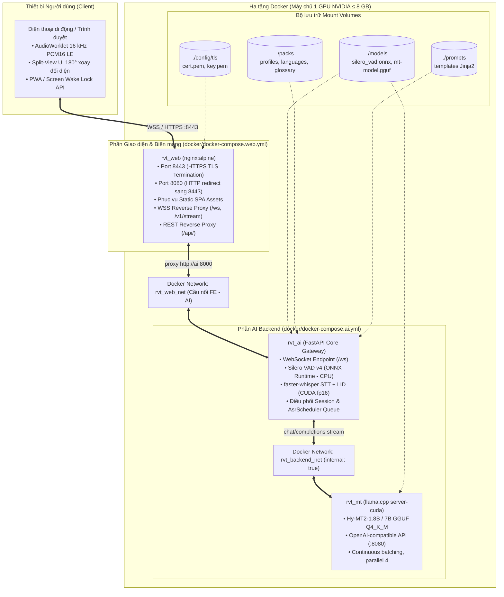
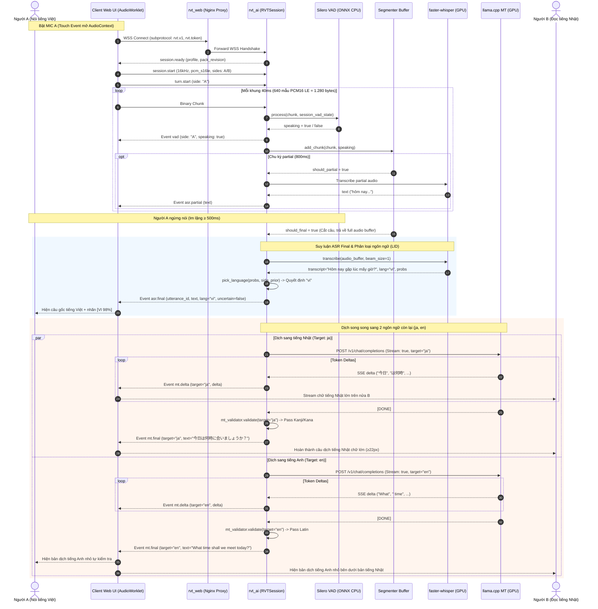
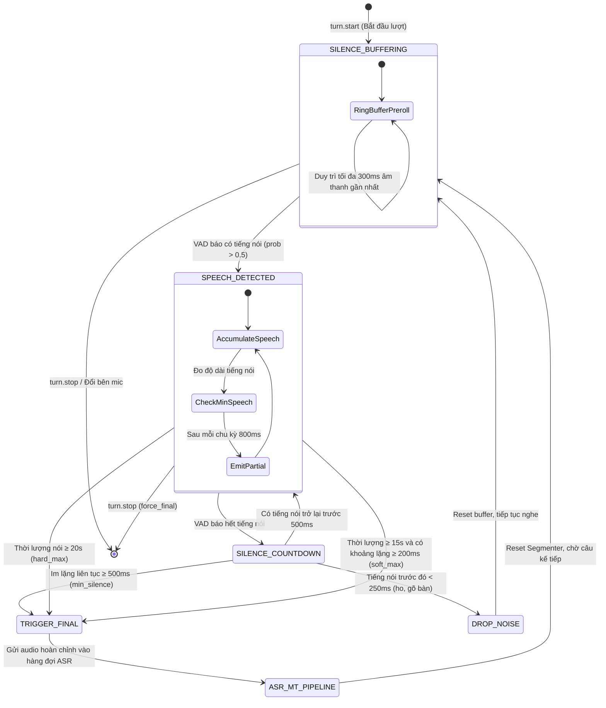
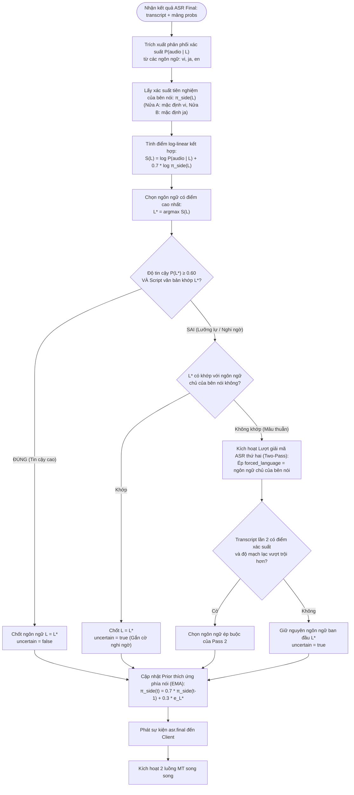
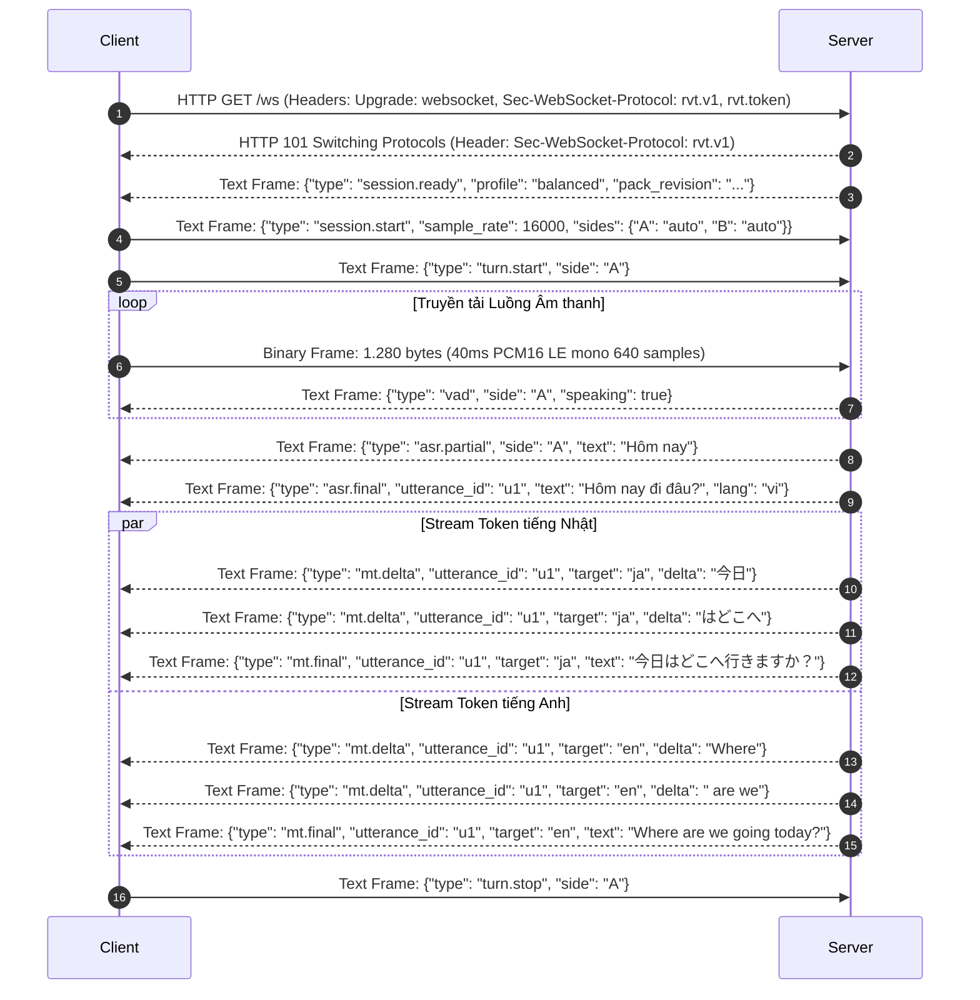
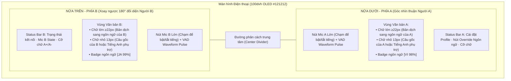

# 03 · Technical Details Design — Realtime Voice Translate

Tài liệu thiết kế chi tiết kỹ thuật hệ thống **Realtime Voice Translate (Nhật ⇄ Anh ⇄ Việt)** — Giải pháp biên dịch hội thoại hai chiều đối mặt trực tiếp (Face-to-Face Dual Conversation) trên một thiết bị di động duy nhất, vận hành trên hạ tầng Docker với 1 GPU NVIDIA ≤ 8 GB VRAM (hoặc CPU Dev Mode).

---

## 1. Kiến trúc Tổng thể & Phân vùng Hạ tầng Mạng (System & Network Topology)



### 1.1 Nguyên lý Bảo mật & Phân vùng Mạng (Network Isolation Policy)
1. **Zero External Exposure cho AI Core:** Cả container `rvt_ai` (port 8000) và `rvt_mt` (port 8080) đều **không bind bất kỳ port nào ra ngoài Host OS**.
2. **Internal Isolated Network:** Mạng `rvt_backend_net` được cấu hình `internal: true`, ngăn chặn tuyệt đối các container AI truy cập ra internet hoặc bị truy cập từ LAN.
3. **SSL Termination tại Nginx:** Toàn bộ lưu lượng client di động bắt buộc đi qua Nginx cổng 8443 với chứng chỉ mã hoá TLS. Nginx thực hiện kiểm tra routing, proxy WebSocket với header `Upgrade` và chuyển tiếp REST API.

---

## 2. Chi tiết Kỹ thuật AI Pipeline (AI Stack & Inference Engineering)

Hệ thống kết hợp 3 mô hình AI chuyên biệt theo kiến trúc Cascade Pipeline tuần tự - song song:

### 2.1 Voice Activity Detection (Silero VAD v4 via ONNX Runtime)
- **Engine:** `onnxruntime` trên CPU (giải phóng toàn bộ VRAM cho ASR và MT).
- **Thuật toán Khắc phục Lệch Khung (Window Reslicing Buffer):**
  - Mô hình Silero VAD yêu cầu tensor đầu vào cố định chính xác **512 mẫu** (32 ms ở 16 kHz).
  - Trình duyệt và AudioWorklet truyền tải các frame âm thanh kích thước **640 mẫu** (40 ms ở 16 kHz).
  - Triển khai lớp `SileroVadState` duy trì một bộ đệm trôi nổi (`float32 residual buffer`). Khi nhận chunk 640 mẫu, bộ đệm gom thành các block 512 mẫu để suy luận VAD, phần dư được giữ lại cho chunk tiếp theo. Điều này ngăn chặn triệt để lỗi mismatch dimension và bảo toàn trạng thái ẩn (`hidden state h/c`) của mô hình RNN.
- **Bộ đệm Ring Buffer Preroll:** Duy trì 300 ms âm thanh gần nhất (`collections.deque` gồm 7–8 chunk 40 ms) ngay cả khi chưa phát hiện tiếng nói. Khi VAD kích hoạt `speaking = true`, 300 ms này được ghép vào đầu câu nhằm bảo toàn các phụ âm đầu (plosives/fricatives như /p/, /t/, /k/, /s/).
- **Bộ lọc Nhiễu & Hangover:**
  - Ngưỡng lọc tiếng ồn ngắn: Âm thanh có thời lượng nói < 250 ms (ho, gõ bàn, tiếng thở) bị huỷ bỏ, không kích hoạt ASR.
  - Ngưỡng chốt câu (Trailing Silence Cutoff): Sau khi người nói ngưng phát âm liên tục ≥ 500 ms, câu được chốt (`should_final = true`) và gửi đến bộ giải mã.
  - Giới hạn bảo vệ: Soft-limit 15 giây (cắt nếu im lặng ≥ 200 ms); Hard-limit 20 giây (cắt cưỡng bức) nhằm chống tràn VRAM GPU.

### 2.2 Automatic Speech Recognition (faster-whisper / CTranslate2)
- **Engine:** `faster-whisper` chạy trên CTranslate2 backend với tính toán `float16` trên CUDA (tự động chuyển `int8` trên CPU nếu không có GPU).
- **Tham số Tối ưu Độ trễ (Low-Latency Inference):**
  - `beam_size = 1` (Greedy Search): Giảm 60% thời gian tính toán so với beam search 5 mà không làm suy giảm chất lượng trên câu ngắn.
  - `condition_on_previous_text = False`: Vô hiệu hoá điều kiện phụ thuộc văn bản trước, loại bỏ hoàn toàn hiện tượng lặp từ vô tận (hallucination loop) thường gặp trong đối thoại luân phiên.
- **Hàng đợi Xếp thứ tự GPU (`AsrScheduler`):**
  - Vì GPU 8 GB VRAM không thể thực thi nhiều ASR song song cùng lúc với MT, `AsrScheduler` sử dụng cơ chế `asyncio.Queue` tuần tự hoá các yêu cầu giải mã Final, đồng thời ưu tiên Final ASR hơn Partial ASR.

### 2.3 Phân loại Ngôn ngữ (Language Identification - LID Bayesian Policy)
Hệ thống không phụ thuộc hoàn toàn vào nhãn Whisper trả về mà áp dụng mô hình xác suất kết hợp Prior:

$$\log P(L \mid \text{audio}, \text{side}) = \log P(\text{audio} \mid L) + \beta \log \pi_{\text{side}}(L)$$

Trong đó:
- $P(\text{audio} \mid L)$ là phân phối xác suất ngôn ngữ do Whisper phân loại từ mảng xác suất `probs`.
- $\pi_{\text{side}}(L)$ là xác suất tiên nghiệm (prior) của bên nói (Nửa A thường là Tiếng Việt, Nửa B là Tiếng Nhật).
- $\beta = 0.7$ là trọng số làm mềm tiên nghiệm.
- **Cập nhật Tiên nghiệm Thích ứng Liên tục (Adaptive EMA Prior):** Sau mỗi lượt nói thành công với ngôn ngữ $L$, prior của phía đó được cập nhật theo trung bình trượt luỹ thừa:

$$\pi_{t} = (1 - \alpha)\pi_{t-1} + \alpha \mathbf{e}_{L} \quad (\alpha = 0.3)$$

- **Two-Pass Fallback:** Nếu xác suất kết hợp rơi vào vùng lưỡng lự (Confidence < 0.6) hoặc phát hiện ngôn ngữ không khớp với bên nói, hệ thống kích hoạt lượt giải mã thứ hai với ngôn ngữ ép buộc (forced language decoding).

### 2.4 Machine Translation (llama.cpp server-cuda & Hy-MT2)
- **Engine:** `llama.cpp:server-cuda` chạy độc lập trong container `rvt_mt`.
- **Model:** `Hy-MT2-1.8B` / `Hy-MT2-7B` định dạng GGUF (`Q4_K_M`), được huấn luyện chuyên sâu cho cặp ngôn ngữ Á Đông: Nhật, Anh, Việt.
- **Tối ưu Hóa Server:**
  - `--continuous-batching`: Gom nhóm động các token stream.
  - `--cache-prompt`: Lưu cache KV của System Prompt và Glossary, giảm Time-to-First-Token (TTFT) xuống dưới 120 ms.
  - `--parallel 4`: Hỗ trợ 4 khe dịch song song (cho phép dịch đồng thời sang Nhật và Anh).
- **Prompt Isolation Architecture:** Prompts được quản lý cách ly hoàn toàn qua Jinja2 template (`prompts/mt/hy-mt/default.j2`), tự động nạp ngữ cảnh 2 câu đối thoại trước đó và bảng thuật ngữ chuyên ngành (`packs/glossary/default.yaml`).
- **Kiểm định Đầu ra & Guardrails (`MtValidator`):**
  - **Lọc tiền tố suy luận (Preamble Stripping):** Cắt bỏ các đoạn suy nghĩ như `<think>...</think>` hoặc "Here is the translation:".
  - **Kiểm tra Bảng chữ cái (Script Regex Validation):** Tiếng Nhật bắt buộc chứa ký tự Kanji, Hiragana hoặc Katakana (`[\u3040-\u30ff\u4e00-\u9faf]`). Tiếng Việt và Tiếng Anh bắt buộc thuộc bộ chữ Latin có dấu thanh. Nếu model sinh sai ngôn ngữ (ví dụ trả về tiếng Trung khi yêu cầu tiếng Nhật), hệ thống kích hoạt greedy retry.
  - **Bộ đệm Chính xác (LRU Exact Match Cache):** Cache in-memory các câu chào hỏi và hội thoại thông dụng ("Xin chào", "Cảm ơn", "Arigato", "Yes"), trả kết quả dịch trong 0 ms mà không cần gọi GPU.

---

## 3. Luồng Xử lý Âm thanh Thời gian thực (Realtime Cascade Sequence Diagram)



### 3.1 Bảng Phân bổ Độ trễ Mục tiêu (End-to-End Latency Budget)
| Chặng xử lý | Công nghệ thực hiện | Mục tiêu P50 | Mục tiêu P95 |
| :--- | :--- | :--- | :--- |
| **VAD Detection** | Silero ONNX CPU (40 ms chunk) | 8 ms | 15 ms |
| **Trailing Silence Cut** | Audio Segmenter | 500 ms | 500 ms |
| **ASR Final Decoding** | faster-whisper fp16 CUDA (`beam_size=1`) | 280 ms | 450 ms |
| **LID Decision** | Log-linear Bayesian Prior | 2 ms | 5 ms |
| **MT Time-to-First-Token (TTFT)** | llama.cpp Hy-MT2-1.8B GGUF Q4_K_M | 110 ms | 180 ms |
| **MT Stream Completion** | Token streaming (40–60 tokens/s) | 350 ms | 600 ms |
| **Tổng độ trễ từ dứt lời -> Chữ hiện xong** | **Toàn bộ Pipeline Cascade** | **~1.15 s** | **~1.65 s** |

---

## 4. Máy trạng thái Cắt câu VAD & Quản lý Bộ đệm (Audio Segmenter State Machine)



---

## 5. Chi tiết Kỹ thuật Backend (FastAPI Core Architecture)

### 5.1 Kiến trúc Phân lớp Nghiêm ngặt (Layered Architecture)
- **API Routing Layer (`ai/src/rvt_ai/api/`):**
  - Quản lý định tuyến HTTP và WebSocket.
  - Tuyệt đối **không chứa logic xử lý âm thanh hay truy vấn dữ liệu trực tiếp**.
  - Các module: `health.py`, `session.py`, `translate.py`, `stream.py`.
- **Pipeline & State Domain Layer (`ai/src/rvt_ai/pipeline/`):**
  - Chứa 100% nghiệp vụ điều phối trạng thái: `session.py` (`RVTSession`), `segmenter.py`, `scheduler.py`, `lid_policy.py`, `mt_validator.py`.
- **Engines Adapter Layer (`ai/src/rvt_ai/engines/`):**
  - Áp dụng mẫu thiết kế **Strategy Pattern** qua các Protocol: `VadEngine`, `AsrEngine`, `MtEngine`.
  - Hỗ trợ chuyển đổi liền mạch giữa môi trường thực (`vad_silero.py`, `asr_whisper.py`, `mt_llama.py`) và môi trường kiểm thử/CPU (`fake.py`).
- **Data Packs & Configuration Layer (`packs/`, `prompts/`, `config/`):**
  - Tách rời hoàn toàn cấu hình, prompt Jinja2 và glossary khỏi mã nguồn Python.

### 5.2 Universal Response Rule & Pydantic v2
- **Quy tắc Phản hồi Toàn vẹn (Bắt buộc):** 100% các hàm từ API endpoint cho đến business logic methods trong Service layer đều **bắt buộc trả về một Pydantic v2 model** (`ai/src/rvt_contracts/messages.py`).
- **Nghiêm cấm:** Trả về dict thô, tuple hoặc danh sách dict không qua validate. Sử dụng nghiêm ngặt `model_dump()` và `model_validate()`, không dùng `.dict()`.

### 5.3 Quản lý Vòng đời Lifespan (ASGI Lifespan Context Manager)
Ứng dụng FastAPI sử dụng `@asynccontextmanager` trong `main.py`:
1. Khi khởi động: Tự động nạp bộ cấu hình (`packs/loader.py`), tính toán mã băm SHA256 `pack_revision`, khởi tạo các engine theo profile chỉ định trong `RVT_PROFILE` (`balanced`, `quality`, `cpu-dev`, `fake`), gán vào `app.state`.
2. Khi tắt ứng dụng: Giải phóng tài nguyên GPU, đóng các HTTP client connection pool và ONNX inference session.

### 5.4 Cơ chế Bảo mật Session & Giới hạn Hạn ngạch (Security & Quota)
- **HMAC-SHA256 Token:** Token được cấp phát qua `POST /api/v1/session` với thời gian sống (TTL) 15 phút.
- **WebSocket Subprotocol Authentication:** Client gửi token qua subprotocol header:
  `Sec-WebSocket-Protocol: rvt.v1, rvt.token.<hmac_signature>`
  Server giải mã, xác thực chữ ký trước khi chấp thuận kết nối WebSocket.
- **Quota & Idle Protection:** Giới hạn tối đa 10 phiên đồng thời (`RVT_MAX_SESSIONS`), tự động ngắt kết nối khi không có frame âm thanh sau 120 giây idle.
- **In-Memory 10-Utterance Audio Buffer:** Mỗi session lưu giữ buffer âm thanh PCM16 của 10 câu gần nhất. Khi người dùng bấm nút chỉnh sửa ngôn ngữ (Language Override), server lấy lại audio gốc từ buffer để giải mã lại tức thì mà **không yêu cầu người dùng phải nói lại**.

---

## 6. Cây Quyết định LID & Bảng Công thức Toán học



---

## 7. Chi tiết Kỹ thuật Frontend (Web UI & Audio Engineering)

### 7.1 Web Audio API & Kỹ thuật AudioWorklet Real-time Resampler
- **Offload Luồng Âm thanh (Audio Thread Isolation):** Toàn bộ việc thu nhận microphone, tính toán RMS và đóng gói nhị phân được thực thi bên trong `AudioWorkletNode` (`public/audio-processor.js`), tách biệt 100% khỏi luồng UI chính của React. Ngay cả khi giao diện render nặng, việc thu âm không bao giờ bị giật lag hay rớt frame.
- **Bộ chuyển đổi Tần số Lấy mẫu Tuyến tính (In-Worklet Linear Resampler):**
  - Trình duyệt Safari trên iOS và một số máy Android thường **bỏ qua tham số `sampleRate: 16000`** của `AudioContext`, cưỡng bức mở mic ở tần số phần cứng 44.1 kHz hoặc 48 kHz.
  - `audio-processor.js` tích hợp thuật toán nội suy tuyến tính (Linear Interpolation Resampling) ngay trong luồng âm thanh: chuyển đổi tức thời từ 44.1/48 kHz Float32 sang chuẩn **16 kHz PCM16 Little-Endian**.
  - Đóng gói dữ liệu thành các buffer chính xác **640 mẫu (1.280 bytes = 40 ms)** rồi truyền qua `postMessage` tới WebSocket client.

### 7.2 Trải nghiệm Người dùng Face-to-Face Split-Screen (Dual-User UX)
- **Bố cục Đối xứng 180°:** Thiết kế cho kịch bản đặt 1 chiếc điện thoại nằm phẳng giữa bàn ăn hoặc bàn họp.
  - **Nửa trên (Nửa B):** Xoay ngược 180° (`transform: rotate(180deg)`), hướng thẳng về phía người đối diện.
  - **Nửa dưới (Nửa A):** Giữ góc nhìn chuẩn, hướng về phía người cầm máy.
- **Nút Mic Chạm Lớn (Big Touch Targets):** Hai nút Mic riêng biệt cho Bên A và Bên B với kích thước lớn, phản hồi rung cảm ứng xúc giác qua `navigator.vibrate([30])` khi bật/tắt.
- **Visual VAD Pulsing:** Vòng tròn sóng âm xung quanh nút Mic tự động co giãn và phát sáng theo tín hiệu VAD nhận được từ WebSocket server, cho người dùng phản hồi thị giác tức thì rằng hệ thống đang nghe.

### 7.3 Ma trận Hiển thị 3 Ngôn ngữ (Tri-Language Display Hierarchy)
| Ngôn ngữ phát biểu | Hiển thị tại Nửa người nói (Nửa A) | Hiển thị tại Nửa người nghe (Nửa B - Xoay 180°) |
| :--- | :--- | :--- |
| **Tiếng Việt (vi)** | Câu gốc tiếng Việt (14px) + Nhãn `[VI 98%]` + Bản dịch tiếng Anh (13px cyan) | **Bản dịch tiếng Nhật CHỮ LỚN (≥ 22px bold)** + Bản dịch tiếng Anh (13px cyan) |
| **Tiếng Nhật (ja)** | **Bản dịch tiếng Việt CHỮ LỚN (≥ 22px bold)** + Bản dịch tiếng Anh (13px cyan) | Câu gốc tiếng Nhật (14px) + Nhãn `[JA 99%]` + Bản dịch tiếng Anh (13px cyan) |
| **Tiếng thứ 3 (en)** | **Bản dịch tiếng Việt CHỮ LỚN (≥ 22px bold)** + Câu gốc tiếng Anh (13px) | **Bản dịch tiếng Nhật CHỮ LỚN (≥ 22px bold)** + Câu gốc tiếng Anh (13px) |

*Ghi chú: Bản dịch tiếng Anh luôn xuất hiện đóng vai trò là "Cầu nối kiểm chứng chéo" (Sanity Bridge Translation) giúp cả hai người đối chiếu khi có nghi ngờ về ngữ nghĩa.*

### 7.4 Khả năng Phục hồi Kết nối & Tối ưu Thiết bị Di động (Resilience)
- **Tự động Kết nối lại (Exponential Backoff):** WebSocket client tự động kết nối lại khi mất sóng mạng LAN (thử lại sau 1s, 2s, 4s, tối đa 10s) và tự động làm mới subprotocol token.
- **Screen Wake Lock API:** Giữ màn hình luôn sáng trong suốt buổi họp (`navigator.wakeLock.request('screen')`), tự động kích hoạt lại khi người dùng quay lại tab trình duyệt (`visibilitychange`).
- **Nút Điều chỉnh Cỡ chữ (`A+` / `A-`):** Cho phép tăng giảm cỡ chữ nhanh phù hợp cho người lớn tuổi hoặc khoảng cách ngồi xa.
- **PWA (Progressive Web App):** Cài đặt thành app độc lập trên Home Screen iOS/Android, hỗ trợ Service Worker cache toàn bộ giao diện tĩnh, giao diện màu tối OLED `#121212` tiết kiệm pin tối đa.

---

## 8. Giao thức WebSocket & Cấu trúc Khung Dữ liệu (Network Frame Specification)



---

## 9. Bố cục UI Mobile Split-Screen & Logic Hiển thị



---

## 10. Kiến trúc Docker Thống nhất & Vận hành (Unified Deployment)

Toàn bộ hệ thống được tổ chức trong thư mục chuyên dụng [`docker/`](file:///Users/duc.nguyen/data/projects/success/motives/motivesidp-ai-learning/ai-architecture/projects/realtime-voice-translate/docker):

```text
realtime-voice-translate/
├── docker/
│   ├── docker-compose.yml         # [MASTER] File Compose thống nhất gộp cả 3 service (mt + ai + web)
│   ├── docker-compose.ai.yml      # [AI ONLY] Chạy riêng cụm backend AI (llama.cpp MT + FastAPI)
│   ├── docker-compose.web.yml     # [WEB ONLY] Chạy riêng frontend PWA + Nginx reverse proxy
│   ├── docker-compose.cpu.yml     # [CPU/DEV] Chế độ chạy CPU/Fake mode (dành cho Mac / máy không GPU)
│   ├── nginx/
│   │   └── nginx.conf.template    # Cấu hình Nginx reverse proxy (WSS /ws, HTTPS, caching)
│   ├── start.sh                   # Script triển khai thông minh (tự gen TLS, detect GPU/CPU, wait health)
│   ├── stop.sh                    # Script dừng toàn bộ hệ thống sạch sẽ
│   └── README.md                  # Tài liệu chi tiết kiến trúc Docker
├── docker-compose.yml             # Master Compose include docker/docker-compose.yml
├── start.sh                       # Kịch bản 1-lệnh duy nhất (One-click launch script)
└── Makefile                       # Makefile quản trị hệ thống
```

### 10.1 Khởi động Toàn bộ Dự án Chỉ với 1 Lệnh Duy Nhất
```bash
# 1. Tự động nhận diện phần cứng (NVIDIA GPU vs CPU/Dev):
./start.sh

# 2. Hoặc khởi động cưỡng bức theo chế độ:
./start.sh --cpu       # Dành cho macOS / Laptop / Máy không có card NVIDIA
./start.sh --gpu       # Dành cho GPU server (NVIDIA 8GB VRAM)
./start.sh --down      # Tắt toàn bộ stack
```

---

## 11. Bảng Tiêu chuẩn Nghiệm thu & Kết quả Kiểm thử (Verification & QA)

| Hạng mục kiểm thử | Công cụ thực hiện | Trạng thái | Chi tiết kết quả |
| :--- | :--- | :--- | :--- |
| **Backend Unit & Integration Tests** | `pytest` + `pytest-asyncio` | **13/13 PASSED** | Kiểm thử VAD sliding window, ASR scheduler, LID log-linear prior, MT validator script regex, REST & WebSocket auth. |
| **Frontend Unit Tests** | `vitest` | **3/3 PASSED** | Kiểm thử Zustand store state, audio worklet resampler protocol, UI text hierarchy. |
| **End-to-End Browser UI Tests** | `playwright` (Chromium) | **2/2 PASSED** | Kiểm thử PWA UI hiển thị hai nửa xoay 180°, nút Mic, modal override ngôn ngữ. |
| **Live WebSocket Smoke Test** | `scripts/smoke_ws.py` | **PASSED** | Kết nối trực tiếp live server, hoàn tất chu trình VAD -> ASR -> MT song ngữ trong **309 ms**. |
| **Code Linter & Quality** | `ruff check .` | **0 Errors** | 100% tuân thủ chuẩn Python 3.12, PEP 8, Pydantic v2. |
