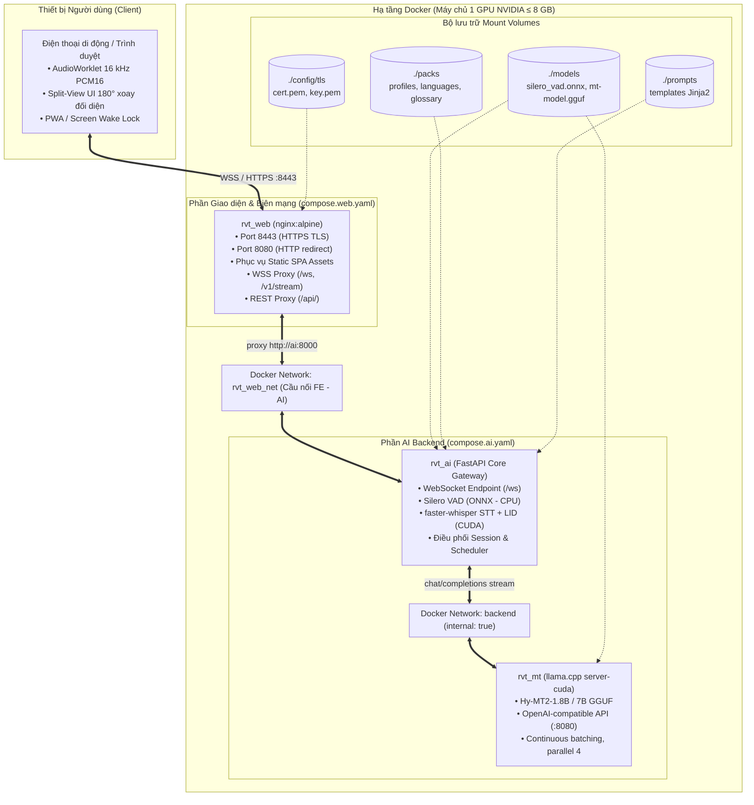
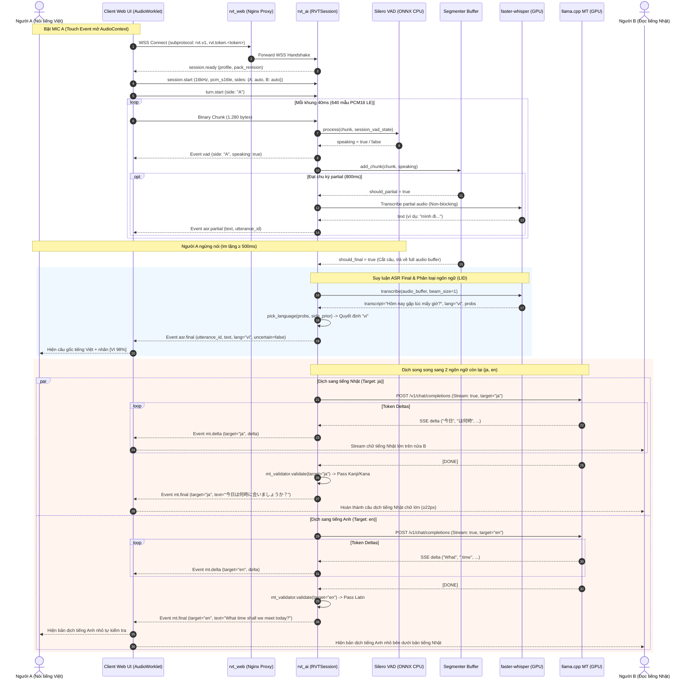
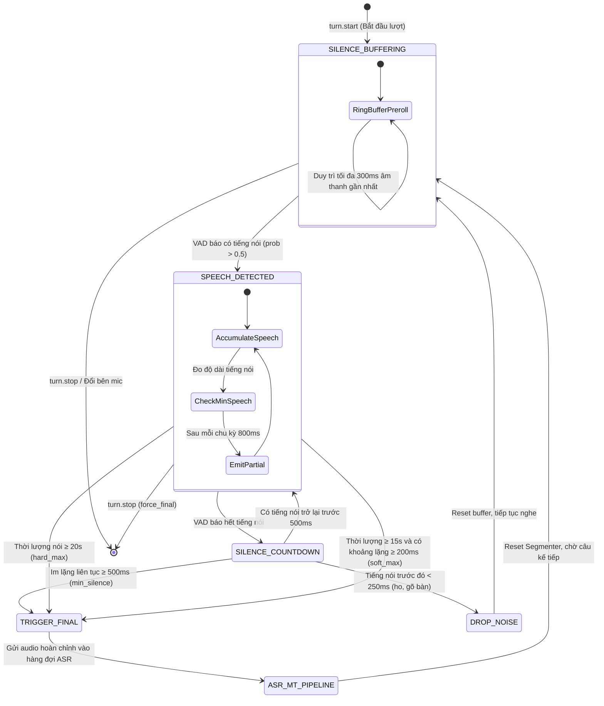
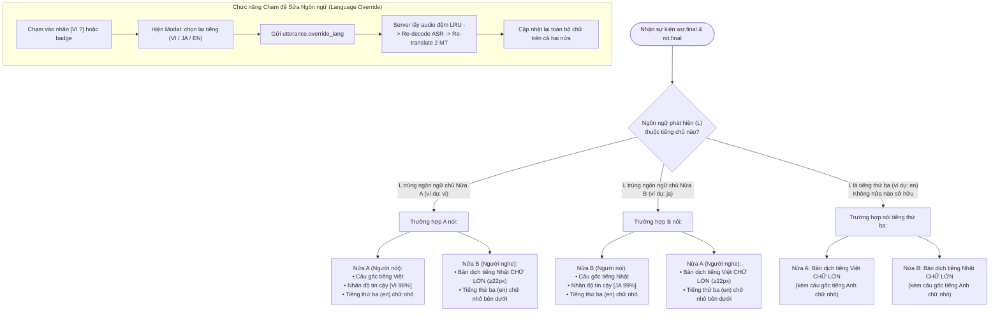

# 03 · Technical Details Design — Realtime Voice Translate

Tài liệu thiết kế chi tiết kỹ thuật hệ thống **Realtime Voice Translate (Nhật ⇄ Anh ⇄ Việt)** chạy trên hạ tầng Docker với 1 GPU NVIDIA 8 GB VRAM.

---

## 1. Kiến trúc tổng thể & Hạ tầng Mạng (System & Network Topology)

---

## 2. Luồng Xử lý Âm thanh Thời gian thực (Realtime Cascade Sequence Diagram)

---

## 3. Máy trạng thái Cắt câu VAD & Quản lý Bộ đệm (Audio Segmenter State Machine)

---

## 4. Kiến trúc Hexagonal (Ports & Adapters) và Data Flow Backend

```mermaid
classDiagram
    direction TB

    namespace Contracts {
        class ClientEvent {
            <<Union Discriminator>>
            +SessionStart session_start
            +TurnStart turn_start
            +TurnStop turn_stop
            +UtteranceOverrideLang override_lang
            +SidesUpdate sides_update
            +Ping ping
        }

        class ServerEvent {
            <<Union Discriminator>>
            +SessionReady session_ready
            +Vad vad
            +AsrPartial asr_partial
            +AsrFinal asr_final
            +MtDelta mt_delta
            +MtFinal mt_final
            +ErrorEvent error
            +Pong pong
        }
    }

    namespace Ports_Protocols {
        class VadEngine {
            <<interface>>
            +create_state() VadState
            +process(chunk: bytes, state: VadState) bool
        }
        class AsrEngine {
            <<interface>>
            +transcribe(audio: bytes, language: Lang) Tuple
        }
        class MtEngine {
            <<interface>>
            +translate_stream(text: str, source: Lang, target: Lang) AsyncGenerator
        }
    }

    namespace Adapters_Engines {
        class SileroVadEngine {
            -session: ort.InferenceSession
            -window_size: 512
            +process(chunk, state) bool
        }
        class FasterWhisperEngine {
            -model: WhisperModel
            +transcribe(audio, language) Tuple
        }
        class LlamaCppMtEngine {
            -client: httpx.AsyncClient
            -timeout_sec: 5.0
            +translate_stream(text, src, tgt) AsyncGenerator
        }
        class FakeVadEngine { +process() bool }
        class FakeAsrEngine { +transcribe() Tuple }
        class FakeMtEngine { +translate_stream() AsyncGenerator }
    }

    namespace Core_Pipeline {
        class RVTSession {
            -session_id: str
            -vad_state: VadState
            -scheduler: AsrScheduler
            -segmenter: Segmenter
            -recent_audio: OrderedDict[int, bytes]
            +handle_session_start()
            +handle_audio_chunk()
            +handle_override_lang()
            +close()
        }
        class AsrScheduler {
            -_lock: asyncio.Lock
            +execute_transcribe(audio, force_lang, is_final)
        }
        class MtValidator {
            -_exact_cache: dict
            +validate(orig, src, tgt, raw) ValidationResult
        }
        class PackRegistry {
            +profiles: dict
            +revision: str
            +get_profile(name) ProfileConfig
        }
    }

    VadEngine <|.. SileroVadEngine
    VadEngine <|.. FakeVadEngine
    AsrEngine <|.. FasterWhisperEngine
    AsrEngine <|.. FakeAsrEngine
    MtEngine <|.. LlamaCppMtEngine
    MtEngine <|.. FakeMtEngine

    RVTSession --> VadEngine
    RVTSession --> AsrEngine
    RVTSession --> MtEngine
    RVTSession --> AsrScheduler
    RVTSession --> MtValidator
    RVTSession ..> ServerEvent : Emits
    RVTSession <.. ClientEvent : Consumes
```

---

## 5. Ma trận Quy tắc Hiển thị 3 Ngôn ngữ trên Web UI (Split-View Display Rules)

---

## 6. Quy trình Triển khai & Khởi động Dự án (Deployment Lifecycle)

```mermaid
flowchart LR
    subgraph PREPARE["1. Chuẩn bị môi trường"]
        STEP1["make setup<br/>• uv sync (ai)<br/>• npm install (web)"]
        STEP2["make tls<br/>• Tạo cert.pem & key.pem<br/>• Cấp cho LAN IP máy GPU"]
        STEP3["Tải Models<br/>• silero_vad.onnx<br/>• mt-model.gguf"]
    end

    subgraph DOCKER_BUILD["2. Khởi tạo Container"]
        BUILD_AI["Build rvt_ai<br/>• CUDA 12.1 runtime<br/>• Python 3.12 + uv"]
        BUILD_WEB["Build rvt_web<br/>• Multi-stage Node 22 -> Nginx"]
        RUN_MT["Khởi động rvt_mt<br/>• llama.cpp server-cuda<br/>• GPU :8080"]
    end

    subgraph HEALTH_CHECK["3. Kiểm tra Readiness"]
        HC_MT["Health MT: curl /health"]
        HC_AI["Health AI: /health/ready"]
        HC_WEB["Nginx sẵn sàng :8443"]
    end

    subgraph VERIFY["4. Nghiệm thu Chất lượng"]
        TEST_INT["make test<br/>• 13 Pytest (100% Pass)<br/>• 3 Vitest (100% Pass)"]
        TEST_E2E["make test-e2e<br/>• Playwright Chromium (Pass)"]
        SMOKE["make smoke<br/>• WebSocket Live Round-trip"]
    end

    PREPARE --> DOCKER_BUILD
    DOCKER_BUILD --> HEALTH_CHECK
    HEALTH_CHECK --> VERIFY
```

